# Создание пакетов в Python через Rye


Подробная инструкция по созданию собственного пакета Python через Rye на примере Windows 11.

Пакет, созданный в рамках этой статьи:

- <https://github.com/Harrix/harrix-test-package>
- <https://pypi.org/project/harrix-test-package>

Официальная документация:

- <https://rye.astral.sh>
- <https://rye.astral.sh/guide/publish>
- <https://packaging.python.org/tutorials/packaging-projects>
- <https://github.com/pypa/sampleproject>

Буду показывать на примере VSCode, но вы можете использовать другой редактор и терминал.

## Подготовка

Установите и настройте Rye, например, по статье [Установка и работа с Rye (Python) в VSCode](https://github.com/Harrix/harrix.dev-articles-2024/blob/main/rye-vscode-python/rye-vscode-python.md) | [🡥](https://harrix.dev/ru/articles/2023/rye-vscode-python/).

## Создание проекта

У меня проект будет называться `harrix-test-package` (но импортироваться будет как `harrix_test_package`). Для своего проекта выберите своё название. Между словами в названии проекта ставьте дефис, а не пробел или символ нижнего подчеркивания.

Откройте в VSCode папку с проектами через `File` → `Open Folder...`, например, `C:\python-projects`, вызовете там терминал `Ctrl` + `` ` `` и создайте проект Rye через команду (разумеется, у вас будет другое название проекта):

```console
rye init harrix-test-package
```

Теперь в VScode откройте созданную папку `C:\python-projects\harrix-test-package`, откройте опять терминал через `Ctrl` + `` ` ``:

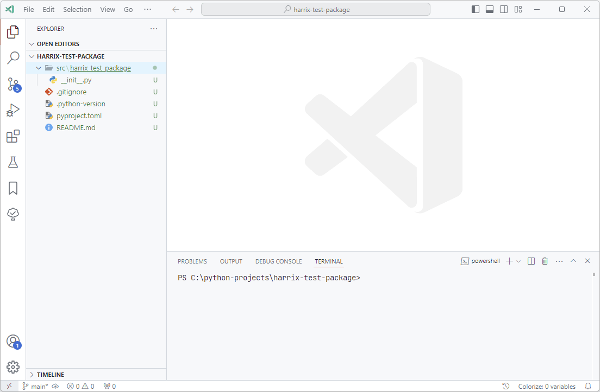

_Рисунок 1 — Созданный пустой проект_

Создайте под свой проект виртуальное окружение. У меня виртуальное окружение будет находиться в папке `.venv`, находящейся в папке с проектом:

```python
rye sync
```

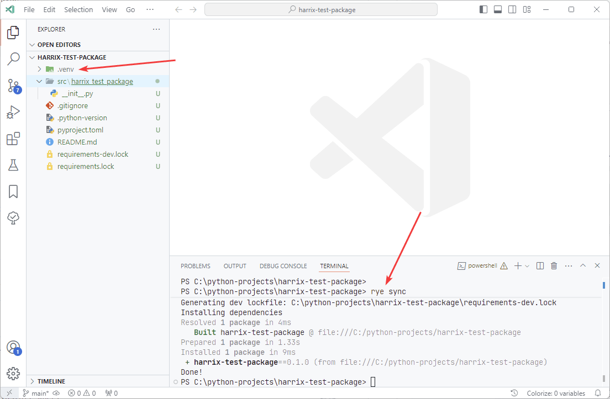

_Рисунок 2 — Вызов rye sync_

## Установка пакетов

Для тестирования внедрения сторонних пакетов в нашу библиотеку установим два популярных пакета `numpy` и `black`. Причем второй пакет будем устанавливать в режиме `--dev`, так как этот пакет нужен для разработки нашей библиотеки, но не нужен человеку, который установит наш пакет. И да, если используешь Rye, то лучше использовать команду `rye fmt` вместо `black` для форматирования кода, но сейчас мы просто тестируем добавление пакета для разработки. Также устанавливаем библиотеку `pytest` для тестирования библиотеки:

```python
rye add numpy
rye add --dev black
rye add --dev pytest
```

Информация об установленных библиотеках будет располагаться в файлах:

- `pyproject.toml`
- `requirements.lock`
- `requirements-dev.lock`

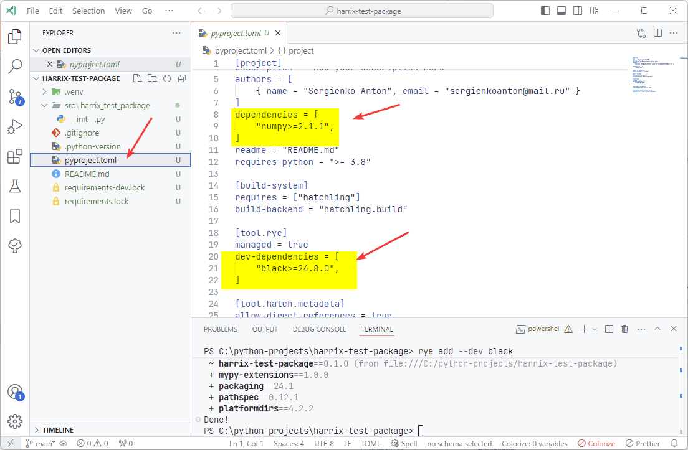

_Рисунок 3 — Установленные библиотеки_

## Создание пакета

У нас будет простой пакет с тремя функциями:

```python
import numpy as np

def multiply_2(x):
    return x * 2

def multiply_10(x):
    return x * 10

def test_numpy():
    return np.arange(-2, 2, 0.5)
```

Для этого создаем файл `functions.py` (у вас он будет называться по другому) в в папке `src\harrix_test_package` и поместим вышеприведенный код:

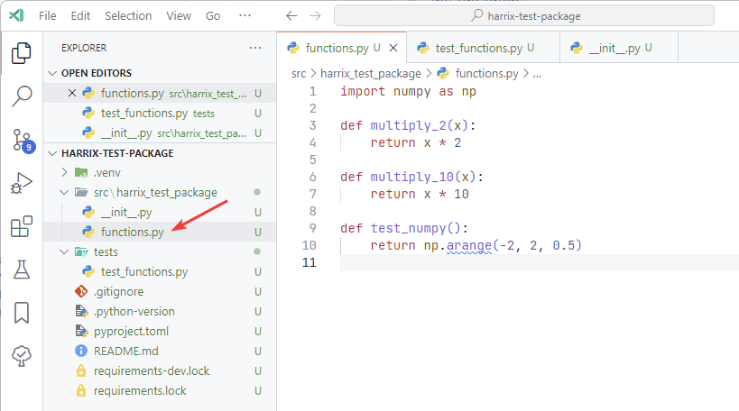

_Рисунок 4 — Файл functions.py_

Обратите внимание, что внутри папки `src` располагается название пакета в том виде, в котором я буду его импортировать в других проектах. И в этом названии дефисы использовать нельзя по правилам синтаксиса Python. Поэтому папка называется `harrix_test_package` (без дефисов), а не `harrix-test-package`.

Файл `src\harrix_test_package\__init__.py` импортирует всё то, что есть в нашем пакете для пользователей:

```python
from .functions import *
```

Проверку нашего пакета будем делать через [pytest](https://docs.pytest.org/en/stable/) (он используется в Rye по умолчанию). Именно для этого выше мы его устанавливали через `rye add pytest --dev`:

Для тестов создадим папку `tests` с файлами тестов. Не забудьте, что название файла тестов должно начинаться с `test_`

Файл `tests\test_functions.py`:

```python
import harrix_test_package as h

def test_multiply_2():
    re = h.multiply_2(2)
    assert re == 4


def test_multiply_10():
    re = h.multiply_10(2)
    assert re == 20

def test_test_numpy():
    re = len(h.test_numpy())
    assert re == 8
```

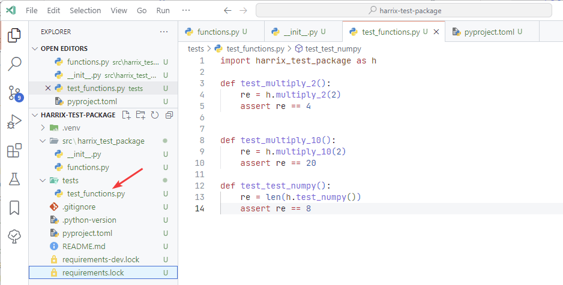

_Рисунок 5 — Файл с тестами функций_

Теперь рассмотрим файлы настроек проекта.

Файл `pyproject.toml` с внесенными изменениями:

```toml
[project]
name = "harrix-test-package"
version = "0.4"
description = "Test package"
authors = [{ name = "Anton Sergienko", email = "anton.b.sergienko@gmail.com" }]
dependencies = ["numpy>=2.1.1"]
readme = "README.md"
requires-python = ">= 3.8"
license = {file = "LICENSE"}

[project.urls]
Homepage = "https://github.com/Harrix/harrix-test-package"

[build-system]
requires = ["hatchling"]
build-backend = "hatchling.build"

[tool.rye]
managed = true
dev-dependencies = ["black>=24.8.0", "pytest>=8.3.3"]

[tool.hatch.metadata]
allow-direct-references = true

[tool.hatch.build.targets.wheel]
packages = ["src/harrix_test_package"]
```

У меня версия пакета равна `0.4`, так как этот пакет уже использовался для экспериментов по созданию пакета другими средствами Python. У вас же она будет равна скорее всего `0.1`, `0.0.1` или `1.0` — всё зависит от выбранной вами нумерации версий пакетов.

Параметры `name`, `description`, `Homepage`, `authors` поменяйте под себя. Раздел `project.urls` добавил вручную, так что, если у вас нет страницы проекта, то можно удалить. Аналогично со строкой `license = {file = "LICENSE"}`.

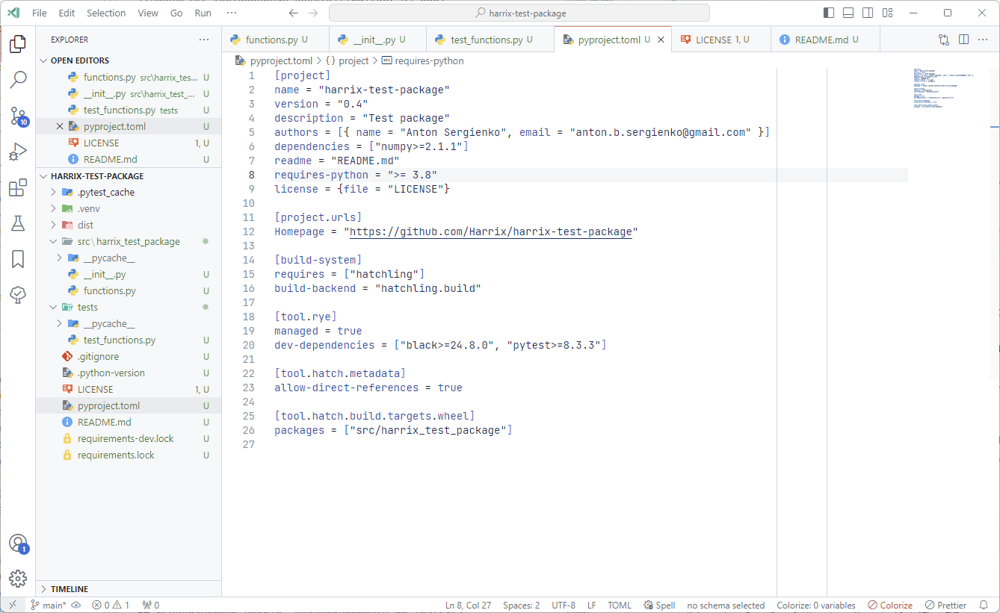

_Рисунок 6 — Файл pyproject.toml_

Создадим файл лицензии `LICENSE`, в котором располагается текст вашей лицензии. У меня это [MIT лицензия](https://en.wikipedia.org/wiki/MIT_License). Блок `[Year] [Your name]` поменяйте под себя:

```markdown
MIT License

Copyright (c) [Year] [Your name]

Permission is hereby granted, free of charge, to any person obtaining a copy
of this software and associated documentation files (the "Software"), to deal
in the Software without restriction, including without limitation the rights
to use, copy, modify, merge, publish, distribute, sublicense, and/or sell
copies of the Software, and to permit persons to whom the Software is
furnished to do so, subject to the following conditions:

The above copyright notice and this permission notice shall be included in all
copies or substantial portions of the Software.

THE SOFTWARE IS PROVIDED "AS IS", WITHOUT WARRANTY OF ANY KIND, EXPRESS OR
IMPLIED, INCLUDING BUT NOT LIMITED TO THE WARRANTIES OF MERCHANTABILITY,
FITNESS FOR A PARTICULAR PURPOSE AND NONINFRINGEMENT. IN NO EVENT SHALL THE
AUTHORS OR COPYRIGHT HOLDERS BE LIABLE FOR ANY CLAIM, DAMAGES OR OTHER
LIABILITY, WHETHER IN AN ACTION OF CONTRACT, TORT OR OTHERWISE, ARISING FROM,
OUT OF OR IN CONNECTION WITH THE SOFTWARE OR THE USE OR OTHER DEALINGS IN THE
SOFTWARE.
```

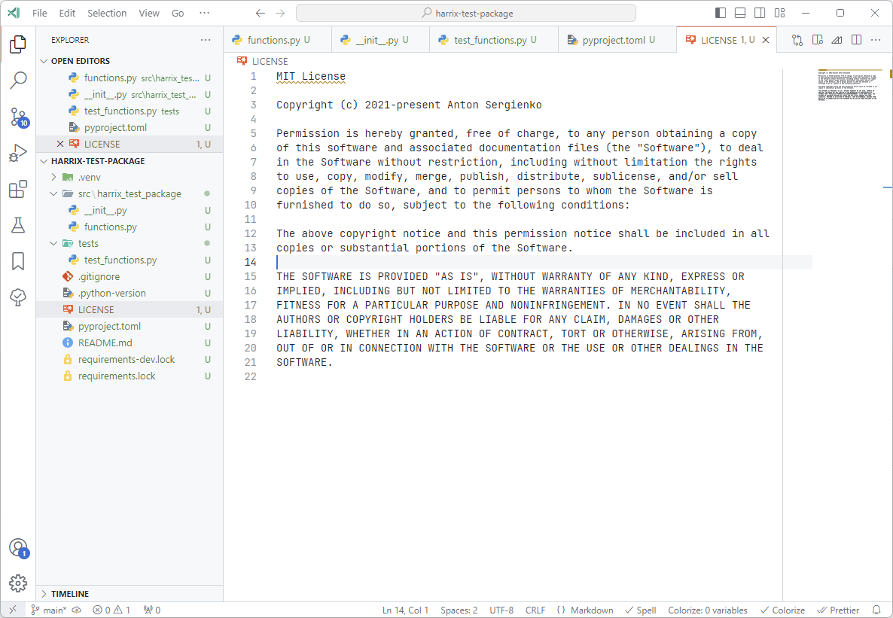

_Рисунок 7 — Файл LICENSE_

Файл `README.md` содержит описание вашего пакета в формате [Markdown](https://ru.wikipedia.org/wiki/Markdown). Оно может быть любым. У меня оно такое:

````markdown
# harrix-test-package

Test package.

## Install

```console
pip install harrix-test-package
```

```console
rye add harrix-test-package
```

## Using

```python
import harrix_test_package as h


print(h.multiply_2(2))
```
````

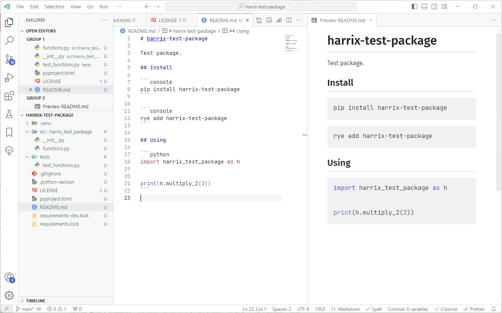

_Рисунок 8 — Файл README.md_

## Тестирование пакета

Мы уже создали папку `tests` с файлом тестов, а также установили `pytest` (если не установили, то установите через `rye add --dev pytest`). Так что для тестирования пакета нужно только запустить команду в терминале:

```console
rye test
```

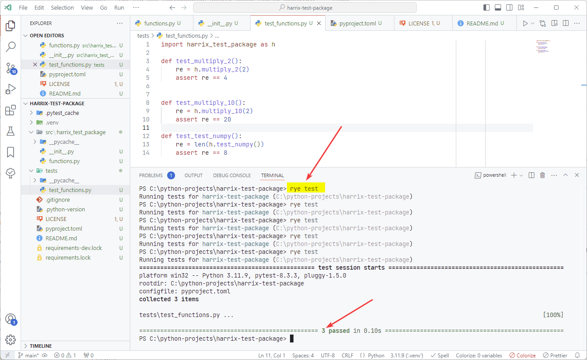

_Рисунок 9 — Результат тестирования пакета_

Устанавливать наш пакет в режиме разработчика, как в pip, не нужно.

## Сборка пакета и публикация на TestPyPi

Данный раздел был удален после написания, так как мой пакет использует `numpy`, а этого пакета нет на TestPyPi, что приводит к проблемам установки моего пакета.

Однако, если вы захотите собрать пакет и отправить его на TestPyPi, то зарегистрируйтесь на [TestPyPi](https://test.pypi.org/account/register/). Также там нужно будет [настроить двуфакторную авторизацию](https://test.pypi.org/manage/account/two-factor/). Я для этого использовал Microsoft Authenticator.

Соберите пакет для публикации и опубликуйте:

```console
rye build
rye publish --repository testpypi --repository-url https://test.pypi.org/legacy/
```

## Сборка пакета и публикация на PyPi

Зарегистрируйтесь на [PyPi](https://pypi.org/account/register/). Также там нужно будет [настроить двуфакторную авторизацию](https://pypi.org/manage/account/two-factor/). Я для этого использовал Microsoft Authenticator.

Соберите пакет для публикации и опубликуйте:

```console
rye build
rye publish --repository testpypi --repository-url https://test.pypi.org/legacy/
```

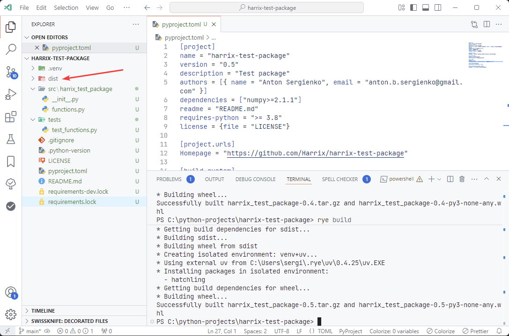

_Рисунок 10 — Процесс сборки пакета_

Отправьте пакет на тестовый сервер:

```python
rye publish --repository testpypi --repository-url https://test.pypi.org/legacy/
```

Вас попросят токен, который вы можете сгенерировать на странице <https://pypi.org/manage/account/token/>:

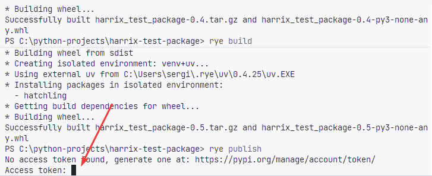

_Рисунок 11 — Запрос токена_

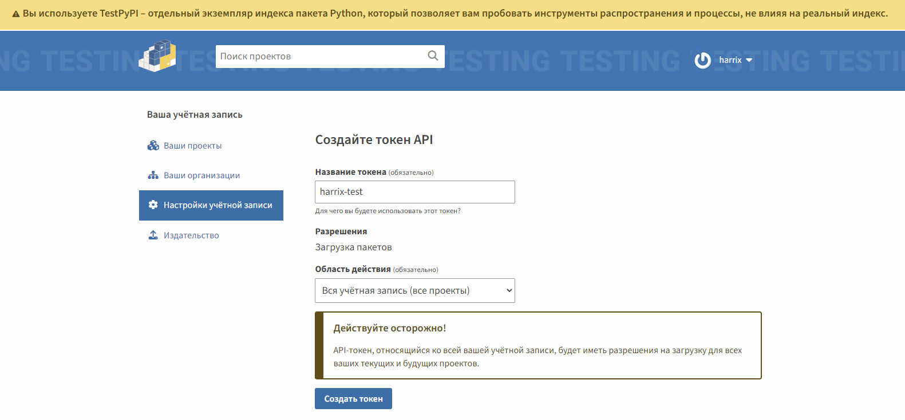

Вставляете токен, жмете `Enter`, процесс пошел.

В случае успеха будет напечатана ссылка на опубликованный пакет:

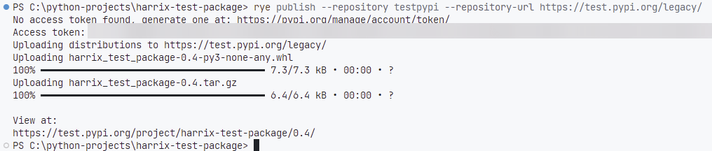

_Рисунок 12 — Успешная публикация_

У меня это <https://test.pypi.org/project/harrix-test-package/0.4/>:

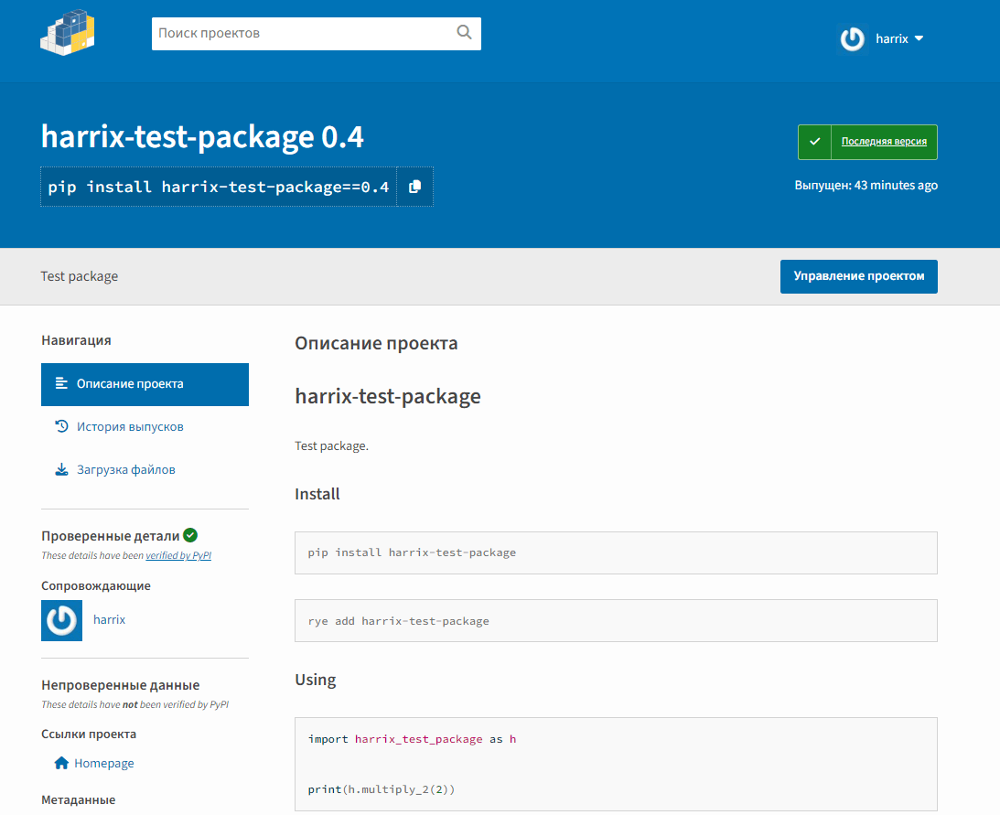

_Рисунок 13 — Опубликованный пакет_

Если вы что-то накосячили с авторизацией и сгенерированным токеном (когда был просто логин и пароль, то было проще), то может выпасть вот такая ошибка:

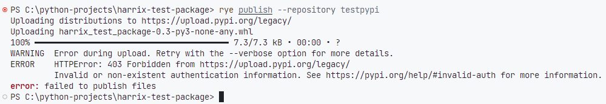

_Рисунок 14 — Ошибка авторизации_

В таком случае надо как-то удалить введенный неправильный токен. Для этого нужно найти файл настроек Rye `credentials`. Он находится в папке `~/.rye` (Unix) или `%USERPROFILE%\.rye` (Windows). Его можно удалить или очистить от ненужного токена. После этого повторно произвести публикацию пакета.

Иногда, если вы забыли поменять версию пакета, его собрали, исправили версию, пересобрали пакет и отправили на сервер, то выдается ошибка, что такой пакет уже был:

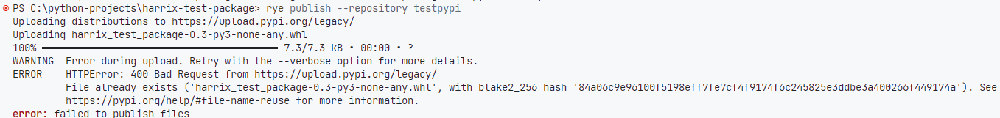

_Рисунок 15 — Ошибка публикации_

Нужно просто или собрать пакет через `rye build --clean`, либо удалить папку `dist`:

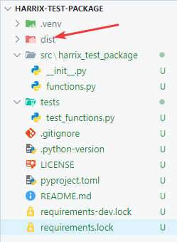

_Рисунок 16 — Папка dist_

## Использование пакета, опубликованного на TestPyPi

Для проверки опубликованного пакета я создам новый Python проект (например, с именем `test`) со своим виртуальным окружением, куда установлю опубликованный пакет.

```console
exit
mkdir c:\projects\test
cd c:\projects\test
Rye install
Rye shell
```

Команда `exit` применяется, если вы находитесь в виртуальном окружении. Если нет, то её использовать не надо, а то вы закроете командную строку.

Устанавливаем пакет. Команду для установки берем со страницы пакета <https://test.pypi.org/project/harrix-test-package>:

```console
Rye install -i https://test.pypi.org/simple/ harrix-test-package
```

В созданной папке `c:\projects\test\` создаем файл `main.py`:

```python
import harrix_test_package as h


print(h.multiply_2(2))
```

После запустим данный файл:

```console
python main.py
```

Если видим вывод числа 4, то всё работает хорошо.

## Сборка пакета и публикация на PyPi

Теперь опубликуем пакет на основном сервере. Для демонстрации я закрыл командную строку и открыл новую. В ней перехожу в папку пакета и активирую виртуальное окружение (используя неполный путь):

```console
cd c:\projects\harrix-test-package
Rye shell
```

Зарегистрируйтесь на [PyPi](https://pypi.org/account/register/).

Соберите пакет для публикации:

```console
python setup.py sdist bdist_wheel
```

Отправьте пакет на основной сервер. При этом вам нужно будет ввести логин и пароль от своей учетки на PyPi:

```python
twine upload dist/*
```

В случае успеха будет напечатана ссылка на опубликованный пакет. Отсюда получаем путь к нашему пакету <https://pypi.org/project/harrix-test-package/>.

## Использование пакета, опубликованного на PyPi

Для проверки опубликованного пакета я создам новый Python проект (например, с именем `test2`) со своим виртуальным окружением, куда установлю опубликованный пакет.

```console
exit
mkdir c:\projects\test2
cd c:\projects\test2
Rye install
Rye shell
```

Если вы не виртуальном окружении, то не используйте команду `exit`.

Устанавливаем пакет. Команду для установки берем со страницы пакета <https://pypi.org/project/harrix-test-package>.

```console
Rye install harrix-test-package
```

В созданной папке `c:\projects\test2\` создаем файл `main.py`:

```python
import harrix_test_package as h


print(h.multiply_2(2))
```

После запустим данный файл:

```console
python main.py
```

Если видим вывод числа 4, то всё работает хорошо.

## Публикация новой версии пакета

Попробуем добавить новую функцию в пакет и опубликовать новую версию. Итак, мега полезная функция:

```python
def multiply_20(x):
    return x * 20
```

После добавления файл `src\harrix_test_package\functions.py` примет вид:

```python
def multiply_2(x):
    return x * 2

def multiply_10(x):
    return x * 10

def multiply_20(x):
    return x * 20
```

Также добавим новый тест в файл `tests\test_functions.py`:

```python
import unittest

import harrix_test_package as h

class Testharrix_test_package(unittest.TestCase):

    def test_multiply_2(self):
        re = h.multiply_2(2)
        self.assertEqual(re, 4)

    def test_multiply_10(self):
        re = h.multiply_10(2)
        self.assertEqual(re, 20)

    def test_multiply_20(self):
        re = h.multiply_20(2)
        self.assertEqual(re, 40)


if __name__ == '__main__':
    unittest.main()
```

Теперь надо запустить юнит-тесты. Для примера я открыл новую командую строку (если вы были в чужом виртуальном окружении, то не забывайте выходить из него через `exit`):

```console
cd c:\projects\harrix-test-package
Rye shell
python -m unittest discover tests
```

Тесты успешно пройдены:

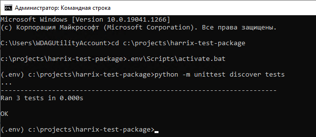

_Рисунок 3 — Тестирование пакета_

В файле `setup.py` поменяем номер версии пакета на `0.2`:

```python
from setuptools import find_packages, setup
import pathlib
here = pathlib.Path(__file__).parent.resolve()
long_description = (here / 'README.md').read_text(encoding='utf-8')

setup(
    name="harrix-test-package",
    version="0.2",
    description="Test package",
    long_description=long_description,
    long_description_content_type='text/markdown',
    url="https://github.com/Harrix/harrix-test-package",
    author="Anton Sergienko",
    author_email="anton.b.sergienko@gmail.com",
    packages=find_packages(where="src"),
    package_dir={"": "src"},
)
```

Собираем и публикуем пакет:

```console
python setup.py sdist bdist_wheel
twine upload dist/*
```

В проектах, в котором использовался наш пакет обновляем его через команду:

```console
Rye update harrix-test-package
```

## Развертывание разработки пакета на новой машине

У нас есть, например, на GitHub [исходники](https://github.com/Harrix/harrix-test-package) нашего пакета, которые мы хотим склонировать на другой компьютер, например, в папку `c:\python-projects` (для примера папку специально назвал по-другому, чтобы она отличалась от `c:\projects`).

Считаем, что [Python](https://github.com/Harrix/harrix.dev-articles-2024/blob/main/install-python/install-python.md) | [🡥](https://harrix.dev/ru/articles/2024/install-python/) и [Git](https://github.com/Harrix/harrix.dev-articles-2024/blob/main/install-git/install-git.md) | [🡥](https://harrix.dev/ru/articles/2024/install-git/) у вас установлены на новой машине. Cклонировать проект можно такой командой:

```console
mkdir c:\python-projects
cd c:\python-projects
git clone https://github.com/Harrix/harrix-test-package
cd c:\python-projects\harrix-test-package
```

Или вы просто копируете как-нибудь свой проект на другую машину (да хоть через флешку).

Если в проекте есть файл `Pipfile`, то проект был создан под Rye. Если есть еще файл `requirements.txt`, то удалите его.

Если есть только файл `requirements.txt`, а файла `Pipfile` нет, то проект создан не под Rye и смотрите другую статью [Создание пакетов в Python](https://github.com/Harrix/harrix.dev-articles-2024/blob/main/create-python-package/create-python-package.md) | [🡥](https://harrix.dev/ru/articles/2024/create-python-package/).

На всякий случай обновляем pip и устанавливаем virtualenv, Rye:

```console
python -m pip install --upgrade pip
python -m pip install virtualenv
python -m pip install Rye
```

Создаем виртуальное окружение и его активируем, устанавливаем все пакеты из файла `Pipfile`:

```console
Rye install
Rye shell
```

Устанавливаем наш пакет в режиме разработчика:

```console
Rye install --dev -e .
```

Всё пакет готов для разработки. Теперь можно добавлять новые функции, тестировать, отправлять на сервер новые версии.

Например, в файл `src\harrix_test_package\functions.py` добавляю функцию:

```python
def multiply_30(x):
    return x * 30
```

В файл `tests\test_functions.py` добавляю тест:

```python
def test_multiply_30(self):
    re = h.multiply_30(2)
    self.assertEqual(re, 60)
```

Запускаю юнит-тесты:

```console
python -m unittest discover tests
```

В файле `setup.py` меняю номер версии пакета на `0.3`.

Собираю и публикую пакет:

```console
python setup.py sdist bdist_wheel
twine upload dist/*
```

## Установка локального пакета

Если вы пока не хотите публиковать разрабатываемый пакет, но хотите использовать его в другом проекте, то его можно установить локально:

```console
pip install -e c:/projects/harrix-test-package
```

В качестве `c:/projects/harrix-test-package` выступает путь, где находится `setup.py`.

Или просто скопировать папку пакета с кодом`C:\GitHub\harrix-test-package\src\harrix_test_package` с кодом в папку `[папка виртуального окружения]\Lib\site-packages`.
