# Создание пакетов в Python через Rye


Подробная инструкция по созданию собственного пакета Python через Rye на примере Windows 11.

<details>
<summary>📖 Содержание ⬇️</summary>

## Содержание

- [Подготовка](#подготовка)
- [Создание проекта](#создание-проекта)
- [Установка пакетов](#установка-пакетов)
- [Создание пакета](#создание-пакета)
- [Тестирование пакета](#тестирование-пакета)
- [Сборка пакета и публикация на TestPyPi](#сборка-пакета-и-публикация-на-testpypi)
- [Сборка пакета и публикация на PyPi](#сборка-пакета-и-публикация-на-pypi)
- [Использование пакета, опубликованного на PyPi](#использование-пакета-опубликованного-на-pypi)
- [Использование пакета, опубликованного на PyPi, с pip](#использование-пакета-опубликованного-на-pypi-с-pip)
- [Публикация новой версии пакета](#публикация-новой-версии-пакета)
- [Развертывание разработки пакета на новой машине](#развертывание-разработки-пакета-на-новой-машине)
- [Установка локального пакета](#установка-локального-пакета)

</details>

Итак, в [Rye](https://github.com/astral-sh/rye) появилось сообщение: «If you're getting started with Rye, consider uv, the successor project from the same maintainers». Так что вот только что перешел на Rye, а теперь надо переходить на [uv](https://github.com/Harrix/harrix.dev-articles-2025/blob/main/create-python-package-rye/create-python-package-rye.md) | [↗️](https://harrix.dev/ru/articles/2025/create-python-package-rye/).

Пакет, созданный в рамках этой статьи:

- <https://github.com/Harrix/harrix-test-package>
- <https://pypi.org/project/harrix-test-package>

Официальная документация:

- <https://rye.astral.sh>
- <https://rye.astral.sh/guide/publish>
- <https://packaging.python.org/tutorials/packaging-projects>
- <https://github.com/pypa/sampleproject>

Буду показывать на примере VSCode, но вы можете использовать другой редактор и терминал.

## Подготовка

Установите и настройте Rye, например, по статье [Установка и работа с Rye (Python) в VSCode](https://github.com/Harrix/harrix.dev-articles-2024/blob/main/rye-vscode-python/rye-vscode-python.md) | [↗️](https://harrix.dev/ru/articles/2024/rye-vscode-python/).

## Создание проекта

У меня проект будет называться `harrix-test-package` (но импортироваться будет как `harrix_test_package`). Для своего проекта выберите своё название. Между словами в названии проекта ставьте дефис, а не пробел или символ нижнего подчеркивания.

Откройте в VSCode папку с проектами через `File` → `Open Folder...`, например, `C:\python-projects`, вызовете там терминал `Ctrl` + `` ` `` и создайте проект Rye через команду (разумеется, у вас будет другое название проекта):

```shell
rye init harrix-test-package
```

Теперь в VScode откройте созданную папку `C:\python-projects\harrix-test-package`, откройте опять терминал через `Ctrl` + `` ` ``:

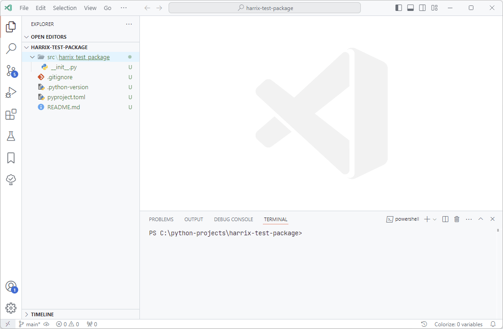

_Рисунок 1 — Созданный пустой проект_

Создайте под свой проект виртуальное окружение. У меня виртуальное окружение будет находиться в папке `.venv`, находящейся в папке с проектом:

```python
rye sync
```

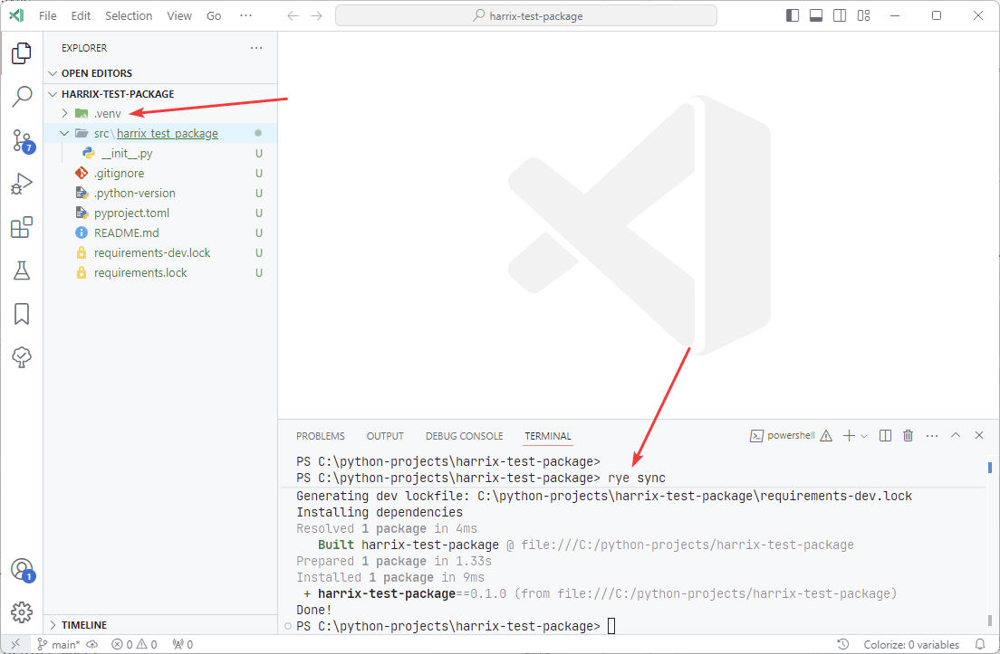

_Рисунок 2 — Вызов rye sync_

## Установка пакетов

Для тестирования внедрения сторонних пакетов в нашу библиотеку установим два популярных пакета `numpy` и `black`. Причем второй пакет будем устанавливать в режиме `--dev`, так как этот пакет нужен для разработки нашей библиотеки, но не нужен человеку, который установит наш пакет. И да, если используешь Rye, то лучше использовать команду `rye fmt` вместо `black` для форматирования кода, но сейчас мы просто тестируем добавление пакета для разработки. Также устанавливаем библиотеку `pytest` для тестирования библиотеки:

```python
rye add numpy
rye add --dev black
rye add --dev pytest
```

Информация об установленных библиотеках будет располагаться в файлах:

- `pyproject.toml`
- `requirements.lock`
- `requirements-dev.lock`

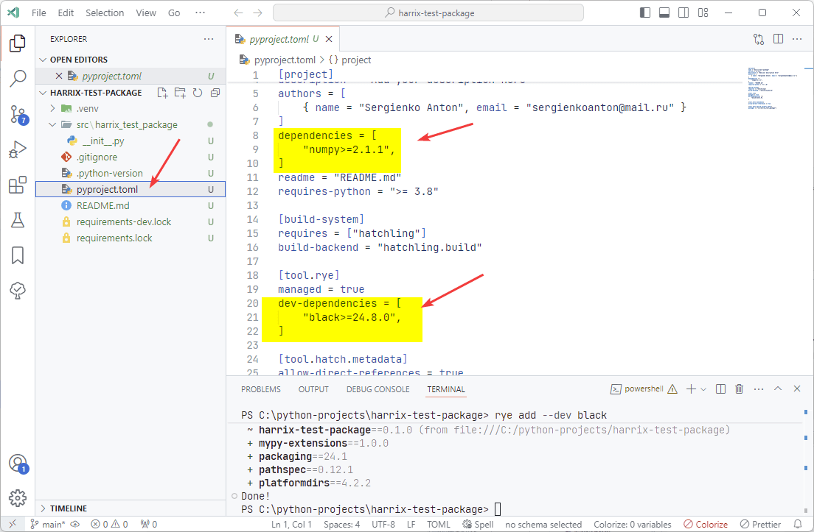

_Рисунок 3 — Установленные библиотеки_

## Создание пакета

У нас будет простой пакет с тремя функциями:

```python
import numpy as np

def multiply_2(x):
    return x * 2

def multiply_10(x):
    return x * 10

def test_numpy():
    return np.arange(-2, 2, 0.5)
```

Для этого создаем файл `functions.py` (у вас он будет называться по другому) в в папке `src\harrix_test_package` и поместим вышеприведенный код:


_Рисунок 4 — Файл functions.py_

Обратите внимание, что внутри папки `src` располагается название пакета в том виде, в котором я буду его импортировать в других проектах. И в этом названии дефисы использовать нельзя по правилам синтаксиса Python. Поэтому папка называется `harrix_test_package` (без дефисов), а не `harrix-test-package`.

Файл `src\harrix_test_package\__init__.py` импортирует всё то, что есть в нашем пакете для пользователей:

```python
from .functions import *
```

Проверку нашего пакета будем делать через [pytest](https://docs.pytest.org/en/stable/) (он используется в Rye по умолчанию). Именно для этого выше мы его устанавливали через `rye add pytest --dev`:

Для тестов создадим папку `tests` с файлами тестов. Не забудьте, что название файла тестов должно начинаться с `test_`

Файл `tests\test_functions.py`:

```python
import harrix_test_package as h

def test_multiply_2():
    re = h.multiply_2(2)
    assert re == 4


def test_multiply_10():
    re = h.multiply_10(2)
    assert re == 20

def test_test_numpy():
    re = len(h.test_numpy())
    assert re == 8
```

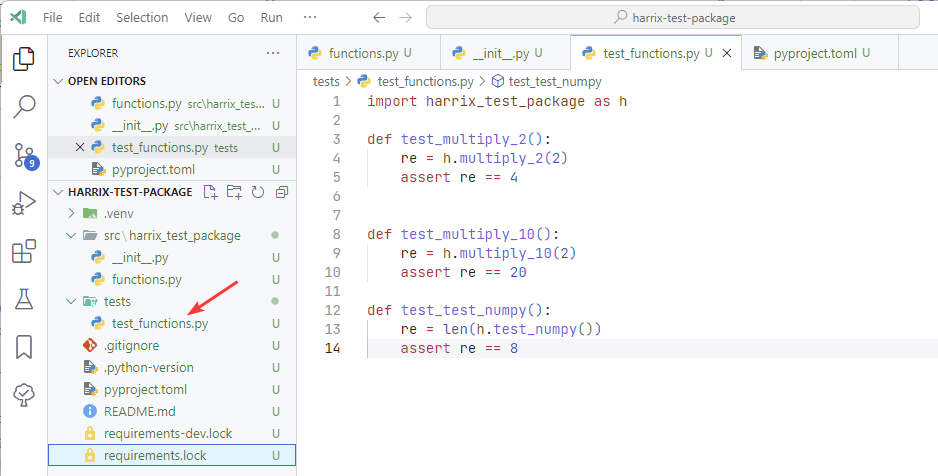

_Рисунок 5 — Файл с тестами функций_

Теперь рассмотрим файлы настроек проекта.

Файл `pyproject.toml` с внесенными изменениями:

```toml
[project]
name = "harrix-test-package"
version = "0.5"
description = "Test package"
authors = [{ name = "Anton Sergienko", email = "anton.b.sergienko@gmail.com" }]
dependencies = ["numpy>=2.1.1"]
readme = "README.md"
requires-python = ">= 3.8"
license = {file = "LICENSE"}

[project.urls]
Homepage = "https://github.com/Harrix/harrix-test-package"

[build-system]
requires = ["hatchling"]
build-backend = "hatchling.build"

[tool.rye]
managed = true
dev-dependencies = ["black>=24.8.0", "pytest>=8.3.3"]

[tool.hatch.metadata]
allow-direct-references = true

[tool.hatch.build.targets.wheel]
packages = ["src/harrix_test_package"]
```

У меня версия пакета равна `0.5`, так как этот пакет уже использовался для экспериментов по созданию пакета другими средствами Python. У вас же она будет равна скорее всего `0.1`, `0.0.1` или `1.0` — всё зависит от выбранной вами нумерации версий пакетов.

Параметры `name`, `description`, `Homepage`, `authors` поменяйте под себя. Раздел `project.urls` добавил вручную, так что, если у вас нет страницы проекта, то можно удалить. Аналогично со строкой `license = {file = "LICENSE"}`.


_Рисунок 6 — Файл pyproject.toml_

Создадим файл лицензии `LICENSE`, в котором располагается текст вашей лицензии. У меня это [MIT лицензия](https://en.wikipedia.org/wiki/MIT_License). Блок `[Year] [Your name]` поменяйте под себя:

```markdown
MIT License

Copyright (c) [Year] [Your name]

Permission is hereby granted, free of charge, to any person obtaining a copy
of this software and associated documentation files (the "Software"), to deal
in the Software without restriction, including without limitation the rights
to use, copy, modify, merge, publish, distribute, sublicense, and/or sell
copies of the Software, and to permit persons to whom the Software is
furnished to do so, subject to the following conditions:

The above copyright notice and this permission notice shall be included in all
copies or substantial portions of the Software.

THE SOFTWARE IS PROVIDED "AS IS", WITHOUT WARRANTY OF ANY KIND, EXPRESS OR
IMPLIED, INCLUDING BUT NOT LIMITED TO THE WARRANTIES OF MERCHANTABILITY,
FITNESS FOR A PARTICULAR PURPOSE AND NONINFRINGEMENT. IN NO EVENT SHALL THE
AUTHORS OR COPYRIGHT HOLDERS BE LIABLE FOR ANY CLAIM, DAMAGES OR OTHER
LIABILITY, WHETHER IN AN ACTION OF CONTRACT, TORT OR OTHERWISE, ARISING FROM,
OUT OF OR IN CONNECTION WITH THE SOFTWARE OR THE USE OR OTHER DEALINGS IN THE
SOFTWARE.
```

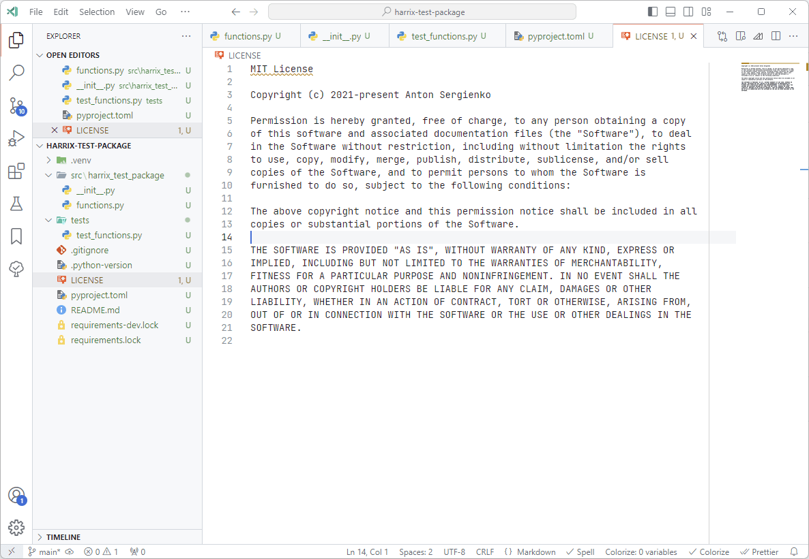

_Рисунок 7 — Файл LICENSE_

Файл `README.md` содержит описание вашего пакета в формате [Markdown](https://ru.wikipedia.org/wiki/Markdown). Оно может быть любым. У меня оно такое:

````markdown
# harrix-test-package

Test package.

## Install

```shell
pip install harrix-test-package
```

```shell
rye add harrix-test-package
```

## Using

```python
import harrix_test_package as h


print(h.multiply_2(2))
```
````


_Рисунок 8 — Файл README.md_

## Тестирование пакета

Мы уже создали папку `tests` с файлом тестов, а также установили `pytest` (если не установили, то установите через `rye add --dev pytest`). Так что для тестирования пакета нужно только запустить команду в терминале:

```shell
rye test
```

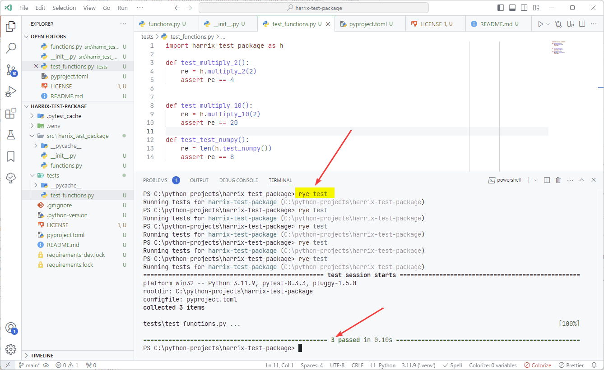

_Рисунок 9 — Результат тестирования пакета_

Устанавливать наш пакет в режиме разработчика, как в pip, не нужно.

## Сборка пакета и публикация на TestPyPi

Данный раздел был удален после написания, так как мой пакет использует `numpy`, а этого пакета нет на TestPyPi, что приводит к проблемам установки моего пакета.

Однако, если вы захотите собрать пакет и отправить его на TestPyPi, то зарегистрируйтесь на [TestPyPi](https://test.pypi.org/account/register/). Также там нужно будет [настроить двуфакторную авторизацию](https://test.pypi.org/manage/account/two-factor/). Я для этого использовал Microsoft Authenticator.

Соберите пакет для публикации и опубликуйте:

```shell
rye build
rye publish --repository testpypi --repository-url https://test.pypi.org/legacy/
```

## Сборка пакета и публикация на PyPi

Зарегистрируйтесь на [PyPi](https://pypi.org/account/register/). Также там нужно будет [настроить двуфакторную авторизацию](https://pypi.org/manage/account/two-factor/). Я для этого использовал Microsoft Authenticator.

Соберите пакет для публикации и опубликуйте:

```shell
rye build
```

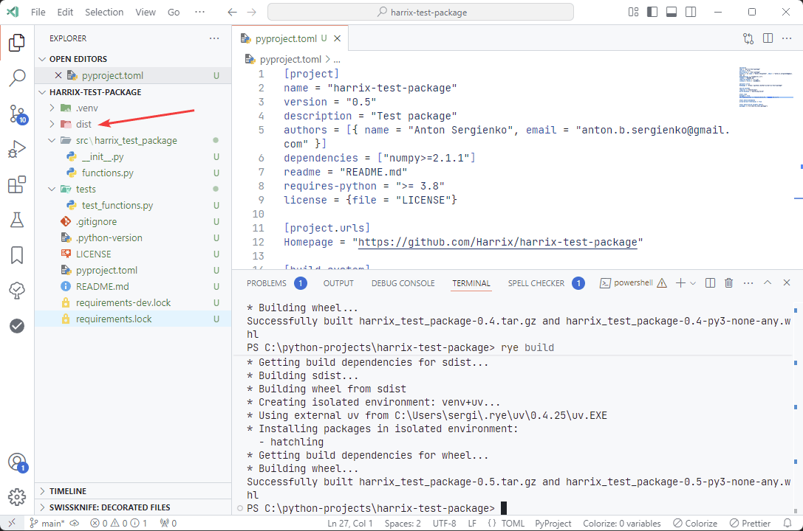

_Рисунок 10 — Процесс сборки пакета_

Отправьте пакет на тестовый сервер:

```python
rye publish
```

Вас попросят токен:

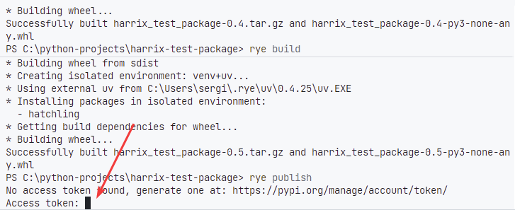

_Рисунок 11 — Запрос токена_

Этот токен который вы можете сгенерировать на странице <https://pypi.org/manage/account/token/>. Если вас попросят какой-то код аутентификации, то у вас настроена двуфакторная авторизация, и надо этот код получить вашим настроенным способом. У меня это Microsoft Authenticator. Итак, этап с кодом прошли, так что создаем токен:

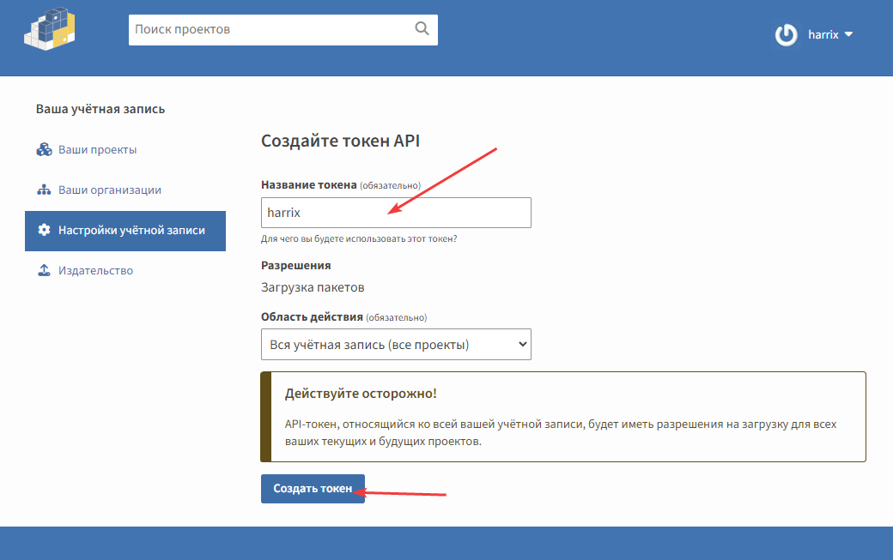

_Рисунок 12 — Создание токена_

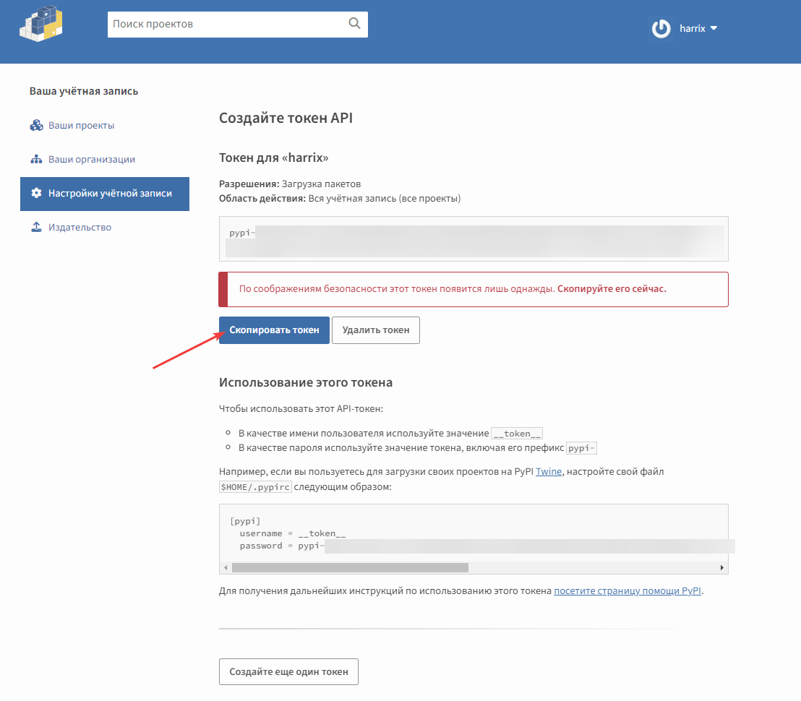

_Рисунок 13 — Созданный токен_

Копируем и вставляете токен в VSCode, жмете `Enter`, процесс пошел.

Вас спросят в первый раз вопрос `Encrypt with passphrase (optional)`. Можете нажать на `Enter`, если доверяете тому компьютеру, за которым сидите. Так как rye должен сохранить ваш токен, чтобы не вводить его каждый раз с нуля, то он хочет узнать, вы хотите токен сохранить незашифрованным (если нажмете `Enter`) или зашифрованным, но тогда надо ввести этот пароль (парольная фраза). В этом случае введете произвольный новый пароль Он не является паролем с сайта PyPI, это не сам токен — это новый пароль для шифровки вашего токена.

В случае успеха будет напечатана ссылка на опубликованный пакет:

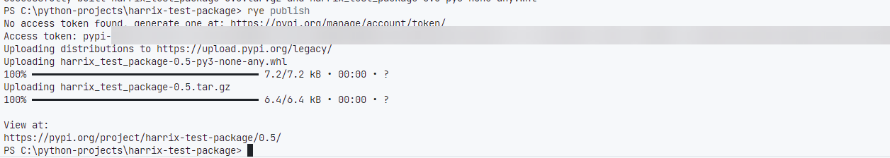

_Рисунок 14 — Успешная публикация_

У меня это <https://pypi.org/project/harrix-test-package/0.5/>:

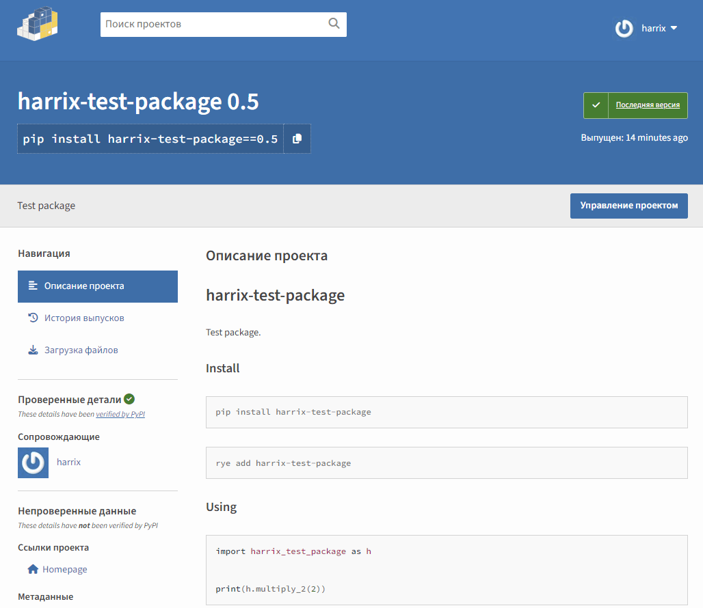

_Рисунок 15 — Опубликованный пакет_

Если вы что-то накосячили с авторизацией и сгенерированным токеном (когда был просто логин и пароль, то было проще), то может выпасть вот такая ошибка:

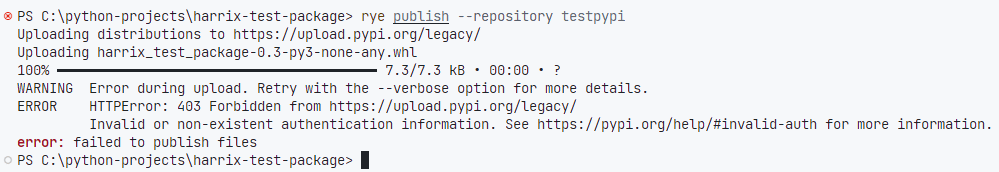

_Рисунок 16 — Ошибка авторизации_

В таком случае надо как-то удалить введенный неправильный токен. Для этого нужно найти файл настроек Rye `credentials`. Он находится в папке `~/.rye` (Unix) или `%USERPROFILE%\.rye` (Windows). Его можно удалить или очистить от ненужного токена. После этого повторно произвести публикацию пакета.

Иногда, если вы забыли поменять версию пакета, его собрали, исправили версию, пересобрали пакет и отправили на сервер, то выдается ошибка, что такой пакет уже был:

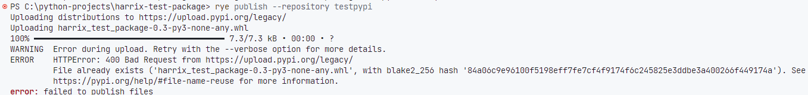

_Рисунок 17 — Ошибка публикации_

Нужно просто или собрать пакет через `rye build --clean`, либо удалить папку `dist`:

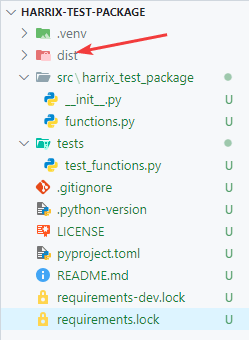

_Рисунок 18 — Папка dist_

## Использование пакета, опубликованного на PyPi

Для проверки опубликованного пакета создаем новый Python проект с использованием Rye (например, с именем `test`) со своим виртуальным окружением, куда установлю опубликованный пакет. Можно сделать [обычным способом](https://github.com/Harrix/harrix.dev-articles-2024/blob/main/rye-vscode-python/rye-vscode-python.md) | [↗️](https://harrix.dev/ru/articles/2024/rye-vscode-python.md/), а можно через консоль с открытием проекта в VSCode. Привожу код для Windows через PowerShell:

```shell
cd C:\python-projects
rye init test
cd test
rye sync
rye add harrix-test-package
"" | Out-File -FilePath src\test\main.py -Encoding utf8
code C:\python-projects\test
```

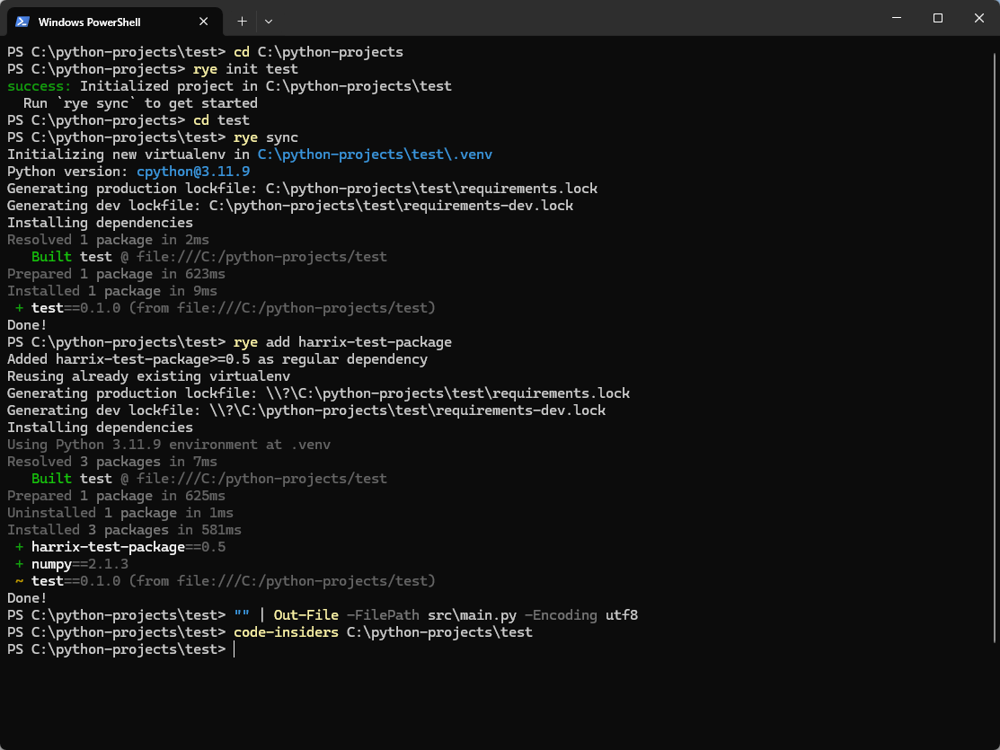

_Рисунок 19 — Выполнение команд в терминале_

Так как я использую Visual Studio Code Insiders, то последняя строчка у меня выглядит как `code-insiders C:\python-projects\test`

В файле `src\main.py` внесем пример кода:

```python
import harrix_test_package as h

print(h.multiply_2(2))

print(h.multiply_10(2))

print(len(h.test_numpy()))
```

Запустим код:

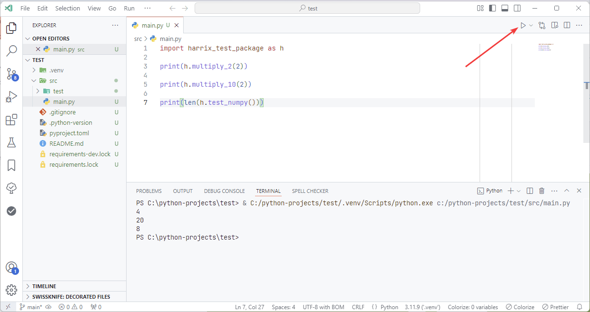

_Рисунок 20 — Использование пакета_

## Использование пакета, опубликованного на PyPi, с pip

Пакет, который был создан — универсальный. Его можно использовать не только в проектах с rye. Давайте создадим пустой проект в PyCharm c стандартным `venv`.

В терминале напишем `pip install harrix-test-package`:

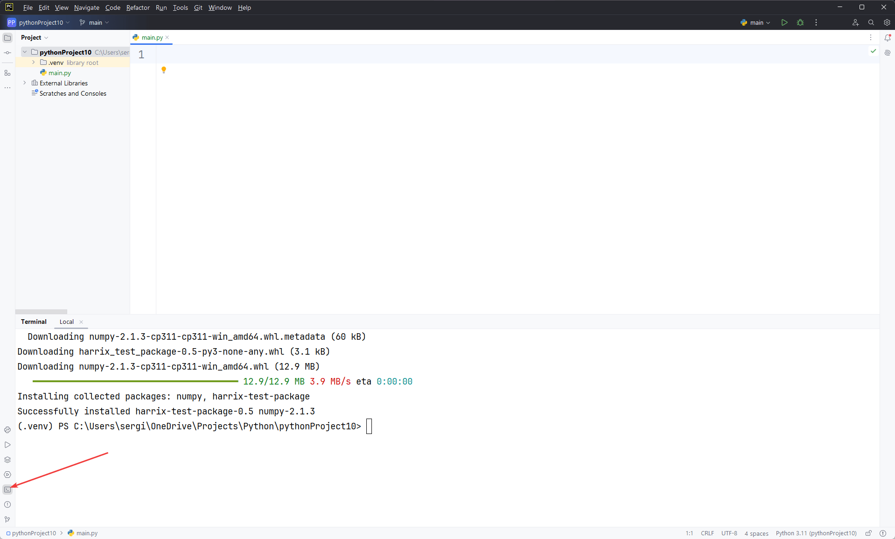

_Рисунок 21 — Установка пакета в PyCharm_

Напишем код использования библиотеки и запустим. Всё работает:

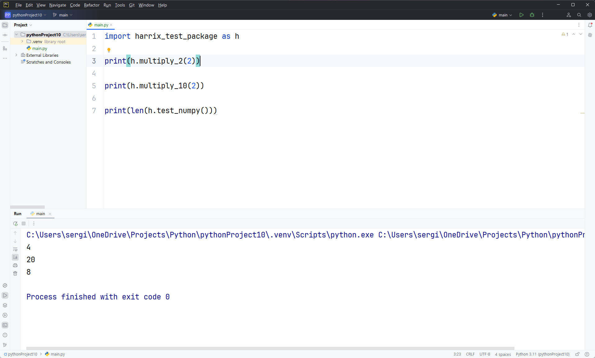

_Рисунок 22 — Запуск кода с использованием пакета_

## Публикация новой версии пакета

Попробуем добавить новую функцию в пакет и опубликовать новую версию. Итак, мега полезная функция:

```python
def multiply_20(x):
    return x * 20
```

После добавления файл `src\harrix_test_package\functions.py` примет вид:

```python
import numpy as np


def multiply_2(x):
    return x * 2


def multiply_10(x):
    return x * 10


def test_numpy():
    return np.arange(-2, 2, 0.5)


def multiply_20(x):
    return x * 20
```

Также добавим новый тест в файл `tests\test_functions.py`:

```python
import harrix_test_package as h


def test_multiply_2():
    re = h.multiply_2(2)
    assert re == 4


def test_multiply_10():
    re = h.multiply_10(2)
    assert re == 20


def test_test_numpy():
    re = len(h.test_numpy())
    assert re == 8

def test_multiply_20():
    re = h.multiply_20(2)
    assert re == 40
```

Теперь надо запустить тесты:

```shell
rye test
```

Тесты успешно пройдены:

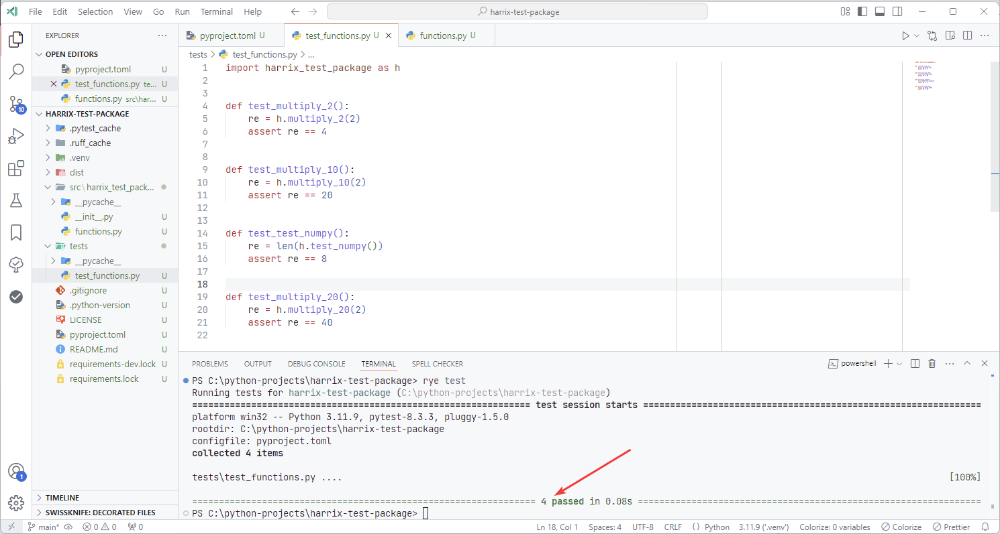

_Рисунок 23 — Тестирование пакета_

В файле `pyproject.toml` поменяем номер версии пакета на следующую, у меня это `0.6`:

```toml
[project]
name = "harrix-test-package"
version = "0.6"
description = "Test package"
authors = [{ name = "Anton Sergienko", email = "anton.b.sergienko@gmail.com" }]
dependencies = ["numpy>=2.1.1"]
readme = "README.md"
requires-python = ">= 3.8"
license = {file = "LICENSE"}

[project.urls]
Homepage = "https://github.com/Harrix/harrix-test-package"

[build-system]
requires = ["hatchling"]
build-backend = "hatchling.build"

[tool.rye]
managed = true
dev-dependencies = ["black>=24.8.0", "pytest>=8.3.3"]

[tool.hatch.metadata]
allow-direct-references = true

[tool.hatch.build.targets.wheel]
packages = ["src/harrix_test_package"]
```

Собираем и публикуем пакет:

```shell
rye build --clean
rye publish
```

Если вы шифровали токен, то надо будет ввести при публикации пароль.

Публикация нового проекта завершена.

В проектах, в котором использовался наш пакет обновляем его через команду:

```shell
rye sync --update harrix-test-package
```

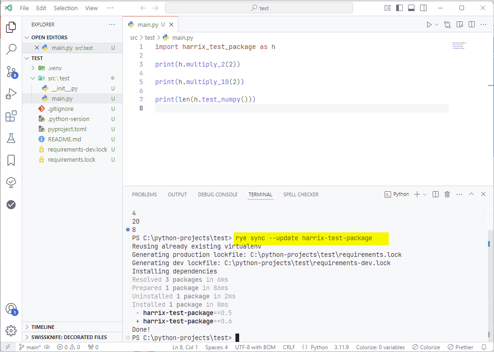

_Рисунок 24 — Обновление пакета_

Или через `pip install harrix-test-package --upgrade`, если ваш проект использует pip.

## Развертывание разработки пакета на новой машине

У нас есть, например, на GitHub [исходники](https://github.com/Harrix/harrix-test-package) нашего пакета, которые мы хотим склонировать на другой компьютер, например, в папку `c:\projects` (для примера папку специально назвал по-другому, чтобы она отличалась от `c:\python-projects`).

Считаем, что [Python](https://github.com/Harrix/harrix.dev-articles-2021/blob/main/install-python/install-python.md) | [↗️](https://harrix.dev/ru/articles/2021/install-python/), [Git](https://github.com/Harrix/harrix.dev-articles-2021/blob/main/install-git/install-git.md) | [↗️](https://harrix.dev/ru/articles/2021/install-git/), [Rye](https://github.com/Harrix/harrix.dev-articles-2024/blob/main/rye-vscode-python/rye-vscode-python.md) | [↗️](https://harrix.dev/ru/articles/2023/rye-vscode-python/) и VSCode у вас установлены на новой машине.

Cклонировать проект можно такой командой:

```shell
mkdir c:\projects
cd c:\projects
git clone https://github.com/Harrix/harrix-test-package
cd c:\projects\harrix-test-package
```

Или вы просто копируете как-нибудь свой проект на другую машину (да хоть через флешку).

Пишем команду для создания виртуального окружения с теми же самыми библиотеками, что были в проекте. Это прописано в файлах `requirements.lock` и `requirements-dev.lock`:

```shell
rye sync
```

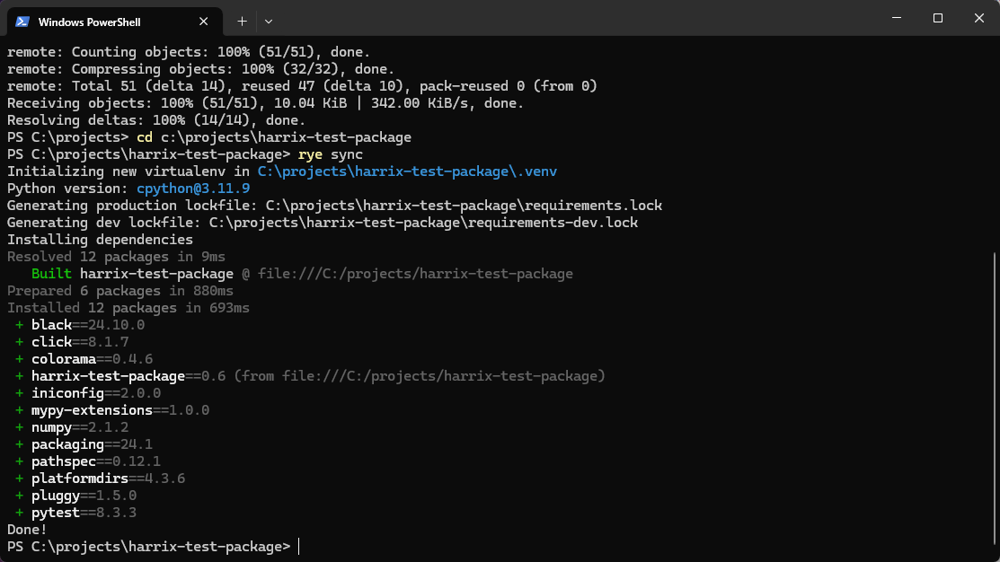

_Рисунок 25 — Выполнение команд в терминале_

Я выполнял команды в терминале, но вы можете спокойно их выполнять и в VSCode.

Теперь проект можете открыть в VSCode:

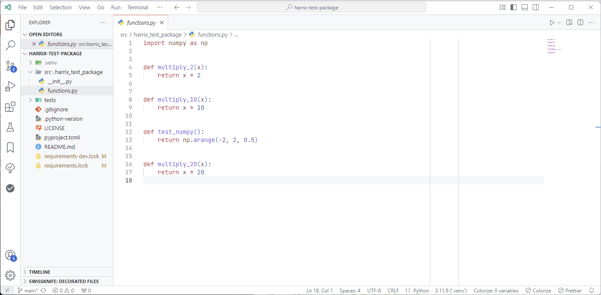

_Рисунок 26 — Проект открытый в VSCode_

Всё. Можете спокойно работать со своим проектом.

## Установка локального пакета

Если вы пока не хотите публиковать разрабатываемый пакет, но хотите использовать его в другом проекте, то его можно установить локально:

```shell
rye add c:/python-projects/harrix-test-package
```

В качестве `c:/projects/harrix-test-package` выступает путь, где находится локальный пакет.
