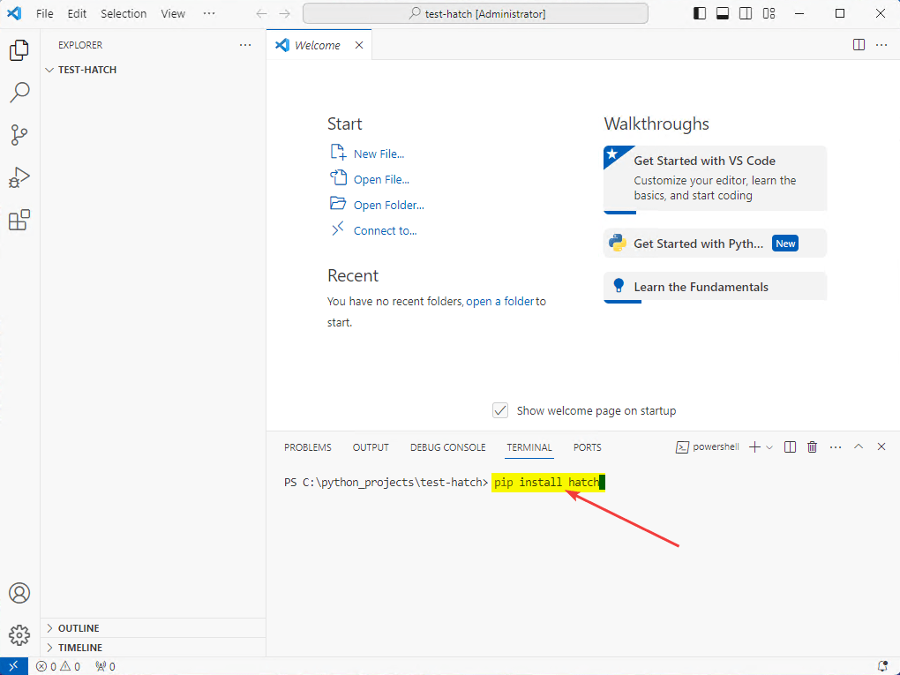

# Настройка Hatch (Python) в VSCode


Вместо Pipenv, venv используем современный Hatch для работы с виртуальным окружением.

## Ссылки

- [Hatch](https://hatch.pypa.io/latest/) — документация.

## Подготовка

<details>
<summary>Установка программ и создание папки для проектов</summary>

Разумеется, нужен Python. Если его нет, то смотрите статью [Установка Python](https://github.com/Harrix/harrix.dev-articles-2021/blob/main/install-python/install-python.md) | [🡥](https://harrix.dev/ru/articles/2021/install-python/).

Нужен VSCode. Если его нет, то смотрите статью [Установка Visual Studio Code (простая)](https://github.com/Harrix/harrix.dev-articles-2021/blob/main/install-vscode-simple/install-vscode-simple.md) | [🡥](https://harrix.dev/ru/articles/2021/install-vscode-simple/).

Нужно расширение Python в VScode:


_Рисунок 1 — Установка расширения Python_

Не забудьте перейти в раздел файлов:


_Рисунок 2 — Раздел Explorer_

Создайте на компьютере папку, где будут располагаться проекты, например, `C:\python-projects`, если у вас еще нет папки для Python проектов (например, через команду `mkdir C:\python_projects\` или просто через проводник). Через `File` → `Open Folder...` откройте эту папку (там тоже через окно открытия папки можно создать нужную папку):


_Рисунок 3 — Открытие папки_

Вас спросят о том, доверяете ли вы авторам этой папки. Но ведь эту папку вы только что создали? Так что доверяем:


_Рисунок 4 — Подтверждение доступа к папке_

И включите режим автосохранения, чтобы не забывать сохранять изменения в файле:


_Рисунок 5 — Режим Auto Save_

</details>

## Краткий пересказ

```console
pip install hatch
mkdir C:\python_projects\
cd C:\python_projects\
hatch new "Test Hatch"
cd test-hatch
hatch shell
```

## Установка Hatch и создание проекта

Вызываем консоль `Ctrl` → `` ` `` (`Ctrl` → `Ё`), прописываем команду установки Hatch глобально (после ввода команды не забываем нажать `Enter`):

```console
pip install hatch
```



_Рисунок 6 — Установка Hatch_

Если команда не срабатывает, то попробуйте `python -m pip install hatch`.

Возможно, что вас попросят обновить `pip` через команду `python.exe -m pip install --upgrade pip`. Почему бы и нет (скриншот приведен из другого эксперимента с Hatch):


_Рисунок 7 — Обновление pip_

Теперь можно создать проект для Hatch. Вместо `Test Hatch` введите имя своего проекта:

```console
hatch new "Test Hatch"
```


_Рисунок 8 — Инициализация проекта_

Итак, у нас из названия проекта `Test Hatch` создалась папка `test-hatch`. Если вы назвали проект по другому, то и название папки будет другим. Командой `cd test-hatch` переходим в эту папку проекта:


_Рисунок 9 — Переход в папку проекта_


_Рисунок 10 — _

## Виртуальное окружение

Теперь нужно создать виртуальное окружение через команду:

```console
hatch shell
```


_Рисунок 11 — _


_Рисунок 12 — _


_Рисунок 13 — _


_Рисунок 14 — _


_Рисунок 15 — _


_Рисунок 16 — _


_Рисунок 17 — _


_Рисунок 18 — _


_Рисунок 19 — _


_Рисунок 20 — _

## Добавление библиотеки


_Рисунок 21 — _


_Рисунок 22 — _
