# Установка Hatch (Python) в VSCode


Вместо Pipenv, venv используем современный Hatch для работы с виртуальным окружением.

<details>
<summary>📖 Содержание</summary>

## Содержание

- [Ссылки](#ссылки)
- [Подготовка](#подготовка)
- [Установка Hatch и создание проекта](#установка-hatch-и-создание-проекта)
- [Виртуальное окружение](#виртуальное-окружение)
- [Добавление библиотеки](#добавление-библиотеки)

</details>

Первоначально эта статья должна была быть более подробной, так как хотел в своей деятельности перейти на Hatch, но по итогу перешел на Rye, так что тут только основное.

## Ссылки

- [Hatch](https://hatch.pypa.io/latest/) — документация.

## Подготовка

<details>
<summary>Установка программ и создание папки для проектов</summary>

Разумеется, нужен Python. Если его нет, то смотрите статью [Установка Python](https://github.com/Harrix/harrix.dev-articles-2021/blob/main/install-python/install-python.md) | [↗️](https://harrix.dev/ru/articles/2021/install-python/).

Нужен VSCode. Если его нет, то смотрите статью [Установка Visual Studio Code (простая)](https://github.com/Harrix/harrix.dev-articles-2021/blob/main/install-vscode-simple/install-vscode-simple.md) | [↗️](https://harrix.dev/ru/articles/2021/install-vscode-simple/).

Нужно расширение Python в VScode:

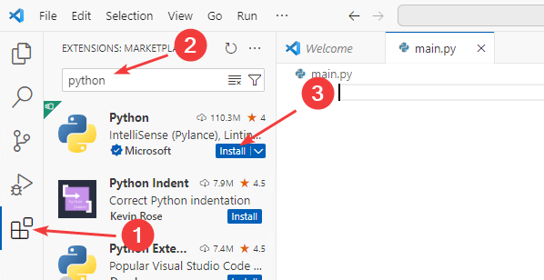

_Рисунок 1 — Установка расширения Python_

Не забудьте перейти в раздел файлов:

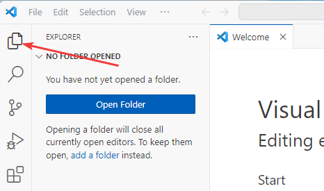

_Рисунок 2 — Раздел Explorer_

Создайте любым способом на компьютере папку, где будут располагаться проекты, например, `C:\python-projects`, если у вас еще нет папки для Python проектов (например, через команду `mkdir C:\python_projects\` или просто через проводник). Через `File` → `Open Folder...` откройте эту папку (там тоже через окно открытия папки можно создать нужную папку):

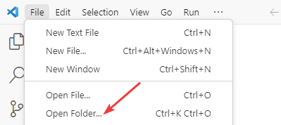

_Рисунок 3 — Открытие папки_

Вас спросят о том, доверяете ли вы авторам этой папки. Но ведь эту папку вы только что создали? Так что доверяем:

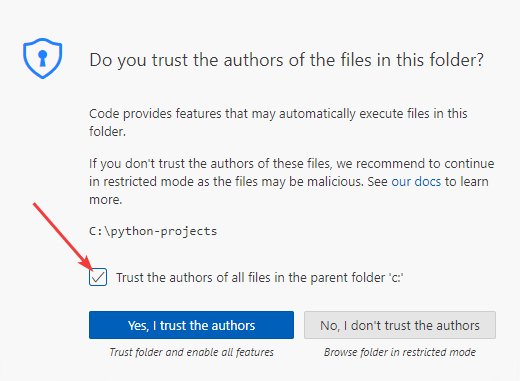

_Рисунок 4 — Подтверждение доступа к папке_

И включите режим автосохранения, чтобы не забывать сохранять изменения в файле:

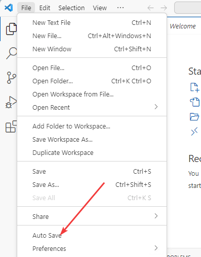

_Рисунок 5 — Режим Auto Save_

</details>

## Установка Hatch и создание проекта

Вызываем консоль `Ctrl` → `` ` `` (`Ctrl` → `Ё`), прописываем команду установки Hatch глобально (после ввода команды не забываем нажать `Enter`):

```shell
pip install hatch
```

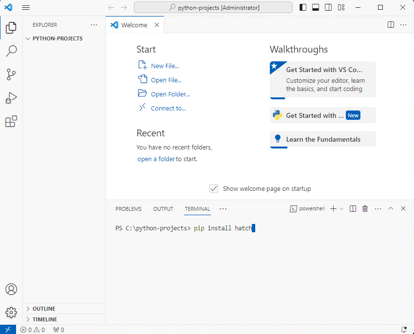

_Рисунок 6 — Установка Hatch_

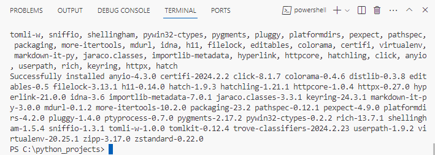

_Рисунок 7 — Успешная установка Hatch_

Если команда не срабатывает, то попробуйте `python -m pip install hatch`. Если и это не сработает, то скорее всего неправильно установили Python.

Возможно, что вас попросят обновить `pip` через команду `python.exe -m pip install --upgrade pip`. Почему бы и нет (скриншот приведен из другого эксперимента с Hatch):

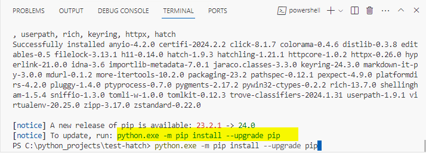

_Рисунок 8 — Обновление pip_

Теперь можно создать проект для Hatch. Вместо `Test Hatch` введите имя своего проекта:

```shell
hatch new "Test Hatch"
```

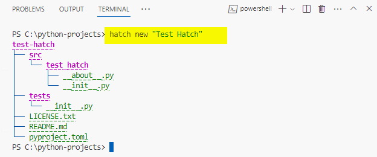

_Рисунок 9 — Инициализация проекта_

Итак, у нас из названия проекта `Test Hatch` создалась папка `test-hatch`. Обратите внимание, что в папке `src` создалась папка `test_hatch`, то есть сам проект для потенциальной публикации в интернете вместо пробела вставляет дефис, а внутри для работы импорта внутри Python скриптов пробел заменяется на нижнее подчеркивание. Если вы назвали проект по другому, то и название папки будет другим.

Командой `cd test-hatch` переходим в эту папку проекта:

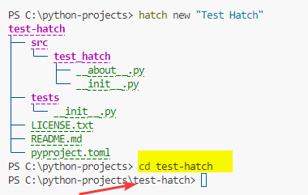

_Рисунок 10 — Переход в папку проекта_

Но лучше сразу откройте через `File` → `Open Folder...` вновь созданную папку `C:\python-projects\test-hatch` и откройте терминал `Ctrl` → `` ` `` (`Ctrl` → `Ё`):

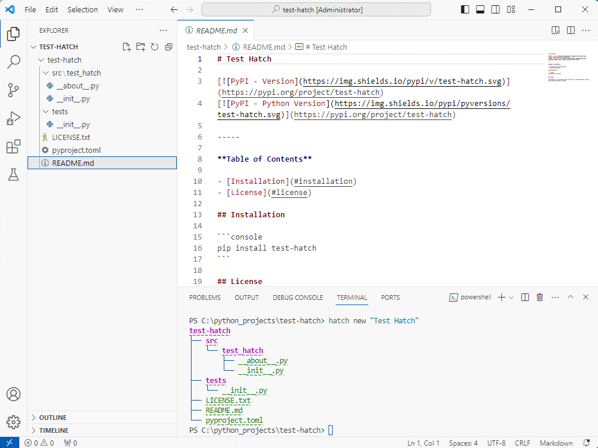

_Рисунок 11 — Открытая папка проекта test-hatch_

Если вы не откроете папку с проектом, то следующая команда по созданию виртуального окружения сработает на папку проектов, а не конкретного проекта.

## Виртуальное окружение

Теперь нужно создать виртуальное окружение через команду:

```shell
hatch shell
```

Так как виртуальное окружение после создания сразу активируется, то у вас в терминале в круглых скобках должно появиться название окружения:

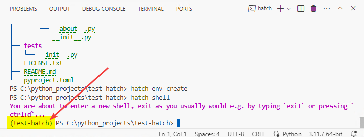

_Рисунок 12 — Созданное виртуальное окружение_

Если вдруг это не произошло, и, например, появилась подобная ошибка, как на рисунке ниже, то вполне возможно ошибка с групповыми политиками:

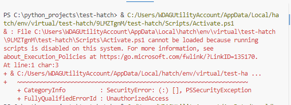

_Рисунок 13 — Ошибка при активации виртуального окружения_

Одно из возможных вариантов решения проблемы:

```shell
Set-ExecutionPolicy -Scope CurrentUser -ExecutionPolicy Unrestricted
```

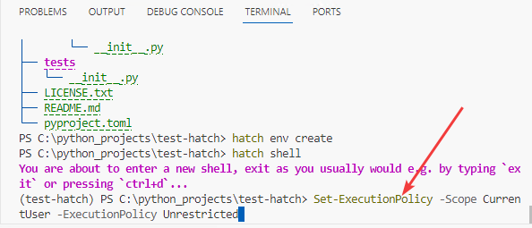

_Рисунок 14 — Исправление ошибки активации виртуального окружения_

После этого перегрузите VSCode и в терминале вызовите опять `hatch shell`.

Созданное виртуальное окружение можно найти в папке `%LOCALAPPDATA%\hatch\env\virtual`, если это потребуется.

Теперь создадим `main.py` в папке `scr/test_hatch`. Например, для этого можно кликнуть на указанную папку правой кнопкой мыши, а затем выбрать `New File...`:

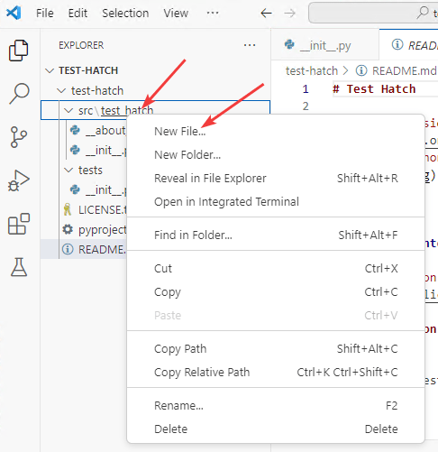

_Рисунок 15 — Выбор пункта создания нового файла_

Вводим имя файла `main.py` и нажимаем `Enter`:

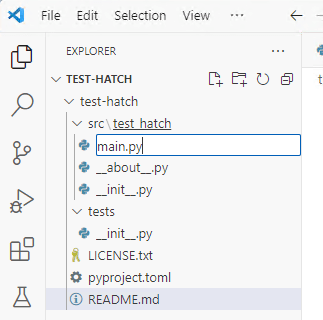

_Рисунок 16 — Создание нового файла_

Теперь VSCode нужно объяснить, чтобы он запускал Python из нашего виртуального окружения. VSCode к сожалению сам найти его не может и запускает глобальную версию Python. Для этого щелкаем в панели внизу справа по глобальной версии Python, а затем выбираем пункт `Enter interpreter path...`:

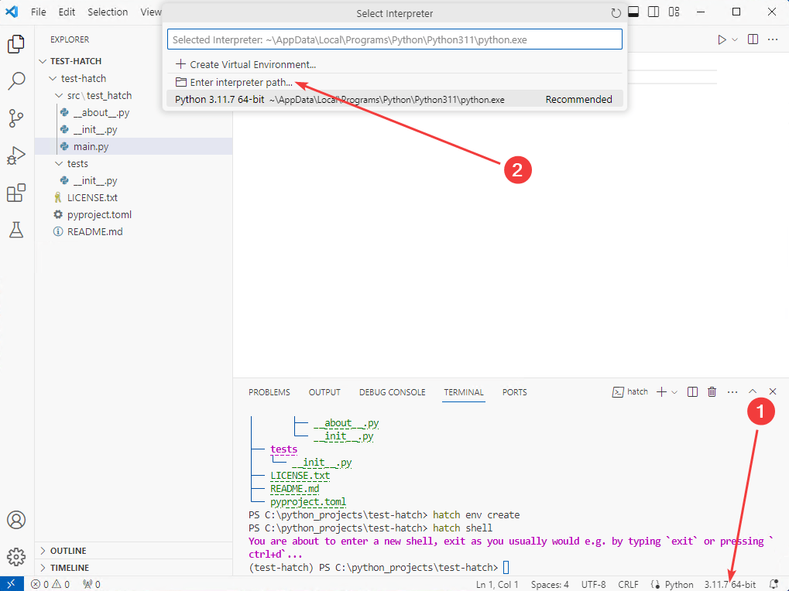

_Рисунок 17 — Выбор Enter interpreter path_

В папке `%LOCALAPPDATA%\hatch\env\virtual` находим папку с нашим виртуальным окружением и спускаемся в папку `Scripts`, где находится `python.exe`, полный путь которого и указываем:

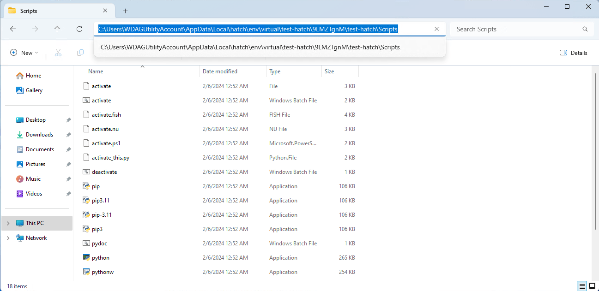

_Рисунок 18 — Путь с Python интерпретатором_

VSCode должен увидеть этот путь к интерпретатору:

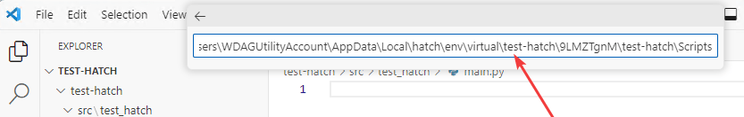

_Рисунок 19 — Установка пути к интерпретатору_

Если вы всё правильно сделали, то теперь внизу справа должно отображается имя вашего виртуального окружения:

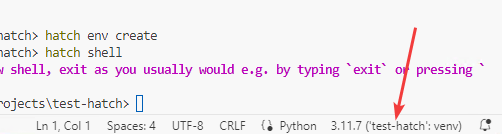

_Рисунок 20 — Отображение выбранного виртуального окружения_

Теперь можем протестировать запуск какого-нибудь Python скрипта:

```python
print(2+2)
```

Запускаем кнопкой запуска сверху справа:

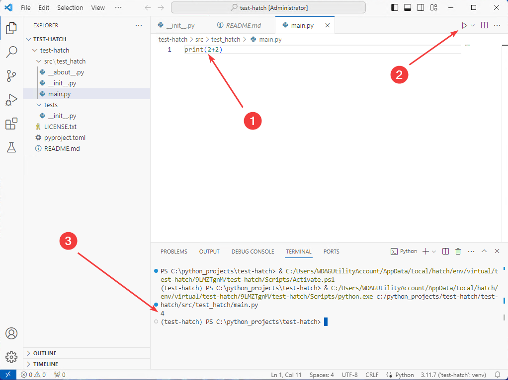

_Рисунок 21 — Запуск Python кода_

Если вы получили нужный вывод, то всё работает.

Часто возникает проблема, что запускается отдельный терминал, где работает не ваше виртуальное окружение, а глобальное. При этом вы не видите название виртуального окружения в круглых скобках:

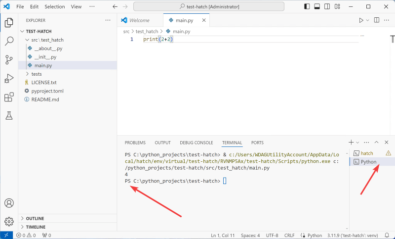

_Рисунок 22 — Запуск кода не через ваше виртуальное окружение_

Да, пример `print(2+2)` сработает, но при работе с библиотеками будет выдаваться сообщение, что их нет.

Для решения можно прописать в новом терминале `hatch shell`, и заново запустить скрипт. Тогда запуск будет произведен в нужном виртуальном окружении:

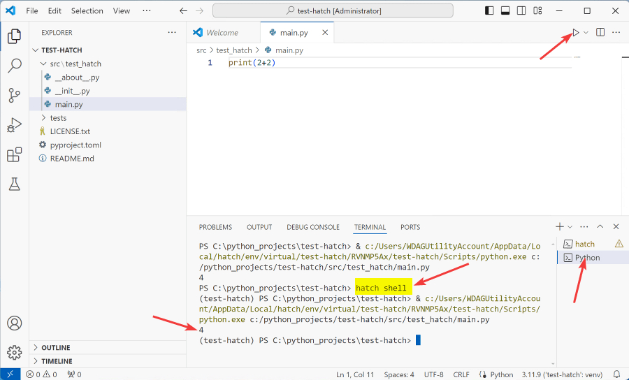

_Рисунок 23 — Повторный вызов hatch shell_

## Добавление библиотеки

Как добавляются библиотеки и как происходит их установка? В отличии от других систем, тут не нужно в консоли прописывать команду наподобие `pip install cowsay`. В Hatch нужно просто прописать название библиотеки в файле `pyproject.toml` в разделе `dependencies`:

```toml
dependencies = [
  "cowsay"
]
```

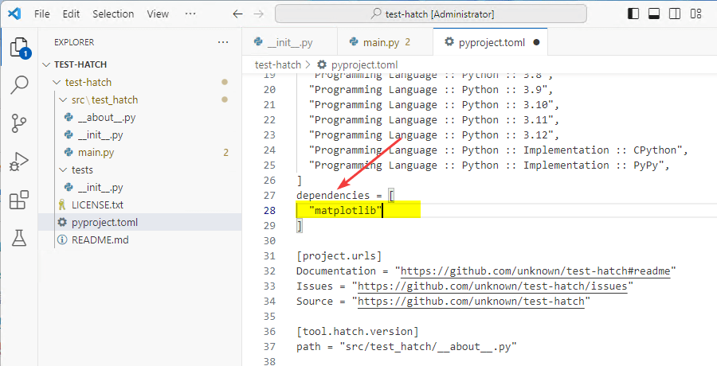

_Рисунок 24 — Добавление библиотеки_

Например, в `main.py` напишем такой код:

```python
import cowsay

cowsay.cow('Hello World')
```

Вначале он будет подчеркивать библиотеку как неустановленную:

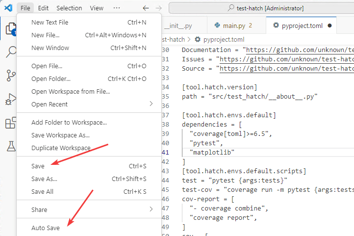

_Рисунок 25 — Сообщение, что библиотека не установлена_

При запуске Python скрипта (или активации виртуального окружения) произойдет автоматическая установка библиотеки. Но так должно быть. Почему у меня так не получается, не до конца разобрался. Поэтому мне приходится после добавления библиотеки в файл `pyproject.toml` вначале выйти из виртуального окружения, а потом уже заново в него войти. Тогда синхронизация библиотек происходит:

```shell
exit
hatch shell
```

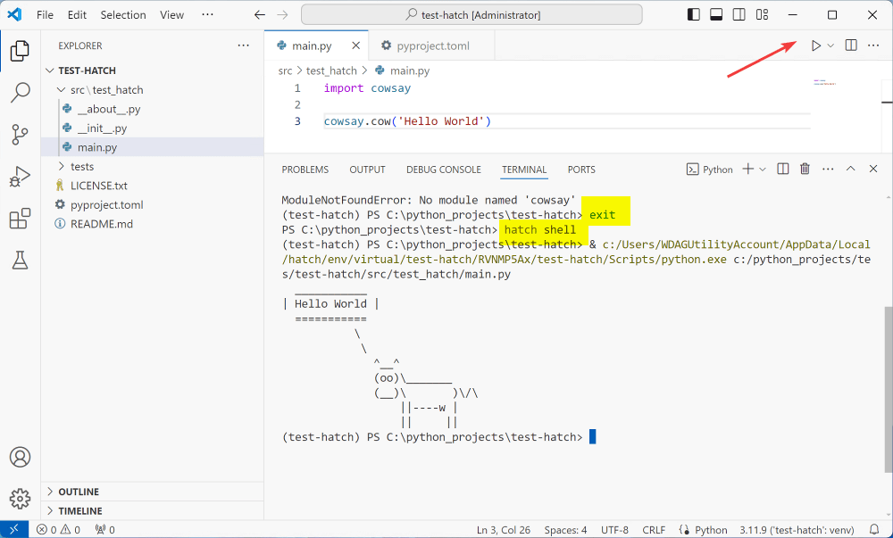

_Рисунок 26 — Установка библиотек через перезапуск виртуального окружения_

Для примера добавил еще `matplotlib` в файл `pyproject.toml`:

```toml
dependencies = [
  "cowsay",
  "matplotlib"
]
```

Применил `exit`, `hatch shell`. Добавил код в `main.py` запустил такой код:

```python
import cowsay

cowsay.cow('Hello World')

import matplotlib.pyplot as plt
import numpy as np

x = np.linspace(-5, 5, 200)
y = x ** 2

fig, ax = plt.subplots()
ax.plot(x, y)
plt.show()
```

Разумеется, что в Hatch больше [возможностей по настройке устанавливаемых библиотек](https://hatch.pypa.io/latest/config/dependency/).
