# Установка и настройка Visual Studio Code


- [Ссылки](#ссылки)
- [Скачивание](#скачивание)
- [Установка](#установка)
- [Выбор темы приложения](#выбор-темы-приложения)
- [Настройки VSCode](#настройки-vscode)
- [Меняем шрифт](#меняем-шрифт)
- [Дополнительные настройки VSCode](#дополнительные-настройки-vscode)
- [Настройка горячих клавиш](#настройка-горячих-клавиш)
- [Работа в программе](#работа-в-программе)
  - [Палитра команд](#палитра-команд)
  - [Работа с папками](#работа-с-папками)
  - [Рабочие области](#рабочие-области)
  - [Сохранение вкладки](#сохранение-вкладки)
  - [Терминал](#терминал)
  - [Поиск и замена](#поиск-и-замена)
  - [Быстрый переход к файлу](#быстрый-переход-к-файлу)
  - [Автодополнение](#автодополнение)
  - [Переход к расположению файла](#переход-к-расположению-файла)
  - [Разделение вкладок](#разделение-вкладок)
  - [CLI](#cli)
- [Настройка сниппетов](#настройка-сниппетов)
- [Проверка орфографии](#проверка-орфографии)
- [Расширения](#расширения)
  - [Russian Language Pack for Visual Studio Code](#russian-language-pack-for-visual-studio-code)
  - [Bookmarks](#bookmarks)
  - [Prettier - Code formatter](#prettier---code-formatter)
  - [Image preview](#image-preview)
  - [SVG Viewer](#svg-viewer)
  - [colorize](#colorize)
  - [Todo Tree](#todo-tree)
  - [Code Runner](#code-runner)
- [Работа с Git](#работа-с-git)
  - [Встроенный функционал](#встроенный-функционал)
  - [GitLens — Git supercharged](#gitlens--git-supercharged)
  - [Git History](#git-history)
- [Программирование на Python](#программирование-на-python)
  - [Расширения для Python](#расширения-для-python)
  - [Запуск Python кода](#запуск-python-кода)
    - [Стандартный запуск](#стандартный-запуск)
    - [Запуск в режиме отладки](#запуск-в-режиме-отладки)
    - [Запуск через консоль с Jupyter](#запуск-через-консоль-с-jupyter)
    - [Запуск через Code Runner](#запуск-через-code-runner)
    - [Запуск в Jupyter](#запуск-в-jupyter)
  - [Виртуальные среды](#виртуальные-среды)
    - [Venv](#venv)
    - [Virtualenv](#virtualenv)
    - [Pipenv](#pipenv)
    - [Несколько виртуальных сред](#несколько-виртуальных-сред)
    - [Принудительный выбор виртуальной среды](#принудительный-выбор-виртуальной-среды)
  - [Автоформатирование кода](#автоформатирование-кода)
- [Работа с Markdown](#работа-с-markdown)
  - [Markdown Preview Enhanced](#markdown-preview-enhanced)
  - [markdownlint](#markdownlint)
  - [Markdown Table Prettifier](#markdown-table-prettifier)
  - [Excel to Markdown table](#excel-to-markdown-table)
  - [Markdown All in One](#markdown-all-in-one)
- [Итоговый файл настроек](#итоговый-файл-настроек)
- [Синхронизация настроек в облаке](#синхронизация-настроек-в-облаке)

## Ссылки

- [Stable Build](https://code.visualstudio.com/).
- [Insiders Edition](https://code.visualstudio.com/insiders/).
- [Документация официальная](https://code.visualstudio.com/docs).
- [Плагины](https://marketplace.visualstudio.com/VSCode).
- [Темы](https://marketplace.visualstudio.com/search?target=VSCode&category=Themes&sortBy=Installs).

Расширения, рассмотренные в статье:

- [Flat UI](https://marketplace.visualstudio.com/items?itemName=lkytal.FlatUI) — светлая тема оформления.
- [Material Icon Theme](https://marketplace.visualstudio.com/items?itemName=PKief.material-icon-theme) — иконки типов файлов.
- [Code Spell Checker](https://marketplace.visualstudio.com/items?itemName=streetsidesoftware.code-spell-checker) — проверка орфографии.
- [Russian - Code Spell Checker](https://marketplace.visualstudio.com/items?itemName=streetsidesoftware.code-spell-checker-russian) — проверка орфографии русского языка.
- [Russian Language Pack for Visual Studio Code](https://marketplace.visualstudio.com/items?itemName=MS-CEINTL.vscode-language-pack-ru) — руссификатор интерфейса (сам не использую).
- [Bookmarks](https://marketplace.visualstudio.com/items?itemName=alefragnani.Bookmarks) — закладки в VSCode.
- [Prettier - Code formatter](https://marketplace.visualstudio.com/items?itemName=esbenp.prettier-vscode) — форматирование кода.
- [Image preview](https://marketplace.visualstudio.com/items?itemName=kisstkondoros.vscode-gutter-preview) — вплывающие превью изображений.
- [SVG Viewer](https://marketplace.visualstudio.com/items?itemName=cssho.vscode-svgviewer) — просмотрщик SVG изображений.
- [colorize](https://marketplace.visualstudio.com/items?itemName=kamikillerto.vscode-colorize) — подсветка кодов цвета.
- [Todo Tree](https://marketplace.visualstudio.com/items?itemName=Gruntfuggly.todo-tree) — показывает список `TODO` и `FIXME`.
- [Code Runner](https://marketplace.visualstudio.com/items?itemName=formulahendry.code-runner) — Позволяет запускать код на C++, Python, Java, JavaScript, PHP и др.
- [GitLens — Git supercharged](https://marketplace.visualstudio.com/items?itemName=eamodio.gitlens) — дополнительные возможности Git (обычно неактивен у меня).
- [Git History](https://marketplace.visualstudio.com/items?itemName=donjayamanne.githistory) — история коммитов репозитория (сам не использую).
- [Python](https://marketplace.visualstudio.com/items?itemName=ms-python.python) — основное расширение для работы с Python.
- [Jupyter](https://marketplace.visualstudio.com/items?itemName=ms-toolsai.jupyter) — расширения по работе с Jupyter блокнотами.
- [Jupyter Keymap](https://marketplace.visualstudio.com/items?itemName=ms-toolsai.jupyter-keymap) — горячие клавиши по работе с Jupyter.
- [Pylance](https://marketplace.visualstudio.com/items?itemName=ms-python.vscode-pylance) — статическая проверка Python кода.
- [Qt for Python](https://marketplace.visualstudio.com/items?itemName=seanwu.vscode-qt-for-python) — поддержка работы PyQt6 и PyQt5.
- [Markdown Preview Enhanced](https://marketplace.visualstudio.com/items?itemName=shd101wyy.markdown-preview-enhanced) — превью для Markdown файлов.
- [markdownlint](https://marketplace.visualstudio.com/items?itemName=DavidAnson.vscode-markdownlint) — линтер (статический анализатор) Markdown файлов.
- [Markdown Table Prettifier](https://marketplace.visualstudio.com/items?itemName=darkriszty.markdown-table-prettify) — выравниватель таблиц в Markdown.
- [Excel to Markdown table](https://marketplace.visualstudio.com/items?itemName=csholmq.excel-to-markdown-table) — копирование таблицы из Excel в Markdown.
- [Markdown All in One](https://marketplace.visualstudio.com/items?itemName=yzhang.markdown-all-in-one) — дополнительные возможности Markdown (сам не использую).

TODO доделать список плагинов

## Скачивание

Есть две версии VSCode:

- Стандартная версия: <https://code.visualstudio.com/>.
- Инсайдерская сборка: <https://code.visualstudio.com/insiders/>.

Вторая сборка программы обновляется каждый день и содержит самые последние возможности программы. За это придется платить возможным наличием багов. Но лично я уже несколько лет пользуюсь инсайдерской версией, и лишь несколько раз встречались критичные баги, которые оперативно исправлялись, и выходила версия без них. Поэтому буду показывать всё на примере инсайдерской версии.

Итак, перейдя по ссылке, скачиваем файл:

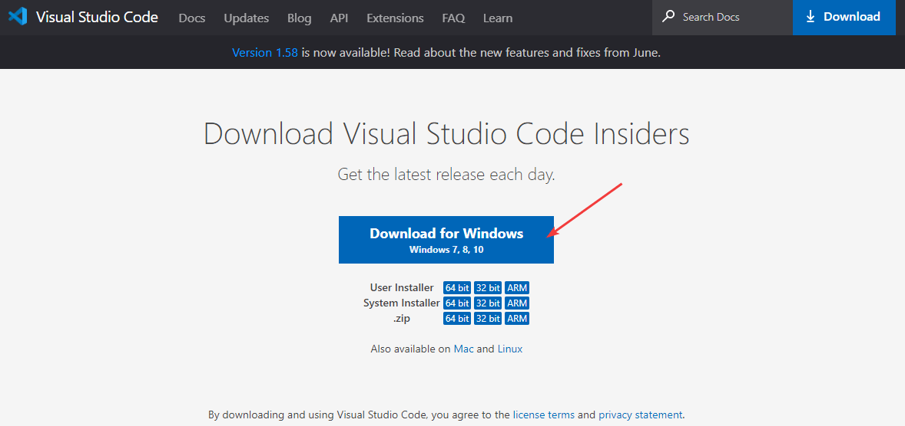

_Рисунок 1 — Скачивание файла_

## Установка

Запускаем файл и проходим стандартную установку:

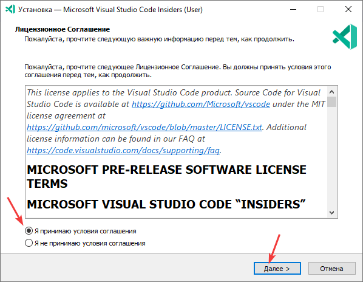

_Рисунок 2 — Соглашение с условиями_

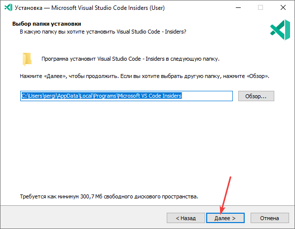

_Рисунок 3 — Выбор пути установки программы_

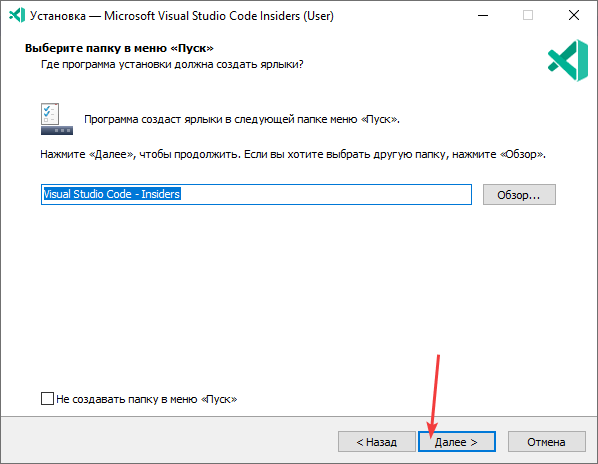

_Рисунок 4 — Выбор расположения программы в главном меню_

Так как VSCode возможно будет основным текстовым редактором у вас, то рекомендую выделить эти пункты:

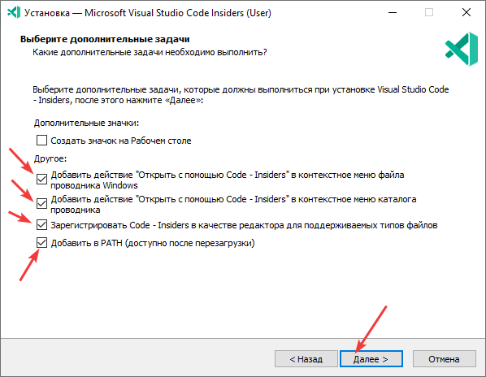

_Рисунок 5 — Настройка программы_

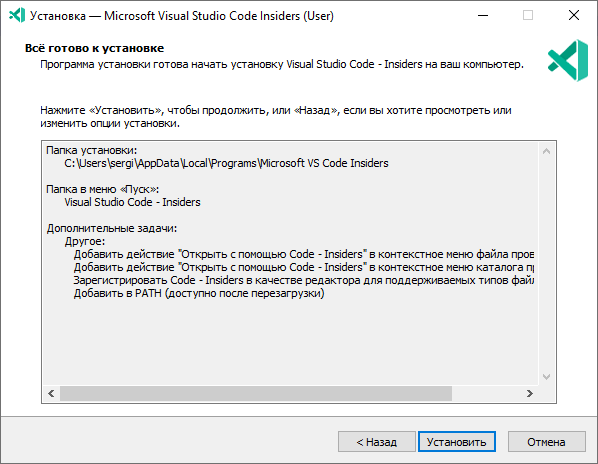

_Рисунок 6 — Выбранные параметры установка_

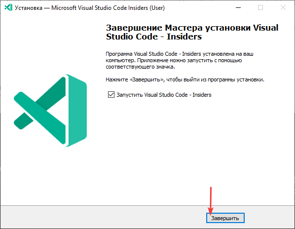

_Рисунок 7 — Конец установки_

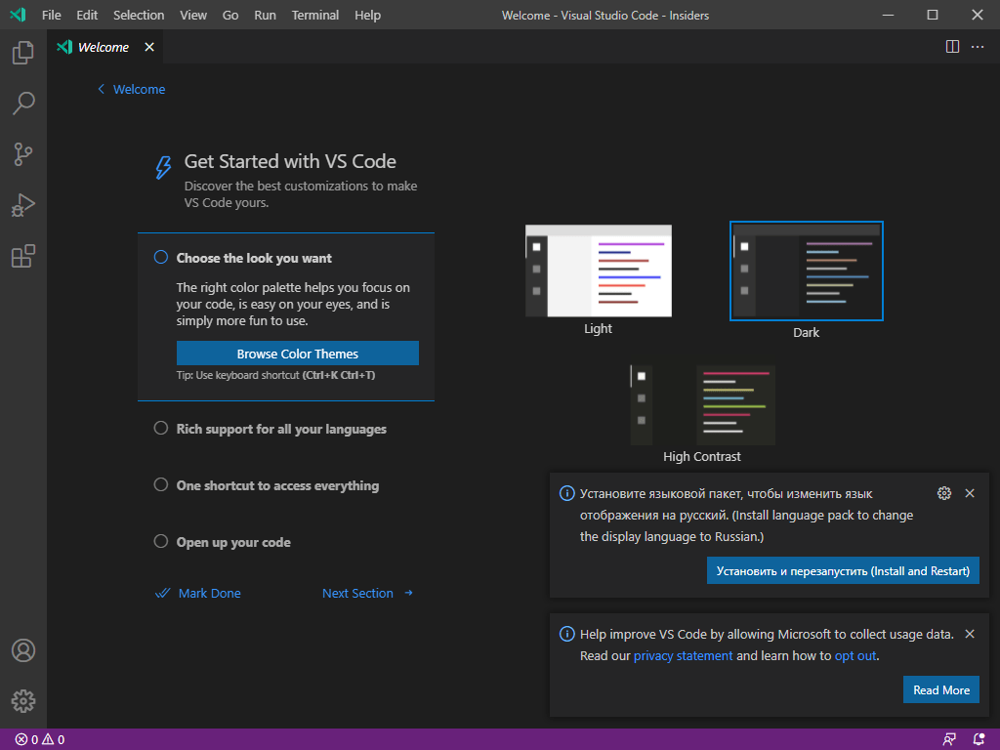

_Рисунок 8 — Запущенное приложение_

## Выбор темы приложения

Да, я понимаю, что многие любят темные темы в программах, но лично я всегда устанавливаю светлую тему. Что сейчас и сделаем.

Посмотреть все темы, которые можно установить, можно [тут](https://marketplace.visualstudio.com/search?target=VSCode&category=Themes&sortBy=Installs).

Перейдем в раздел расширений:

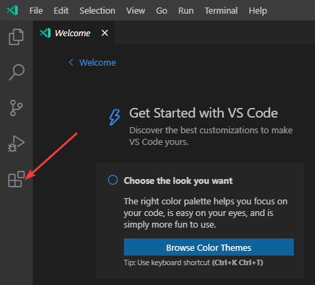

_Рисунок 9 — Раздел расширений_

Мне нравится тема [Flat UI](https://marketplace.visualstudio.com/items?itemName=lkytal.FlatUI), поэтому в поиске вбиваю тему и устанавливаю её.

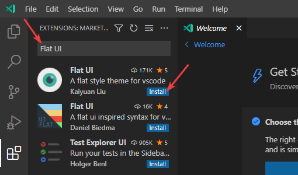

_Рисунок 10 — Установка темы_


_Рисунок 11 — Выбор установленной темы_

Все установленные темы можно посмотреть и выбрать через `File` → `Preferences` → `Color Theme`:

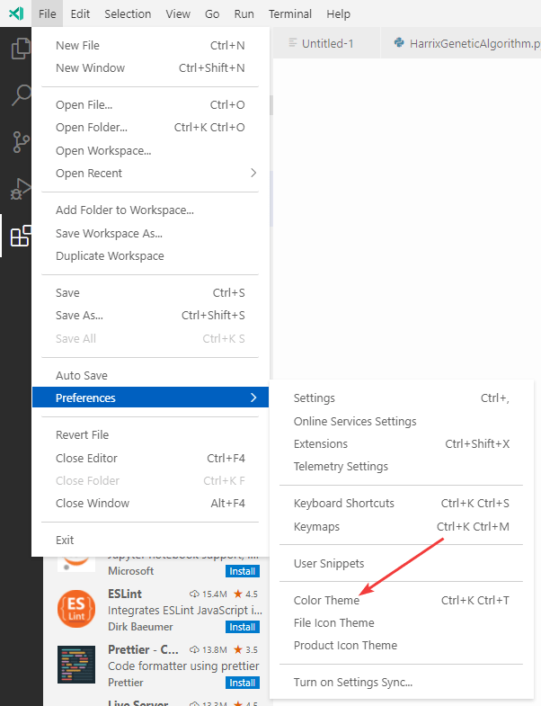

_Рисунок 12 — Все установленные темы_

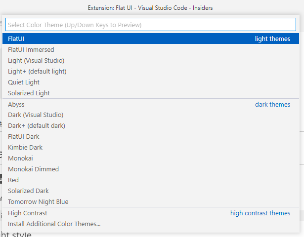

_Рисунок 13 — Список установленных тем_

Кроме темы оформления можно выбрать отдельно тему значков для обозначения расширений файлов. Мне нравится [Material Icon Theme](https://marketplace.visualstudio.com/items?itemName=PKief.material-icon-theme).

Опять в разделе расширений находим наш пакет, устанавливаем и выбираем:

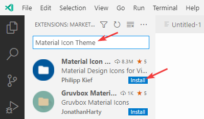

_Рисунок 14 — Поиск и установка пакета_

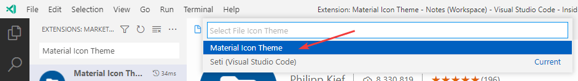

_Рисунок 15 — Выбор пакета иконок_

Все установленные наборы иконок можно посмотреть и выбрать через `File` → `Preferences` → `File Icon Theme`.

Пока у нас программа выглядит так с установленными темами:

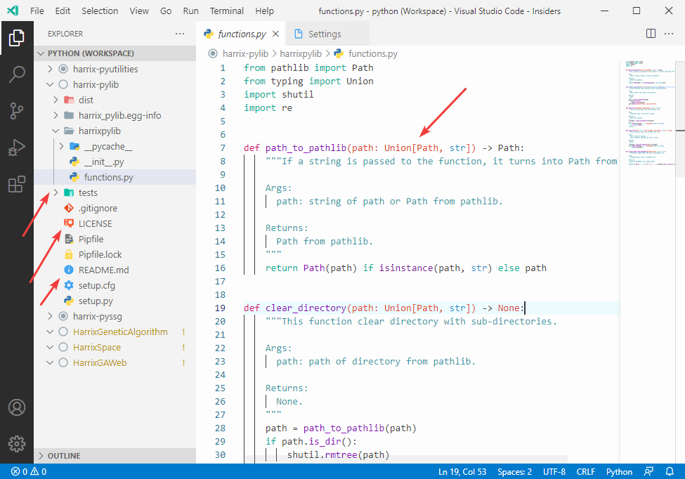

_Рисунок 16 — VSCode со светлой темой_

## Настройки VSCode

Когда мы выбирали наши расширения как активные, то эти расширения прописывались в настройках приложения. Посмотрим, где они находятся.

Идем `File` → `Preferences` → `Settings`:

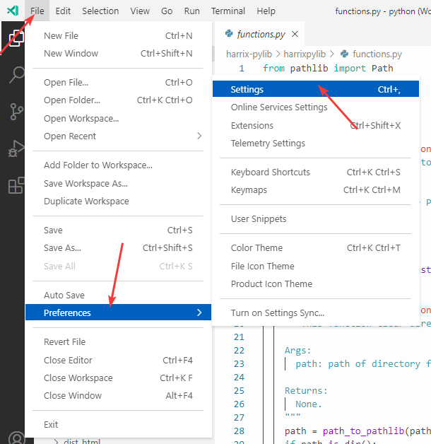

_Рисунок 17 — Настройки VSCode_

Настройки можно редактировать в графическом виде:

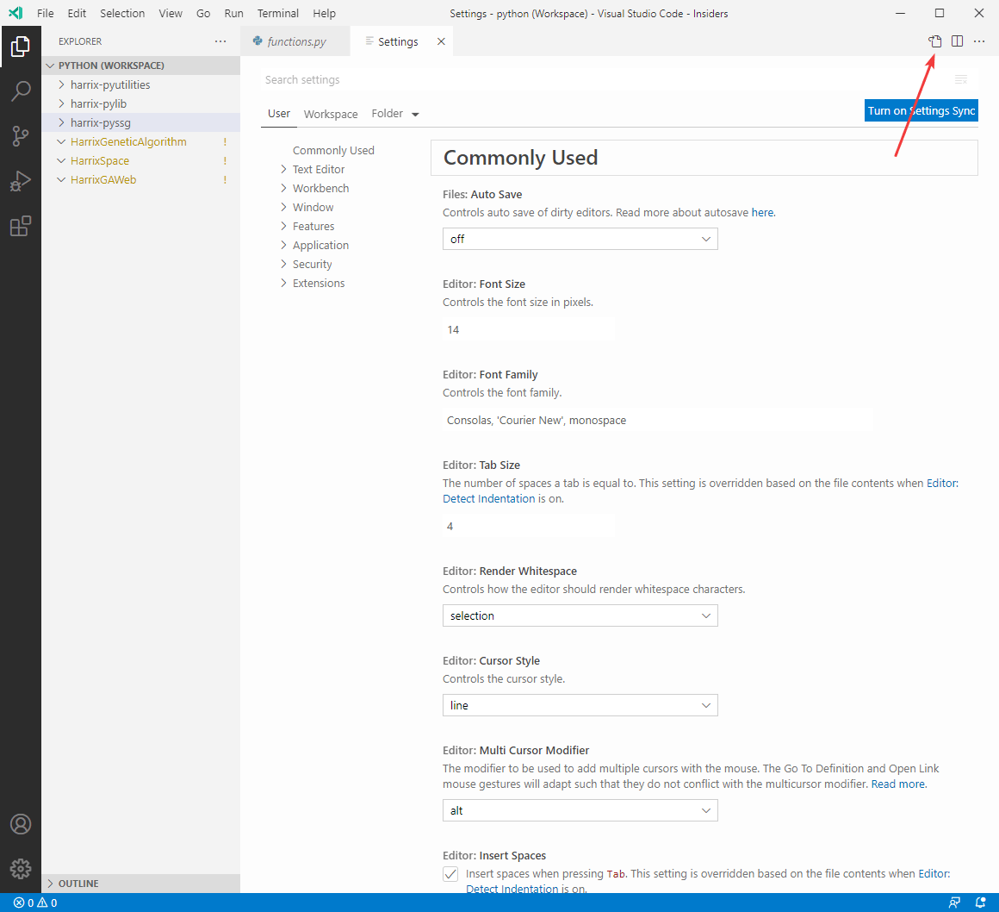

_Рисунок 18 — Настройки в графическом виде_

А если нажать на кнопку, которая на предыдущем скрине показана стрелкой, то перейдем в классический текстовой режим, где все настройки представлены в виде JSON файла:


_Рисунок 19 — Настройки в текстовом виде_

Теперь вы знаете, где это находится. И мы будем не раз возвращаться в настройки.

## Меняем шрифт

Одной из холиварных тем среди программистов является тема шрифтов. Сам в своё время сидел на Courier New, [PT Sans](https://github.com/google/fonts/tree/main/ofl/ptsansnarrow), [Roboto Mono](https://github.com/googlefonts/RobotoMono), а теперь перешел [JetBrains Mono](https://www.jetbrains.com/ru-ru/lp/mono/). Вот его и установлю. Но справедливости ради скажу, что большинство программистов сидят на [
FiraCode](https://github.com/tonsky/FiraCode).

На сайте <https://www.jetbrains.com/ru-ru/lp/mono/> скачаем архив со шрифтами:

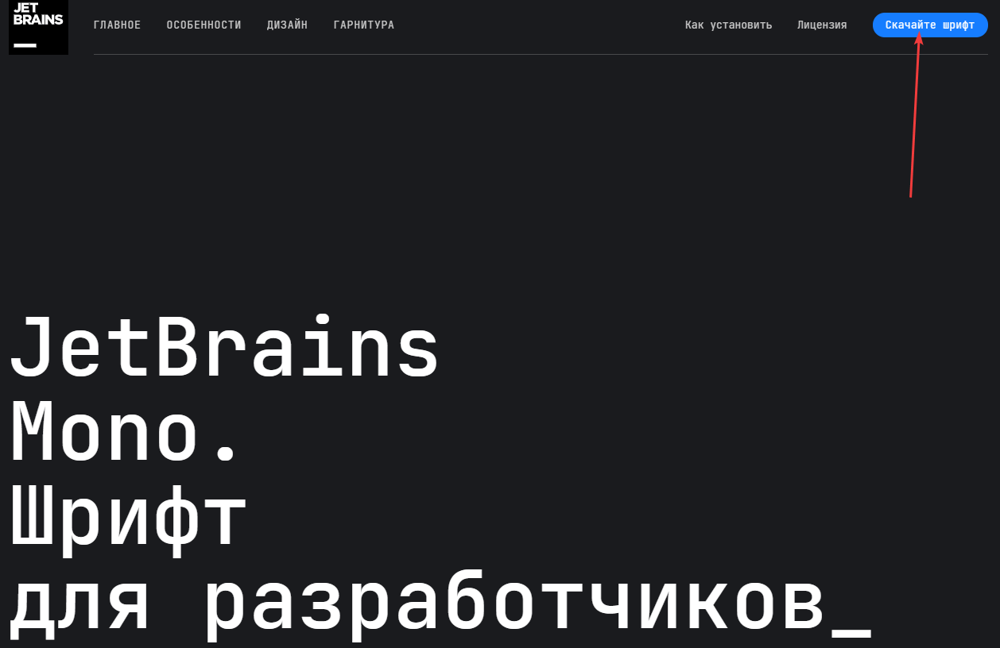

_Рисунок 20 — Сайт шрифта JetBrains Mono_

Распаковываем его и копируем все файлы расширения `.ttf` в папке `\fonts\ttf`:

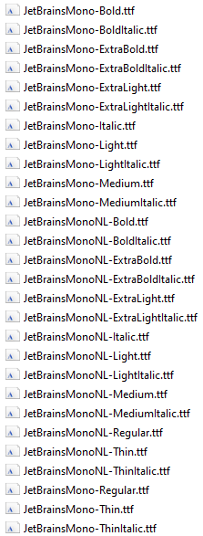

_Рисунок 21 — Файлы шрифта JetBrains Mono_

А потом их вставляем или перетаскиваем в `Панели управления` или в `Параметрах`:


_Рисунок 22 — Раздел шрифтов в Панели управления_

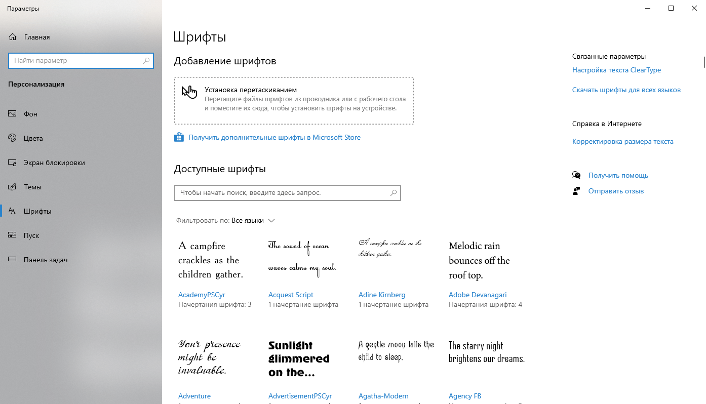

_Рисунок 23 — Раздел шрифтов в Параметрах_

Перезагружаем VSCode и переходим в настройки VSCode, которые обсуждались выше. Поле `Font Family` выглядит так:

```text
Consolas, 'Courier New', monospace
```

Меняем его на:

```text
'JetBrains Mono','Roboto Mono', 'Fira Code', 'Courier New', monospace
```

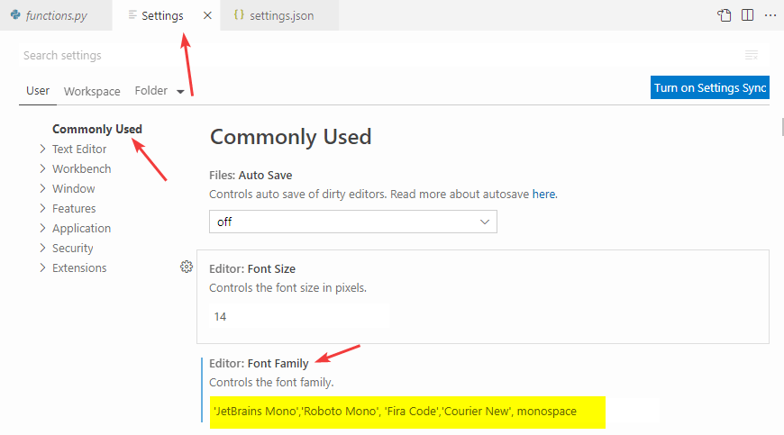

_Рисунок 24 — Изменение шрифта_

Да, я прописал два лишних шрифта (`Roboto Mono`, `Fira Code`), чтобы, если установите их, то могли быстро поставить нужный вам на первое место. Тут работает такой принцип: если нет первого, то включается второй шрифт, если и его нет, то третий и так далее. Шрифты `'Courier New', monospace` устанавливать специально не надо: они должны быть на любом компе (monospace — это вообще псевдоним какого-то системного моно-шрифта, то есть все символы в нем одной ширины).

Кстати, после изменений в графическом режиме настроек, в JSON файле тоже произошли изменения (точнее они там и происходили):

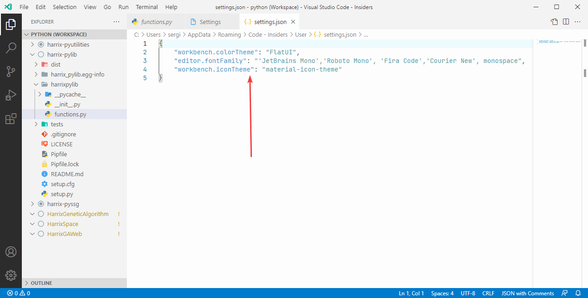

_Рисунок 25 — Измененные настройки_

Теперь наш текстовой редактор будет выглядеть так:

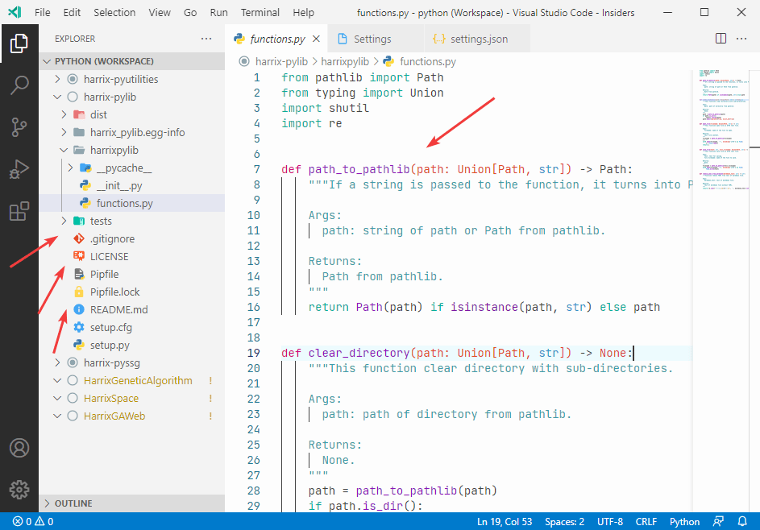

_Рисунок 26 — VSCode со светлой темой и новым шрифтом_

## Дополнительные настройки VSCode

Как вы можете видеть в графическом режиме, настроек в VSCode очень много. Покажу только те, которые я лично меняю. Но рекомендую полазить по ним, чтобы отыскать настройки под себя.

Всегда включая мгновенное автосохранение документа при его редактировании:

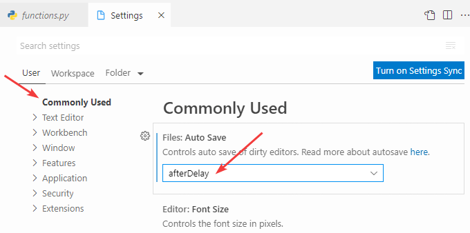

_Рисунок 27 — Автосохранение документа_

Включаю перенос слов:

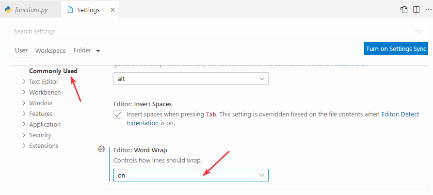

_Рисунок 28 — Перенос слов_

Перенос слов включил, но по правилам хорошего тона во многих языках программирования длинные строки не приветствуются. Поэтому хочу поставить три вертикальные линии на 80 (стандарт со времен перфокарт), 88 (black для Python) и 120 символов (ESLint), чтобы можно было отслеживать в на глаз длину строк. Но тут есть один нюанс: некоторые настройки не редактируются в графическом режиме настроек VSCode. Например, наша настройка `editor.rulers`. Поэтому в JSON файле настроек пишем вручную `"editor.rulers": [80, 88, 120],`:

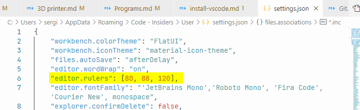

_Рисунок 29 — Настройка вертикальных линий в редакторе_

На скрине ниже вы видите две вертикальные линии, которые ни к чему вас не обязывают, но мы можете контролировать по ним сами себя:

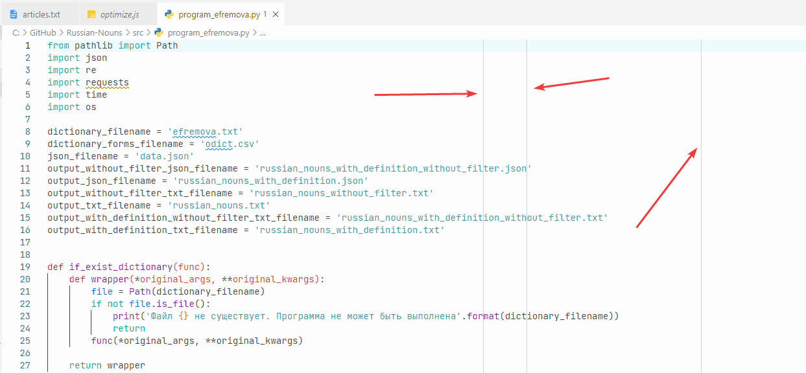

_Рисунок 30 — Вертикальные линии в редакторе_

Следующая настройка позволяет при удалении файла не показывать предупреждения об удалении:

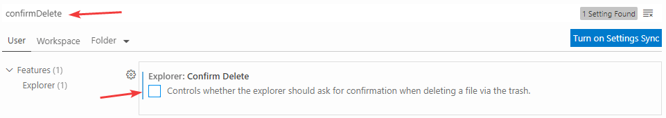

_Рисунок 31 — Удаление файлов без запроса подтверждения_

А через следующую настройку `files.associations` можно соотносить подсветку синтаксиса с расширениями файлов, которые пишутся немного по другому. Непонятно? Например, файлы с расширением `.inc` VSCode не умеет распознавать, но это просто файлы настроек программ как и файлы с расширением `.ini`. А мы можем научить VSCode правильно такие файлы распознавать:

```text
"files.associations": {
  "*.inc": "ini"
},
```

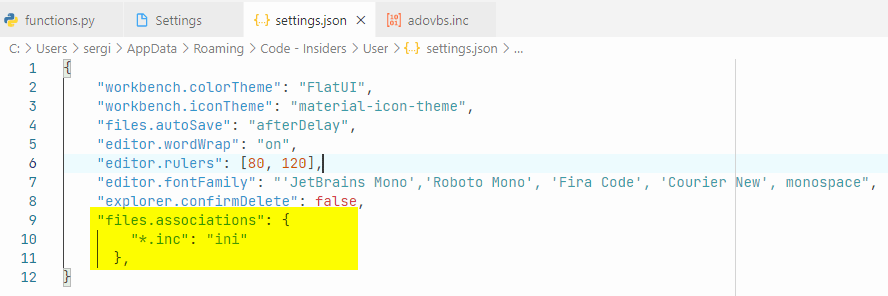

_Рисунок 32 — Настройка файловых ассоциаций_

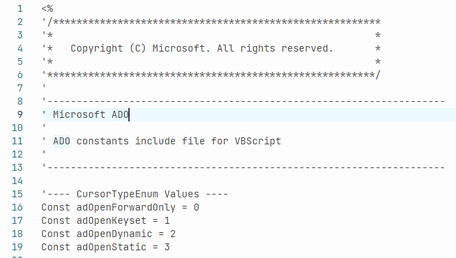

_Рисунок 33 — Было_

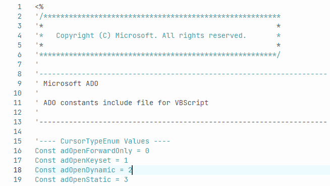

_Рисунок 34 — Стало_

Настройка `"files.trimTrailingWhitespace": true,` позволяет VSCode автоматически удалять лишние пробелы в конце строк, когда вы начнете редактировать другие строки. Например, вот эти пробелы будут удалены:

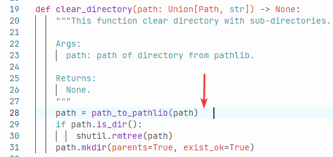

_Рисунок 35 — Пробелы, которые будут удалены_

Выше мы попросили не просить подтверждение на удаление файлов. Попросим, чтобы этого не было и при перетаскивании файлов через `"explorer.confirmDragAndDrop": false,`. Ниже я перетаскиваю файл, и раздражающего запроса об подтверждении действий не будет:

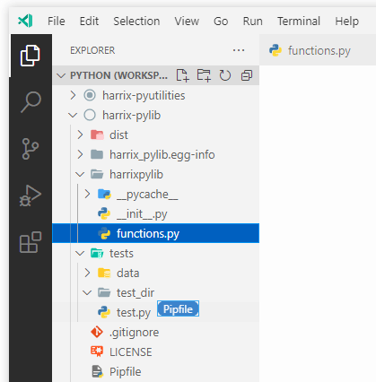

_Рисунок 36 — Перетаскивание файла_

С помощью настройки `"editor.mouseWheelZoom": true,` можно увеличивать или уменьшать размер шрифта через колесико мыши при зажатом `Ctrl`:

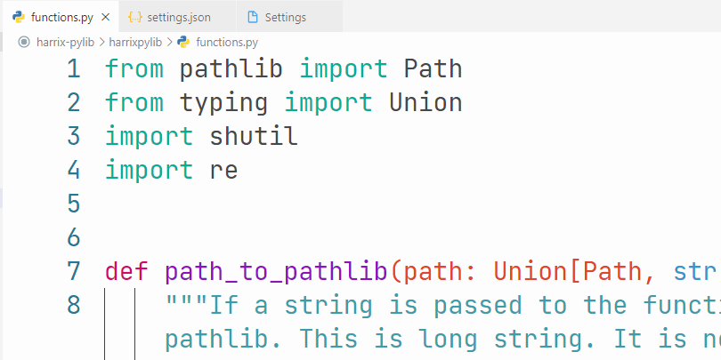

_Рисунок 37 — Увеличенный текст_

Сейчас настройки программы выглядят так:

```json
{
  "workbench.colorTheme": "FlatUI",
  "workbench.iconTheme": "material-icon-theme",
  "files.autoSave": "afterDelay",
  "editor.wordWrap": "on",
  "editor.rulers": [80, 120],
  "editor.fontFamily": "'JetBrains Mono','Roboto Mono', 'Fira Code', 'Courier New', monospace",
  "explorer.confirmDelete": false,
  "files.associations": {
    "*.inc": "ini"
  },
  "files.trimTrailingWhitespace": true,
  "explorer.confirmDragAndDrop": false,
  "editor.mouseWheelZoom": true
}
```

Потом появятся другие настройки, когда будем рассматривать плагины.

Настройки ниже позволят для python в качестве табуляции использовать 4 пробела, а для всех остальных документов по 2.

```json
  "editor.tabSize": 2,
  "[python]": {
    "editor.tabSize": 4
  },
```

## Настройка горячих клавиш

Профессиональный инструмент программирования должен давать возможность переназначать горячие клавиши под себя.

Например, в большинстве средах программирования дублирование текущей строки (`Copy line down`) стоит на комбинации `Ctrl` + `D`, а в VSCode по умолчанию это делается через `Shift` + `Alt` + `Down` (попробуйте). Исправим это. Для этого идем `File` → `Preferences` → `Keyboard Shortcuts`:

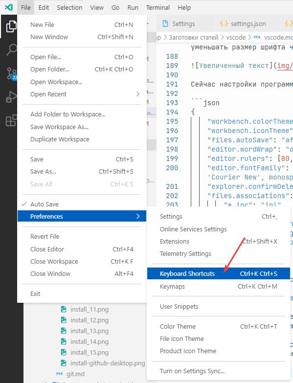

_Рисунок 38 — Пункт меню по настройке горячих клавиш_

В появившемся списке введем название команды (`Copy line down`), чтобы показать нашу команду. Как видим, она висит на `Shift` + `Alt` + `Down`:

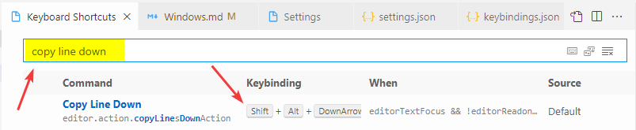

_Рисунок 39 — Список команд с горячими клавишами_

Двойной клик по команде, и внизу откроется поле для ввода новой комбинации клавиш, где я ввел `Ctrl` + `D`:

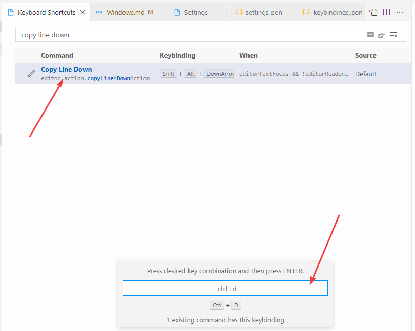

_Рисунок 40 — Изменение горячих клавиш на команду_

После этого нажимаем на `Enter` и получаем нужное нам переназначение:

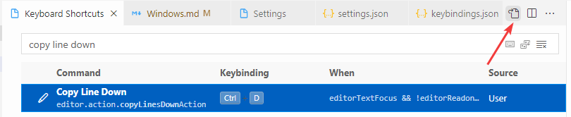

_Рисунок 41 — Команда с измененными горячими клавишами_

Кстати, помните, что настройки в графическом виде производились в JSON файле? Также и с настройками горячих клавиш. Если вы щелкните на кнопку, которая стрелкой на скрине выше отмечена, то попадете в JSON файл измененных горячих клавиш, где прописано наше переназначение:

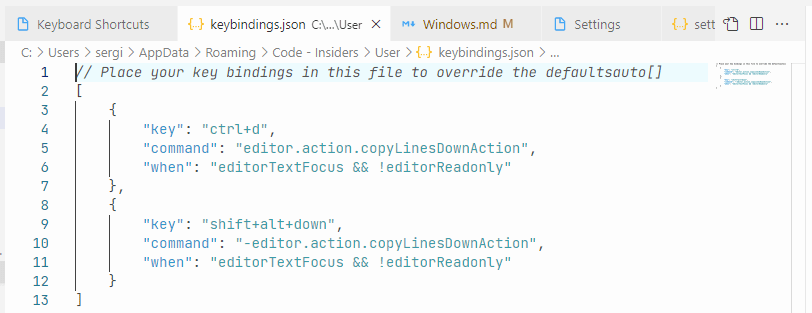

_Рисунок 42 — JSON файл с настройками горячих клавиш_

## Работа в программе

Рассмотрим некоторые элементы управления в программе.

### Палитра команд

Если нажать `F1`, то вызовется палитра команд с очень большим количеством команд:

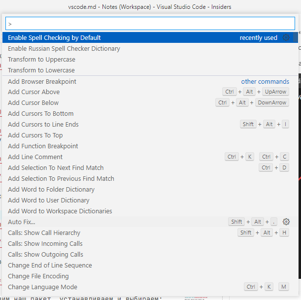

_Рисунок 43 — Палитра команд_

Например, ниже показано, как сделать выделенный текст прописными буквами через эту палитру команд:


_Рисунок 44 — Палитра команд_

### Работа с папками

Вы можете открывать целые папки со всеми файлами, включая картинки, документы и др. через `File` → `Open Folder`:

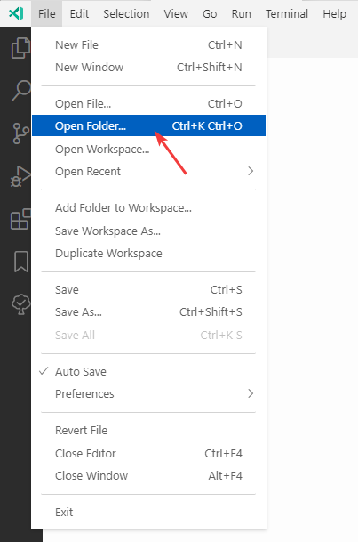

_Рисунок 45 — Команда открытия папки_

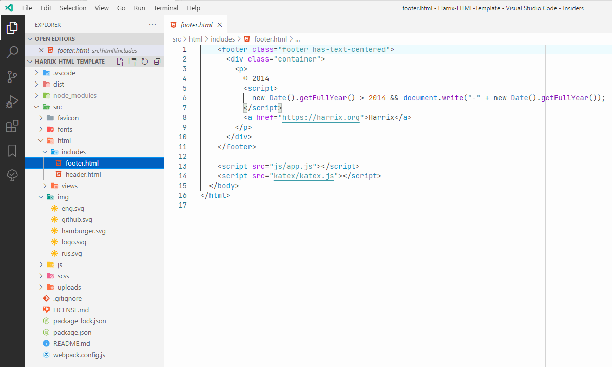

_Рисунок 46 — Пример открытия папки_

### Рабочие области

Вы можете часто работать с одним и тем же набором открытых файлов и папок. И такое состояние называется **Workspace** (Рабочая область). И такую рабочую область можно сохранять как файл, а при его открытии откроются все папки и файлы, которые там были записаны.

Например, выше я открыл в VSCode папку `C:\GitHub\Harrix-HTML-Template`. Через `File` → `Add Folder to Workspace` добавлю, например, папку `C:\GitHub\static-site-webpack-habr`:

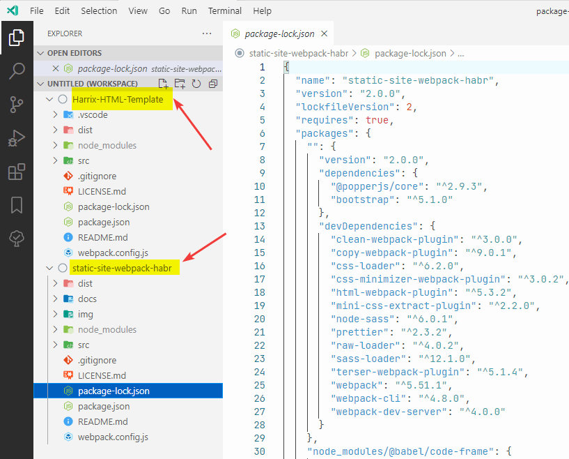

_Рисунок 47 — Две открытые папки_

Теперь через `File` → `Save Workspace As…` сохраняю рабочую область, например, как `temp.code-workspace`. И это будет обычный JSON файл с таким содержимым:

```json
{
  "folders": [
    {
      "path": "C:\\GitHub\\Harrix-HTML-Template"
    },
    {
      "path": "C:\\GitHub\\static-site-webpack-habr"
    }
  ],
  "settings": {}
}
```

Через команду `File` → `Open Workspace` откроются все те же самые папки:


_Рисунок 48 — Пример открытия рабочей области_

Лично я использую несколько рабочих областей, каждую из которых открываю в отдельном окне через `File` → `New Window`.

### Сохранение вкладки

Когда вы открываете файл, в котором не вносите никаких изменений, то название файла будет во вкладке написано курсивом:

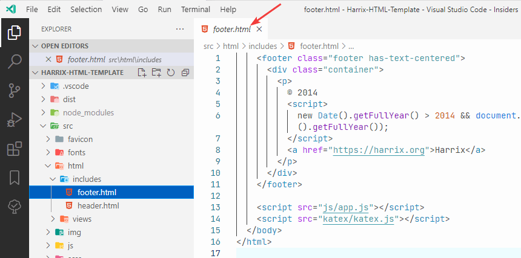

_Рисунок 49 — Название файла написано курсивом_

Это означает, что если открыть любой другой файл, то наш файл закроется. Чтобы он не закрывался, то в контекстном меню вкладки можно выбрать `Keep Open`:


_Рисунок 50 — Сохранение вкладки открытой_

Если в файл вносятся какие-то изменения, то вкладка не закроется в любом случае.

### Терминал

В VSCode встроен удобный терминал, который часто заменяет тот же Windows Terminal или cmd во многих задачах. Вызывается через `Ctrl` → `` ` ``:

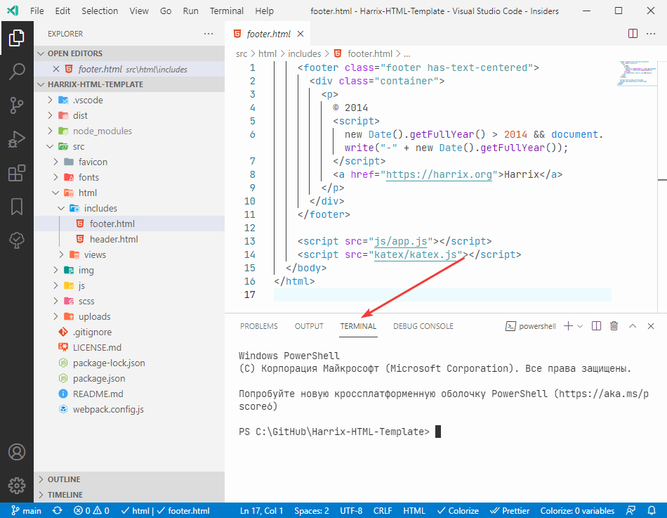

_Рисунок 51 — Открытый консольный терминал_

В этом терминале можно выполнять любые задачи, которые выполняются в командной строке.

Если нужно, то любую папку можно открыть в терминале через контекстное меню через команду `Open in Integrated Terminal`:

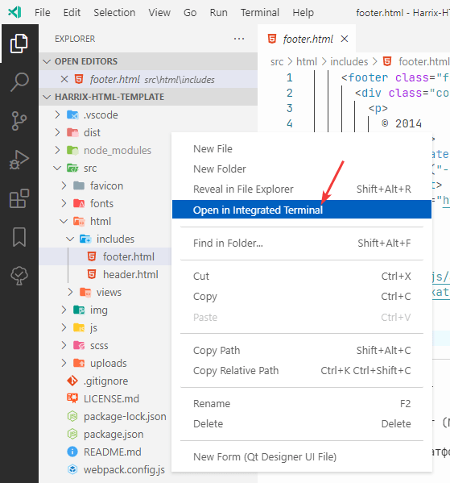

_Рисунок 52 — Открытый консольный терминал_

Терминалов может несколько, они могут одновременно отображаться на экране, можно открыть разные терминалы, которые есть на компьютере (например, PowerShell, GitBash, cmd и др.):


_Рисунок 53 — Работа с несколькими терминалами_

Напоминаю, что выход в терминале из какой-нибудь выполняющейся программы можно сделать через `Ctrl` + `C`.

### Поиск и замена

В VSCode встроен мощный поиск и замена по файлам проекта (рабочей области):

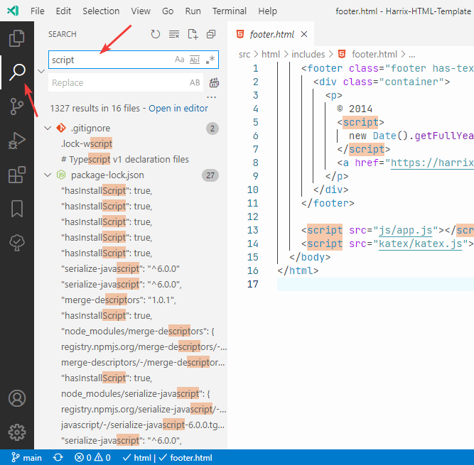

_Рисунок 54 — Вкладка поиска_

Поиск можно производить с учетом регистра, использовать регулярные выражения.

В строке `Replace` располагается текст для замены. Справа от нее находится кнопка для вызова команды замены:


_Рисунок 55 — Пример замены script на noscript во всех файлах проекта_

Если нужен поиск по конкретной папке, то можно в контекстном меню папки найти команду `Find in Folder…`:

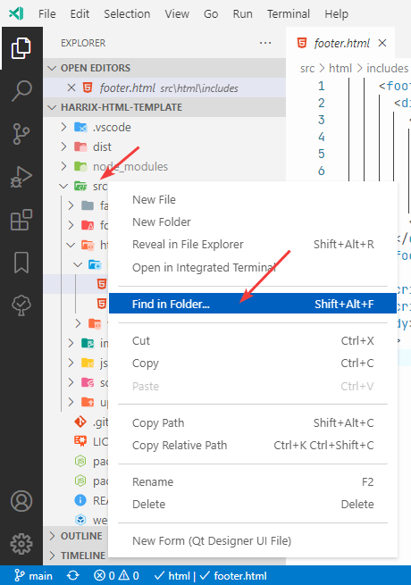

_Рисунок 56 — Поиск по папке_

Тогда в панели поиска появится название папки, в которой нужно производить поиск:

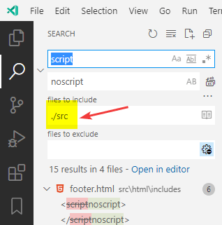

_Рисунок 57 — Имя папки в панели поиска_

Если же нужен поиск и замена только в одном открытом файле, то вызываем через стандартные `Ctrl` + `F`:

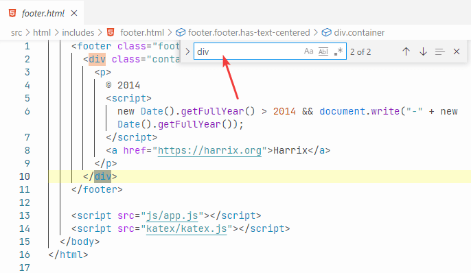

_Рисунок 58 — Поиск в открытом файле_

Если щелкнем по стрелке слева, то откроется окно для замены в открытом файле:

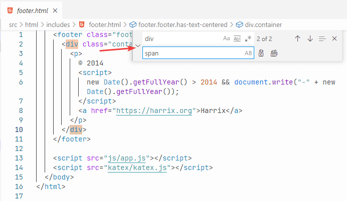

_Рисунок 59 — Замена в открытом файле_

### Быстрый переход к файлу

Если нужно быстро перейти к файлу проекта, зная его название, то это можно сделать через `Ctrl` + `P`:

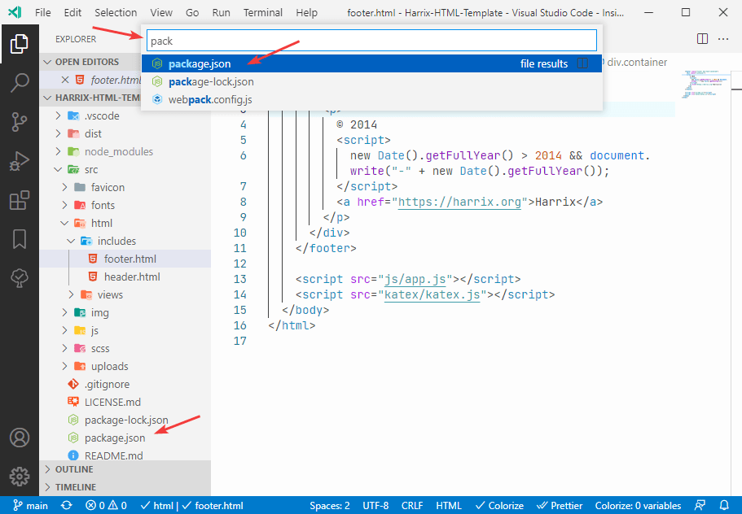

_Рисунок 60 — Быстрый переход к файлу_

### Автодополнение

Как и во многих редакторах в VSCode работает автодополнение, которое принудительно можно вызвать через `Ctrl` + `Space`:

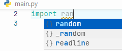

_Рисунок 61 — Вызов автодополнения_

### Переход к расположению файла

Если кликнуть по файлу правой кнопкой мыши и выбрать `Reveal in File Explorer`, то вы попадете в папку, где данный файл располагается:

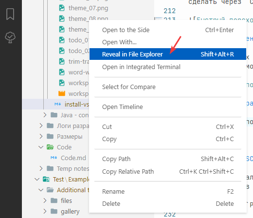

_Рисунок 62 — Переход к расположению файла_

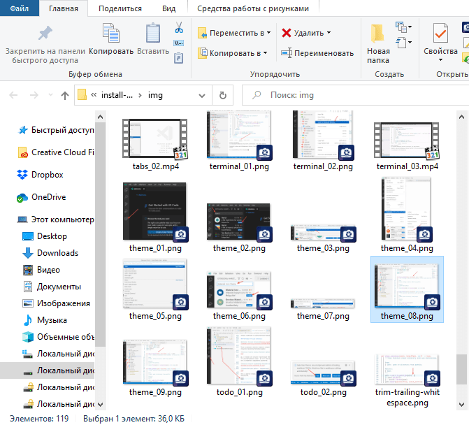

_Рисунок 63 — Папка с файлом_

### Разделение вкладок

TODO

### CLI

CLI — Интерфейс командной строки ([Command line interface](https://ru.wikipedia.org/wiki/%D0%98%D0%BD%D1%82%D0%B5%D1%80%D1%84%D0%B5%D0%B9%D1%81_%D0%BA%D0%BE%D0%BC%D0%B0%D0%BD%D0%B4%D0%BD%D0%BE%D0%B9_%D1%81%D1%82%D1%80%D0%BE%D0%BA%D0%B8)). Когда мы открываем VSCode, то видим полноценный оконный интерфейс. А в терминале программы запускаются без данного интерфейса, что вы уже, конечно, давно знаете. Но многие программы, которые имеют интерфейс можно запустить как консольную программу в том же терминале. И VSCode не исключение.

Подробно об таком режиме работы можно прочитать в [официальной документации](https://code.visualstudio.com/docs/editor/command-line).

Если у вас стандартный VSCode, то в командной строке команды будут начинаться с `code`, а если, как у нас, VSCode Insiders, то `code-insiders`.

Например, через команду `code-insiders --list-extensions` мы получим список установленных расширений:

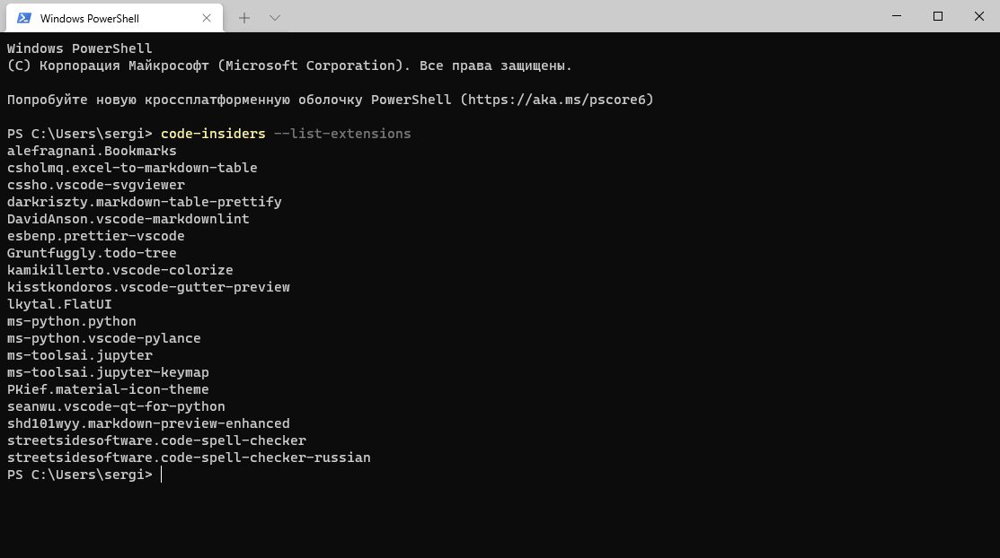

_Рисунок 64 — Список установленных расширений_

Это можно использовать, например, в собственных скриптах, где в процессе работы нужно вызвать VSCode, чтобы пользователь что-то сделал в файле.

## Настройка сниппетов

Программисты — люди ленивые. И они очень не любят дублировать повторяющиеся куски кода. У каждого программиста есть свой список заготовок (шаблоны HTML файла, подпись в письме и др.), которые они любят вставлять в свои коды. И такие подготовленные куски кода или текста называются сниппетами.

Также регулярно нужно вставлять в текст нестандартные символы, которых нет на клавиатуре (`«»`, `©`, `→` и др.), что тоже можно описать в виде сниппетов (именно эту задачу можно еще решить через плагин [Insert Unicode](https://marketplace.visualstudio.com/items?itemName=brunnerh.insert-unicode)).

Как вы поняли, в VSCode есть инструмент по работе со сниппетами. Идем `File` → `Preferences` → `User Snippets`:

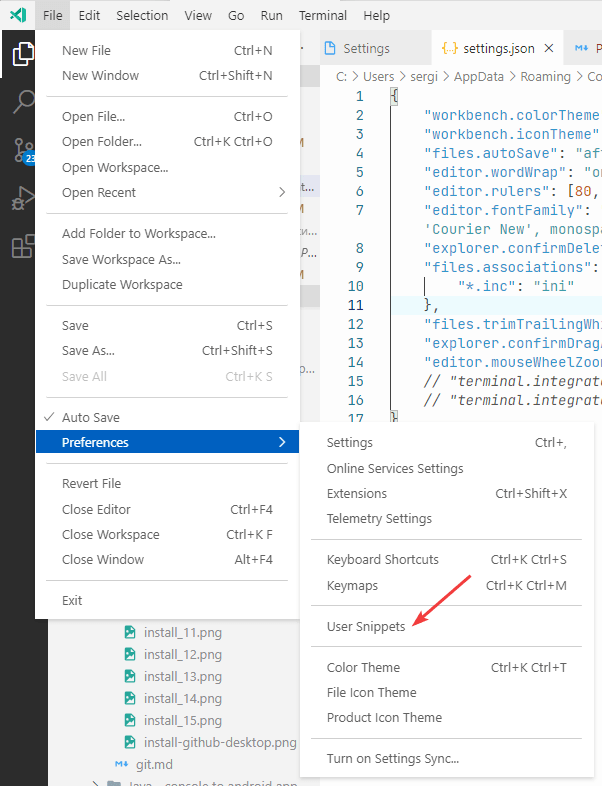

_Рисунок 65 — Пункт меню с настройками сниппетов_

Вы можете сделать сниппеты как глобальные, так и специализированные, которые будут работать в определенных типов файлов. Создадим глобальный:

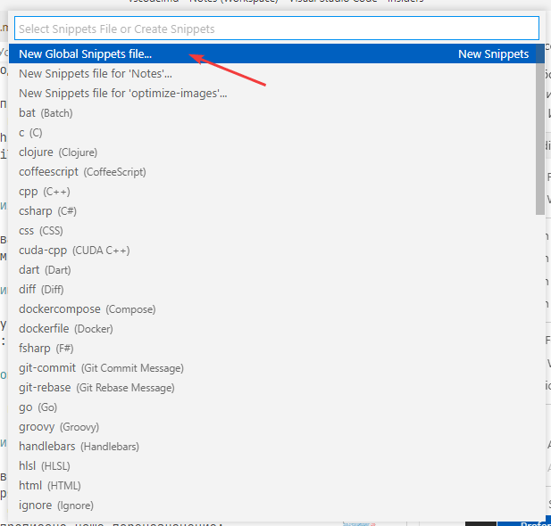

_Рисунок 66 — Создание новой коллекции сниппетов_

Введем имя коллекции, например, `common` и нажмем `Enter`:

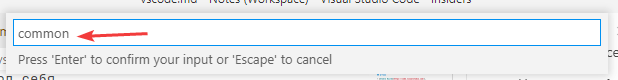

_Рисунок 67 — Ввод имени коллекции сниппетов_

После этого откроется JSON файл с комментариями, где мы можем вставлять свои сниппеты. Для примера я вставлю код вот такого сниппета, который будет добавлять стрелку вправо:

```json
"Insert →": {
  "prefix": "->",
  "body": [
    "→"
  ]
},
```

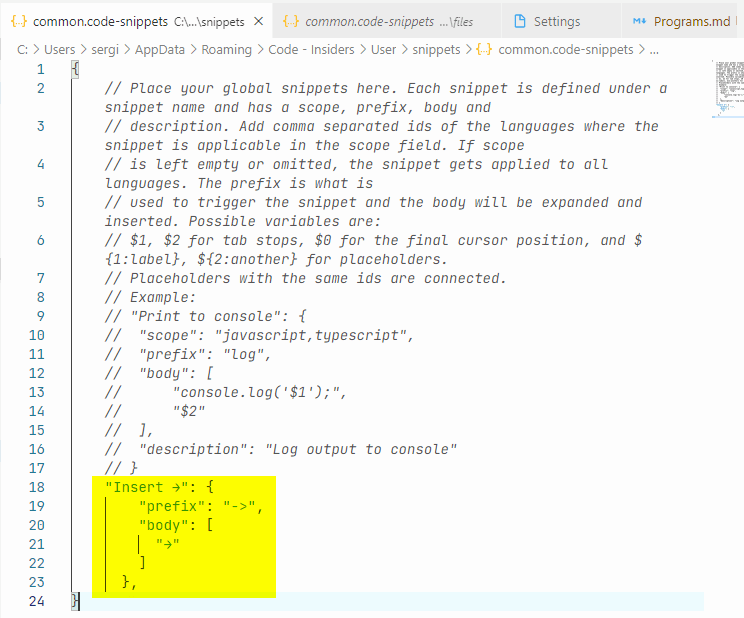

_Рисунок 68 — Введенный сниппет_

Теперь, если мы в VSCode нажнем писать `->`, то у нас появится выбор, чтобы заменить эти два символа на нормальную стрелку:

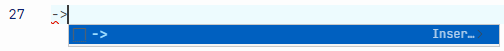

_Рисунок 69 — Пример использования сниппета_

То есть в сниппете раздел `prefix` означает, с чего начинается подмена, а `body` означает то, на что мы будем заменять префикс.

Вот пример сниппета, который вместо `doctype` будет подставлять HTML болванку:

```json
"Insert HTML": {
  "prefix": "doctype",
  "body": [
    "<!DOCTYPE html>",
    "<html>",
    "  <head>",
    "    <meta charset=\"utf-8\">",
    "    <title></title>",
    "  </head>",
    "  <body>",
    "  </body>",
    "</html>"
  ],
   }
```


_Рисунок 70 — Пример использования сниппета_

Обратите внимание на то, как построен этот многострочный сниппет. Мне это не нравится, и в том же Atom или Sublime Text сделано куда лучше, но что есть, то есть. На сайте <https://snippet-generator.app/> можно генерировать свои собственные многострочные сниппеты.

Ниже под спойлером лежит мой список сниппетов, в котором я использую часто встречаемые Unicode символы:

<details>
<summary>Сниппеты</summary>

**common.code-snippets**:

```json
{
  "Insert «»": {
    "prefix": "<<>>",
    "body": ["«»"]
  },
  "Insert «": {
    "prefix": "<<",
    "body": ["«"]
  },
  "Insert »": {
    "prefix": ">>",
    "body": ["»"]
  },
  "Insert ©": {
    "prefix": "(c)",
    "body": ["©"]
  },
  "Insert ×": {
    "prefix": "x",
    "body": ["×"]
  },
  "Insert →": {
    "prefix": "->",
    "body": ["→"]
  },
  "Insert …": {
    "prefix": ",,,",
    "body": ["…"]
  },
  "Insert em dash (век живи — век учись)": {
    "prefix": "---",
    "body": ["—"]
  },
  "Insert en dash (2010–2018)": {
    "prefix": "--",
    "body": ["–"]
  },
  "Insert keyboard shortcut": {
    "prefix": "``",
    "body": ["`` → ``"]
  },
  "Insert HTML": {
    "prefix": "doctype",
    "body": [
      "<!DOCTYPE html>",
      "<html>",
      "  <head>",
      "    <meta charset=\"utf-8\">",
      "    <title></title>",
      "  </head>",
      "  <body>",
      "  </body>",
      "</html>"
    ]
  }
}
```

А тут пример сниппета исключительно под Markdown.

**markdown.json**:

```json
{
  "Insert image": {
    "prefix": "img",
    "body": [""]
  }
}
```

</details>

## Проверка орфографии

Для проверки орфографии нужно установить расширение [Code Spell Checker](https://marketplace.visualstudio.com/items?itemName=streetsidesoftware.code-spell-checker) и [Russian - Code Spell Checker](https://marketplace.visualstudio.com/items?itemName=streetsidesoftware.code-spell-checker-russian).

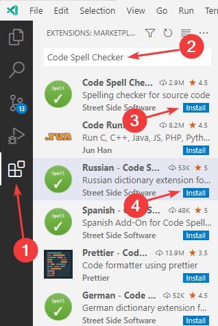

_Рисунок 71 — Установка расширений_

После установки лучше перезапустить VSCode, потом вызвать панель команд через `F1`, где выбрать команду `Enable Russian Spell Checker Dictionary`, которая и включит проверку орфографии:

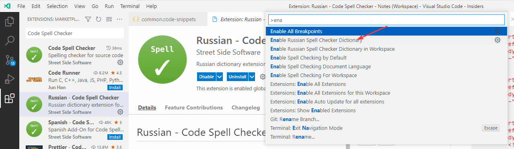

_Рисунок 72 — Включение проверки русского языка_

Очень вероятно, что вам захочется одновременно проверять как русский язык, так и английский. Для этого в настройках можно ввести настройку:

```json
 "cSpell.language": "en,ru",
```

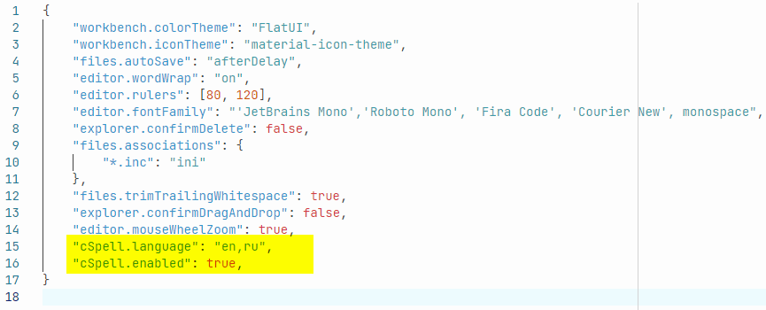

_Рисунок 73 — Настройки проверки орфографии_

Теперь, слова с ошибками будут подсвечиваться, а также отображаться в списке проблем:

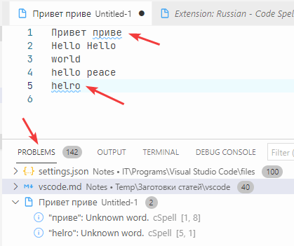

_Рисунок 74 — Примеры орфографических ошибок_

Также при наведении на неправильное слово появится возможность исправить слово на правильное:


_Рисунок 75 — Исправление ошибки_

Иногда может оказаться, что вы слово написали правильно, но его просто нет в словаре:

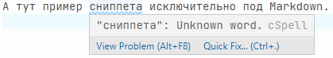

_Рисунок 76 — В словаре нет слова «сниппета»_

Еще совсем недавно новые слова добавлялись в файл настроек VSCode, что сильно его засоряло. В новом обновлении плагина появилась возможность создавать файл своего собственного словаря. Для этого щелкаем правой кнопкой по слову, выбираем `Create a Custom Dictionary File`:

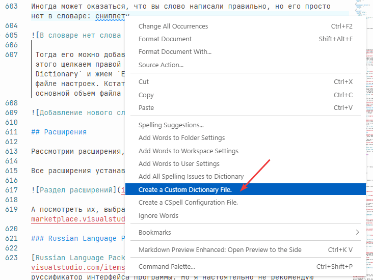

_Рисунок 77 — Выбор команды «Create a Custom Dictionary File»_

Можно выбрать место действия данного словаря: папка, рабочая область или везде. Последний вариант `User` я и выбираю:

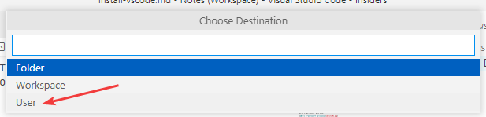

_Рисунок 78 — Выбор место действия словаря_

будет создан файл, где в столбик можно размещать слова для словаря:

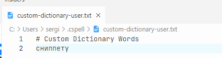

_Рисунок 79 — Добавление вручную слова в словарь_

После создания файла словаря новые словаря можно добавлять через команду `Add Word to User Dictionary` в контекстном меню:

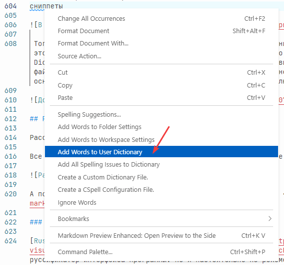

_Рисунок 80 — Добавление нового слова в словарь_

Обратите внимание на путь создания файла словаря. У меня это `C:\Users\sergi\.cspell\custom-dictionary-user.txt`.

TODO будет ли синхронизироваться словарь в настройках?

## Расширения

Рассмотрим расширения, которые нам могут помочь в работе.

Все расширения устанавливаются через раздел, в котором мы уже были:


_Рисунок 81 — Раздел расширений_

А посмотреть их, выбрать, оценить можно на официальном сайте <https://marketplace.visualstudio.com/VSCode>.

### Russian Language Pack for Visual Studio Code

[Russian Language Pack for Visual Studio Code](https://marketplace.visualstudio.com/items?itemName=MS-CEINTL.vscode-language-pack-ru) — руссификатор интерфейса программы. Но я настоятельно не рекомендую использовать руссификатор. Привыкайте работать с английским языком. Так будет выглядеть программа:

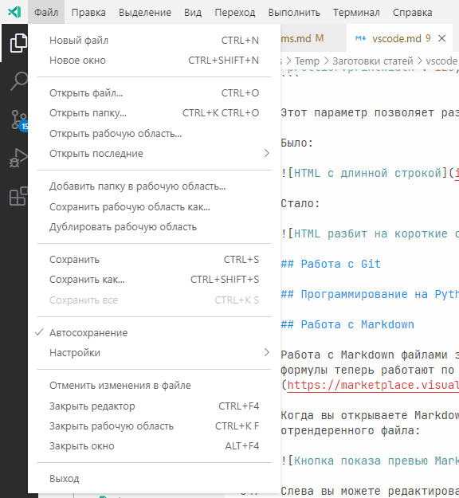

_Рисунок 82 — VSCode с русским интерфейсом_

### Bookmarks

[Bookmarks](https://marketplace.visualstudio.com/items?itemName=alefragnani.Bookmarks) — закладки в VSCode.

После установки вы через контекстное меню сможете устанавливать закладки в любом документе в любом месте:

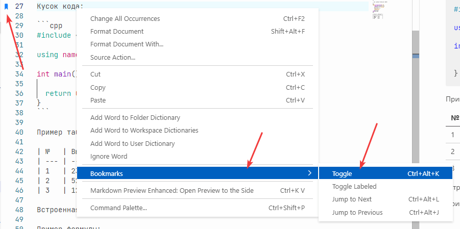

_Рисунок 83 — Включение закладки в контекстном меню_

Также слева появится раздел с вашими закладками:

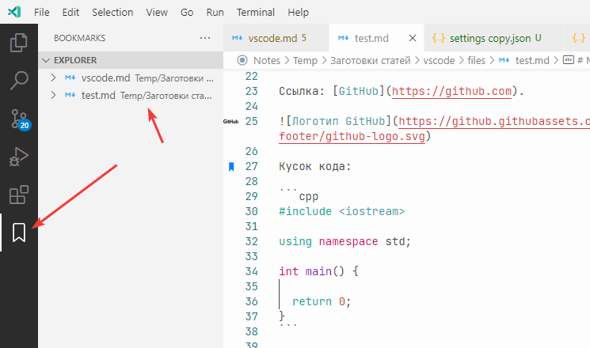

_Рисунок 84 — Раздел с закладками_

### Prettier - Code formatter

[Prettier - Code formatter](https://marketplace.visualstudio.com/items?itemName=esbenp.prettier-vscode) — плагин, который позволяет красиво отформатировать ваш код на языках: JavaScript, TypeScript, JSON, CSS, SCSS, HTML, Markdown и др.

Когда вам нужно будет отформатировать код, то из палитры команда `F1` выбираете команду `Format document`:

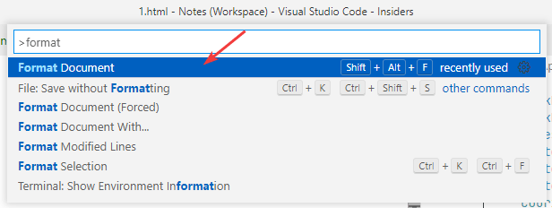

_Рисунок 85 — Format document_

При первом использовании будет предложено выбрать плагин для форматирования кода.

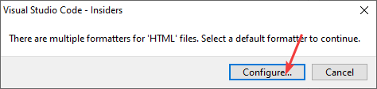

_Рисунок 86 — Запрос на выбор плагина для форматирования кода_

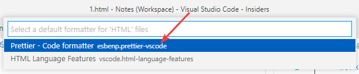

_Рисунок 87 — Выбор плагина для форматирования кода_

Покажем, как работает код. Например, есть такой код:

```html
<!DOCTYPE html>
<html>
  <head>
    <meta charset="utf-8" />
    <title></title>
  </head>
  <body></body>
</html>
```

Плагин нам его преобразует вот в такой:

```html
<!DOCTYPE html>
<html>
  <head>
    <meta charset="utf-8" />
    <title></title>
  </head>
  <body></body>
</html>
```

Из дополнительных настроек плагина я использую `printWidth`:

```json
"prettier.printWidth": 120,
```

Этот параметр позволяет разбивать длинные строки на строки по 120 символов.

Было:

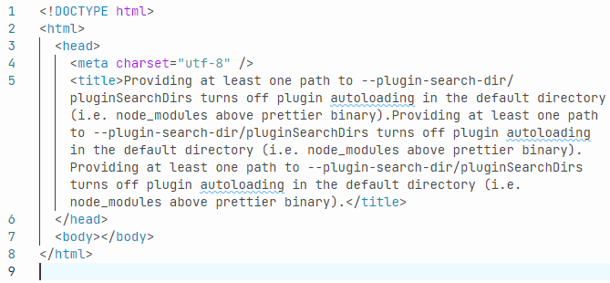

_Рисунок 88 — HTML с длинной строкой_

Стало:

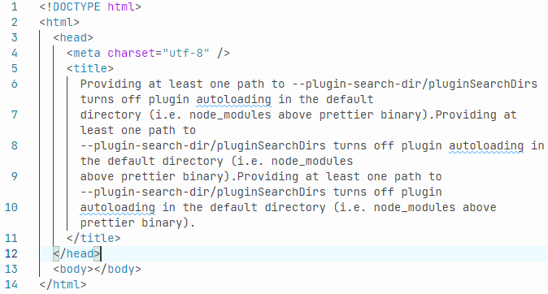

_Рисунок 89 — HTML разбит на короткие строки_

### Image preview

[Image preview](https://marketplace.visualstudio.com/items?itemName=kisstkondoros.vscode-gutter-preview) — вплывающие превью изображений.

Во-первых, слева в документе, где приводится ссылка на картинку, показывается мини версия картинки.

Во-вторых, при наведении на ссылку картинки, появится всплывающее окно с миниатюрой картинки:

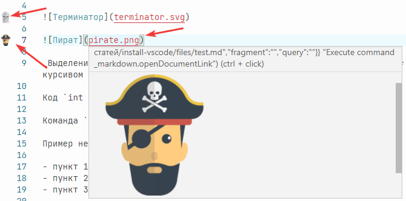

_Рисунок 90 — Пример работы плагина_

Размер миниатюр небольшой, поэтому я их увеличиваю настройкой:

```json
"gutterpreview.imagePreviewMaxHeight": 200,
```

### SVG Viewer

[SVG Viewer](https://marketplace.visualstudio.com/items?itemName=cssho.vscode-svgviewer) — просмотрщик SVG изображений.

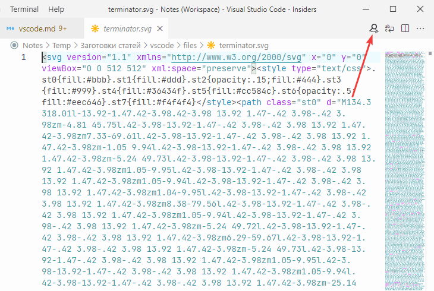

_Рисунок 91 — Кнопка просмотра SVG_

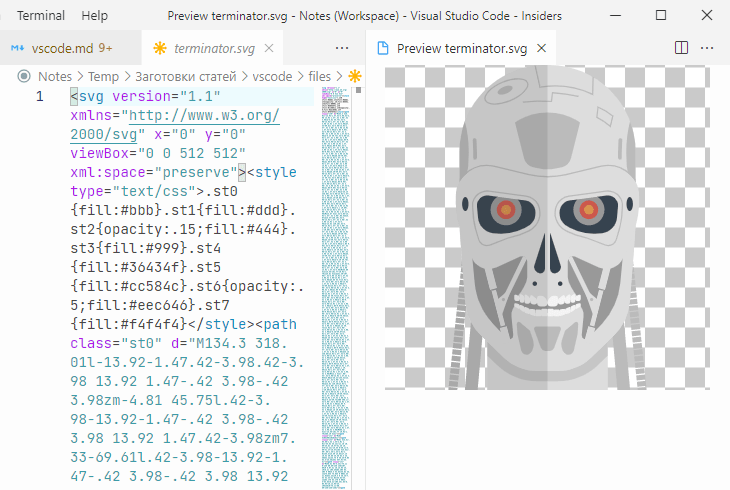

_Рисунок 92 — Код SVG вместе с его визуализацией_

### colorize

[colorize](https://marketplace.visualstudio.com/items?itemName=kamikillerto.vscode-colorize) — подсветка кодов цвета цветом, который они обозначают.

Было:

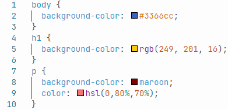

_Рисунок 93 — Пример CSS кода с кодами цветов_

Стало:

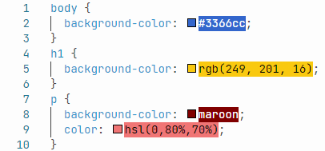

_Рисунок 94 — Пример CSS кода с подсвеченными кодами цветов_

Можно в настройках указать, в каких [типах файлов](https://code.visualstudio.com/docs/languages/overview) будет подсветка цветов. Мне этот плагин нужен в Markdown документах. Поэтому у меня такая настройка:

```json
"colorize.languages": ["css", "scss", "sass", "javascript", "html", "markdown"],
```

### Todo Tree

[Todo Tree](https://marketplace.visualstudio.com/items?itemName=Gruntfuggly.todo-tree) — показывает список `TODO` и `FIXME`, расставленных в коде и документах проекта, что позволяет быть в курсе того, куда в коде нужно вернуться и доделать недоделанное.

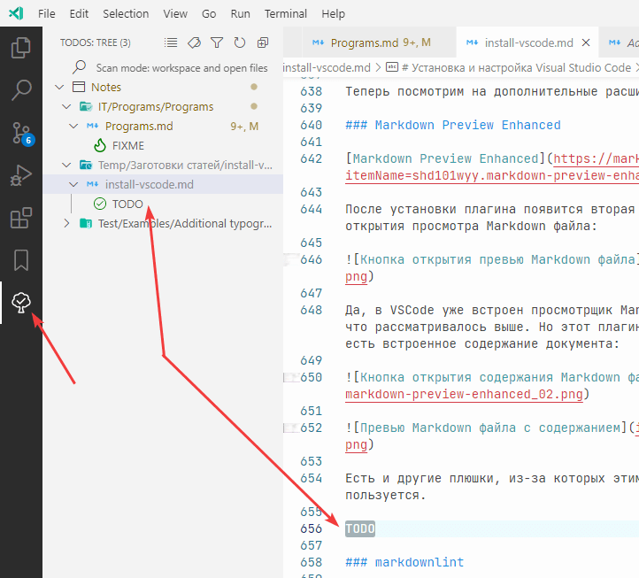

_Рисунок 95 — Список todos_

Через какое-то время плагин попросил добавить расширенную настройку на TODO в Markdown документах:

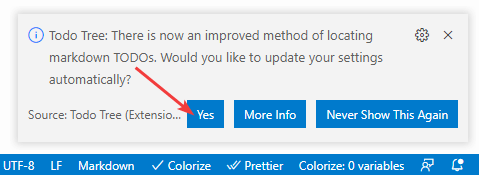

_Рисунок 96 — Запрос на добавление настройки_

В `settings.json` это выглядит так:

```json
"todo-tree.regex.regex": "(//|#|<!--|;|/\\*|^|^\\s*(-|\\d+.))\\s*($TAGS)",
```

### Code Runner

[Code Runner](https://marketplace.visualstudio.com/items?itemName=formulahendry.code-runner) — Позволяет запускать код на C++, Python, Java, JavaScript, PHP и многих других языках программирования.

Во избежание многих проблем добавьте в настройки VSCode запуск расширения через встроенный терминал. При этом исчезнут проблемы с кодировкой русского языка, возможностью ввода данных и др.:

```json
"code-runner.runInTerminal": true,
```

Примеры использования будут рассмотрены ниже в разделе о программировании на Python и C++.

TODO Code Runner

## Работа с Git

### Встроенный функционал

Вам вначале нужно будет установить Git отдельно на компьютер (после этого перезапустите VSCode).

Лично я с Git предпочитаю работать через стороннюю программу (GitHub Desktop, GitKraken и др.), которая не привязывается к конкретной среде разработке, так как в проекте над файлами работа может производиться в разных программах. Но VSCode имеет мощные встроенные средства по работе с Git.

Во вкладке `Source Control` вы увидите изменения во всех репозиториях рабочей области (в примере ниже открыто три репозитория, и в одном из них есть изменения). При щелчке по файлу откроется оно со сравнением изменений файла:

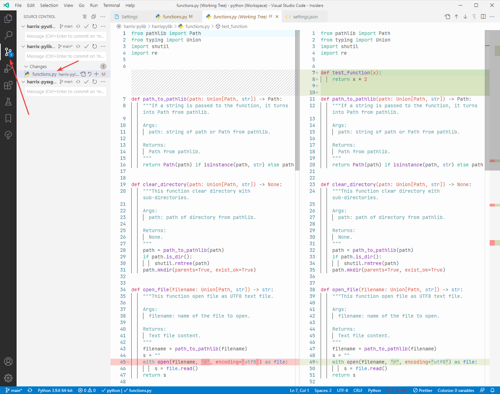

_Рисунок 97 — Изменения в файле с момента последнего коммита_

При вводе названия коммита и нажатии `Ctrl` + `Enter` изменения сформируются в коммит:

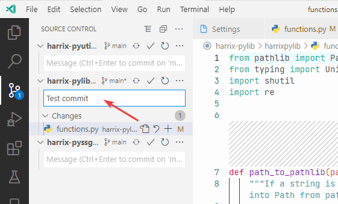

_Рисунок 98 — Создание коммита_

Но отправки коммита на сервер GitHub не произойдет, для этого нужно нажать кнопку `Push`:

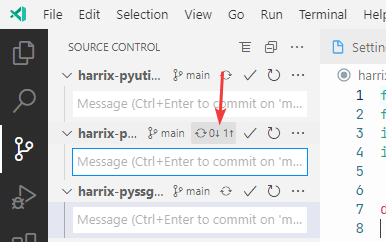

_Рисунок 99 — Отправка коммита на сервер_

При щелчке на обозначение текущей ветки репозитория откроется список команд по работе с ветками: создание новых, переключение между ветками и др.:

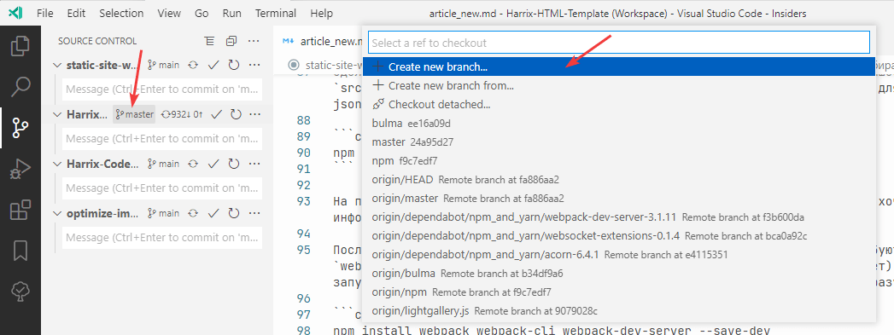

_Рисунок 100 — Команды по работе с ветками_

При щелчке на многоточие мы получим меню с множеством команд по работе с Git:

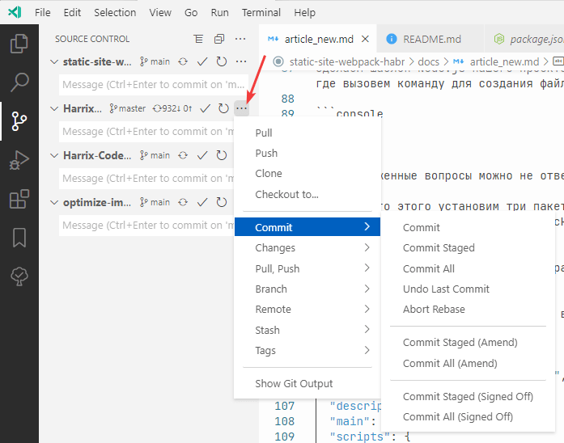

_Рисунок 101 — Команды по работе с git_

### GitLens — Git supercharged

[GitLens — Git supercharged](https://marketplace.visualstudio.com/items?itemName=eamodio.gitlens) — расширение, сильно расширяющая возможности по работе с Git. Но жрет ресурсов он много, так что на слабых машинах лучше его не ставить.

Например, он на текущей строке любого документа репозитория покажет, когда и кем эта строка последний раз менялась, а также название коммита с этим изменением:

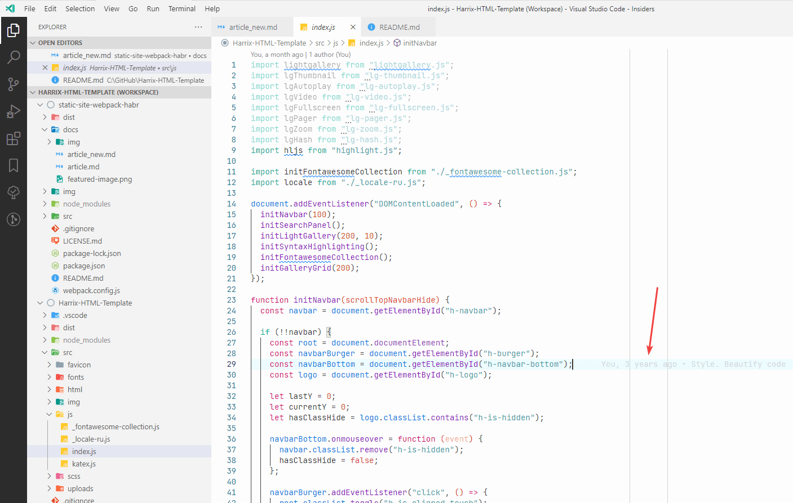

_Рисунок 102 — Кто и когда менял эту строку_

Также слева наверху появится кнопка, которая позволит перемещаться между изменениями разных коммитов:

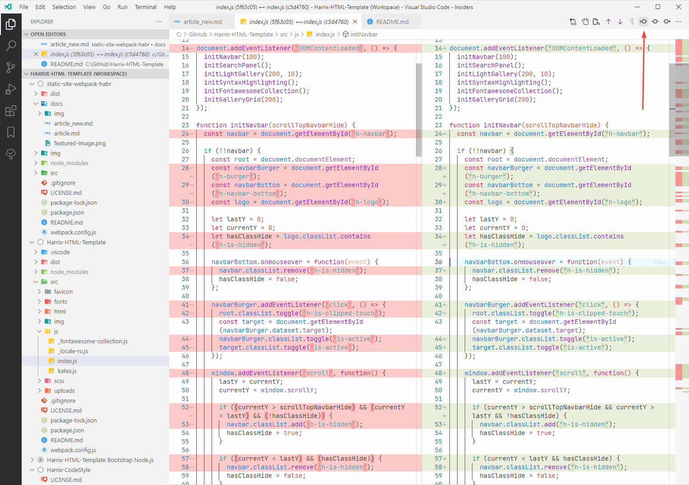

_Рисунок 103 — Перемещение по истории коммитов_

Подробнее о плагине читайте в его документации.

### Git History

[Git History](https://marketplace.visualstudio.com/items?itemName=donjayamanne.githistory) — история коммитов репозитория.

Через панель команд `F1` вызываем команду `Git: View History` и видим историю коммитов:

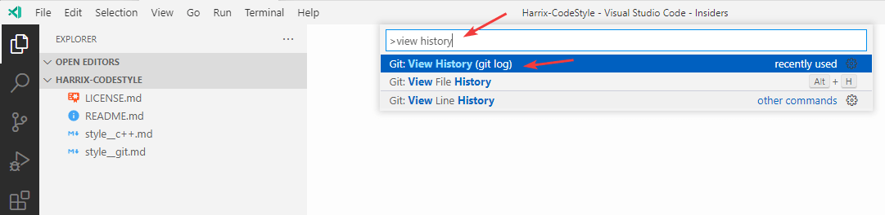

_Рисунок 104 — Команда показа истории коммитов_

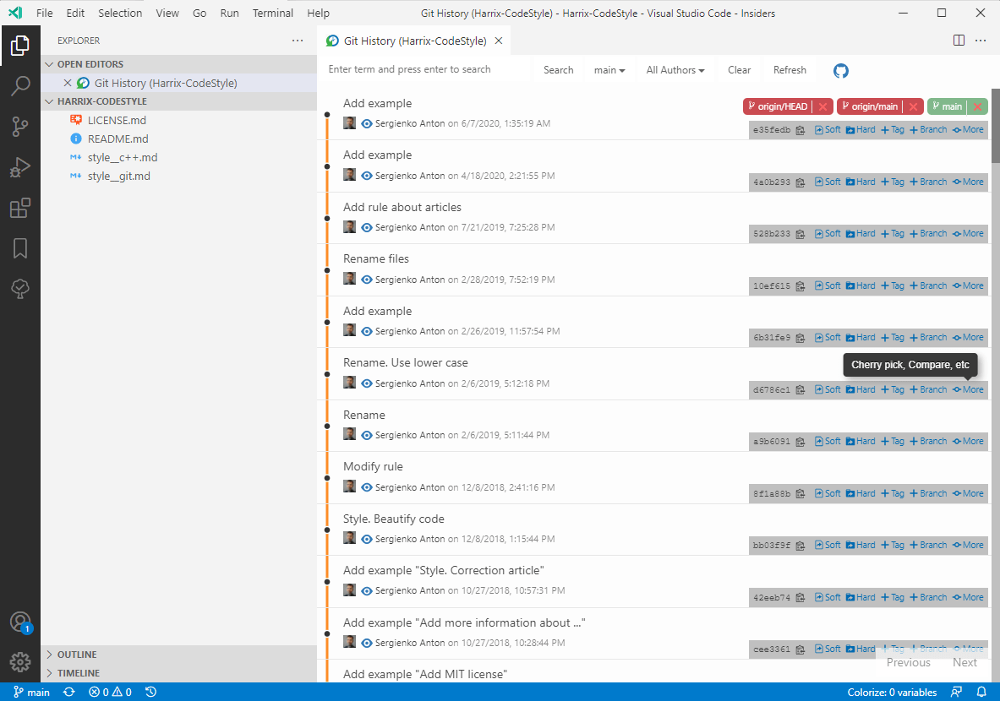

_Рисунок 105 — История коммитов_

А по команде `Git: View File History` можно увидеть историю коммитов именно данного файла:

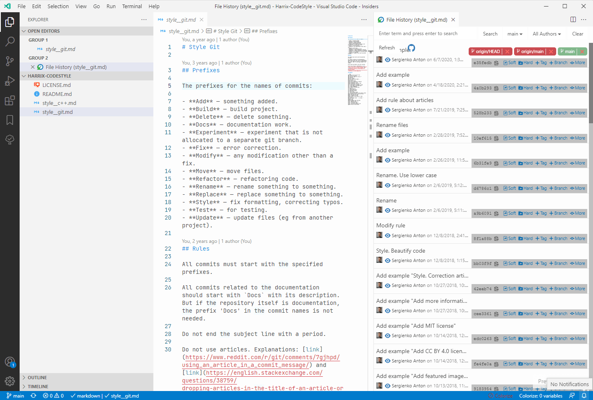

_Рисунок 106 — История коммитов файла_

Опять таки напишу, что для работы с Git использую GitHub Desktop, так что эти два плагина я не использую у себя. Правда GitLens стоит, но не активен, чтобы изредка им пользоваться.

## Программирование на Python

Есть официальная документация о работе с Python в VSCode: [Python in Visual Studio Code](https://code.visualstudio.com/docs/languages/python).

Вам вначале нужно будет установить Python отдельно на компьютер (после этого перезапустите VSCode).

И на всякий случай обновите у себя `pip` (терминал или командную строку лучше открывать с правами администратора):

```shell
python -m pip install --upgrade pip
```

Не забудьте после установки Python перезапустить VSCode.

### Расширения для Python

Установите [Python](https://marketplace.visualstudio.com/items?itemName=ms-python.python) — основное расширение для работы с Python.

Вместе с ним автоматически (на август 2021) установятся расширения (если не установились, то установите):

- [Jupyter](https://marketplace.visualstudio.com/items?itemName=ms-toolsai.jupyter) — расширения по работе с Jupyter блокнотами.
- [Jupyter Keymap](https://marketplace.visualstudio.com/items?itemName=ms-toolsai.jupyter-keymap) — горячие клавиши по работе с Jupyter.
- [Pylance](https://marketplace.visualstudio.com/items?itemName=ms-python.vscode-pylance) — статическая проверка кода, автодополнения, справка и так далее.

Рекомендую также следующие расширения, которые могут пригодиться:

- [Qt for Python](https://marketplace.visualstudio.com/items?itemName=seanwu.vscode-qt-for-python) — поддержка работы PyQt6 и PyQt5, если вы работаете с Qt.

### Запуск Python кода

В VSCode есть несколько способов запуска вашего Python кода.

#### Стандартный запуск

Когда вы создаете файл с кодом Python, то наверху справа появится кнопка запуска кода:

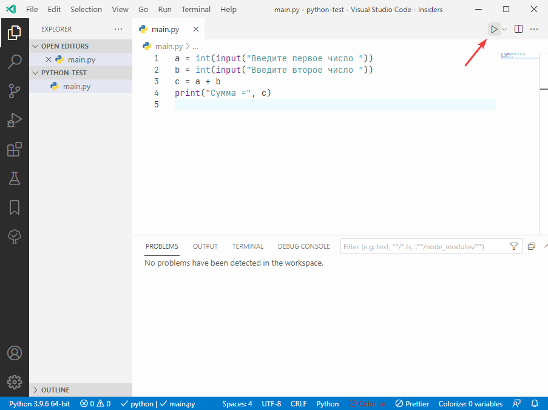

_Рисунок 107 — Запуск скрипта_

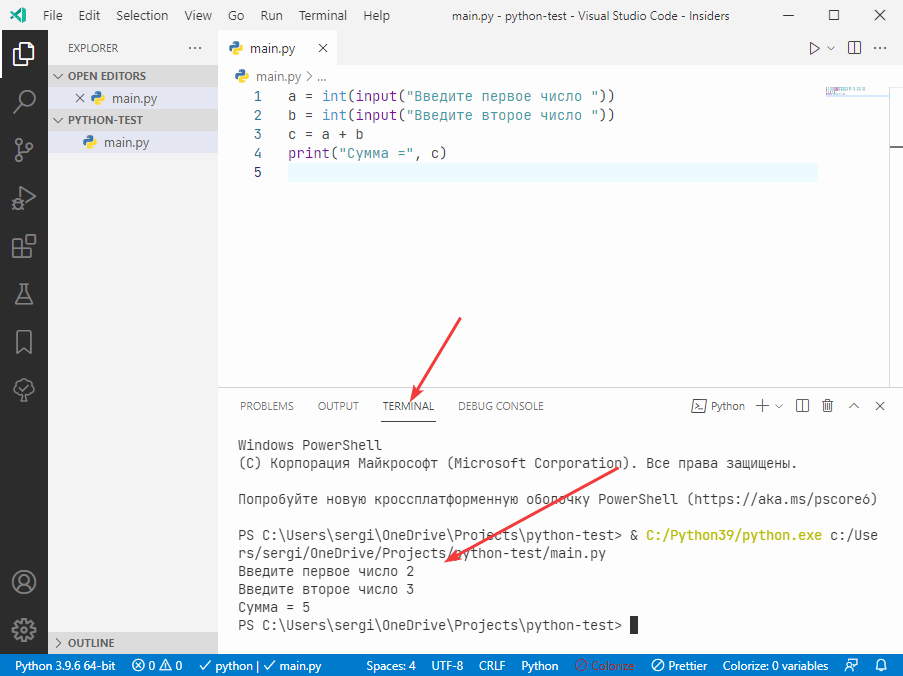

_Рисунок 108 — Результат выполнения программы_

#### Запуск в режиме отладки

Можно запустить код в режиме отладки с точками остановки:

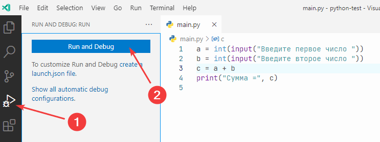

_Рисунок 109 — Запуск кода через панель отладки_


_Рисунок 110 — Пример запуска кода_

Также в режиме отладки можно запустить через знакомую кнопку в форме треугольника:

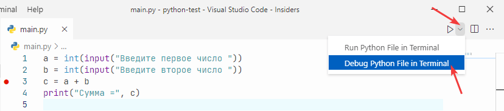

_Рисунок 111 — Запуск кода через кнопку старта_

#### Запуск через консоль с Jupyter

Вы можете запустить код в интерактивном виде через использование Jupyter через клик правой кнопкой по коду через `Run Current File in Interactive Window` (вас возможно попросят доустановить глобальные python пакеты `ipykernel` и др.):

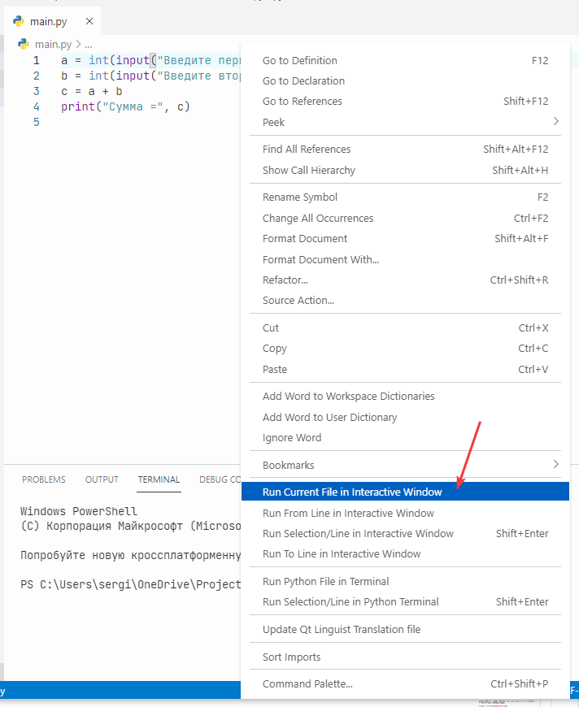

_Рисунок 112 — Запуск кода через Jupyter_


_Рисунок 113 — Пример запуска кода_

#### Запуск через Code Runner

Если вы установили [Code Runner](https://marketplace.visualstudio.com/items?itemName=formulahendry.code-runner), о котором говорилось выше, то в меню кнопки запуска появится пункт `Run Code`:

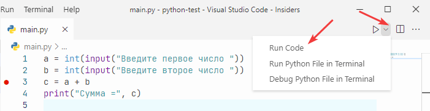

_Рисунок 114 — Запуск через Code Runner_

Вы же не забыли включить в настройках VSCode эту настройку:

```json
"code-runner.runInTerminal": true,
```

Если нет, то получите стандартный запуск кода в терминале:

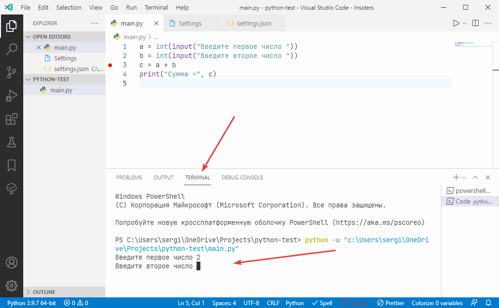

_Рисунок 115 — Запуск скрипта в терминале_

Если забыли, то получите проблемы с русским языком, а также невозможность ввести данные при выполнении `int(input())`, например:

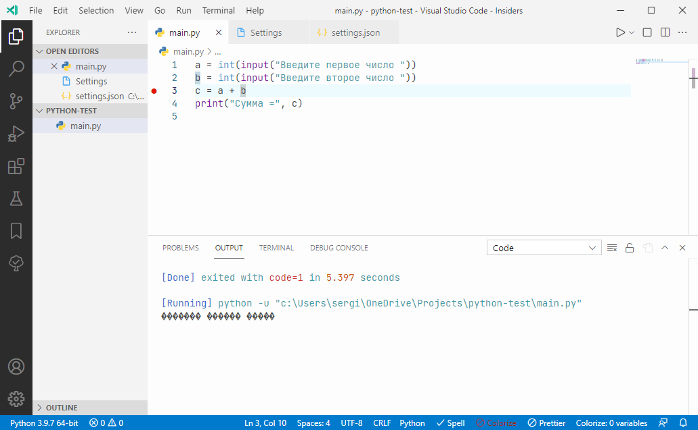

_Рисунок 116 — Запуск скрипта в output_

Как видите, что особого смысла в Code Runner для Python нет, так как и без него можно запускать код в терминале.

#### Запуск в Jupyter

Официальная документация по работе Jupyter: [Jupyter Notebooks in VS Code](https://code.visualstudio.com/docs/datascience/jupyter-notebooks).

Для работы с Jupyter нужен пакет [Jupyter](https://marketplace.visualstudio.com/items?itemName=ms-toolsai.jupyter), который ставится автоматически при установке пакета [Python](https://marketplace.visualstudio.com/items?itemName=ms-python.python).

Создать новый блокнот Jupyter можно через `F1` → `Jupyter: Create New Blank Notebook`:

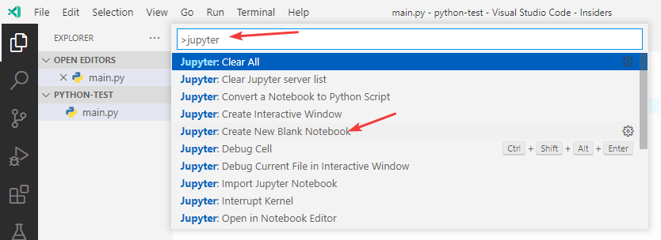

_Рисунок 117 — Создание нового блокнота_

После этого будет создан новый полноценный блокнот Jupyter, с которым можно работать:

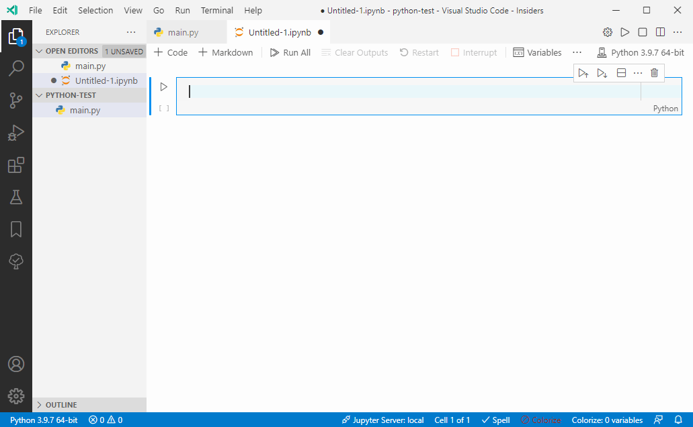

_Рисунок 118 — Созданный блокнот_

Например, я ввожу код тестового примера, который запускаю через треугольник слева от куска кода:

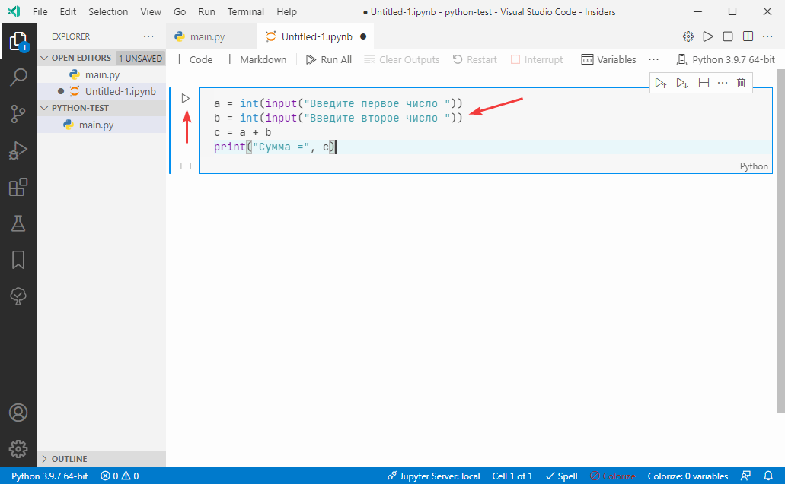

_Рисунок 119 — Ввод кода и его запуск_

Команды `input()` будут выполняться через всплывающие окна:

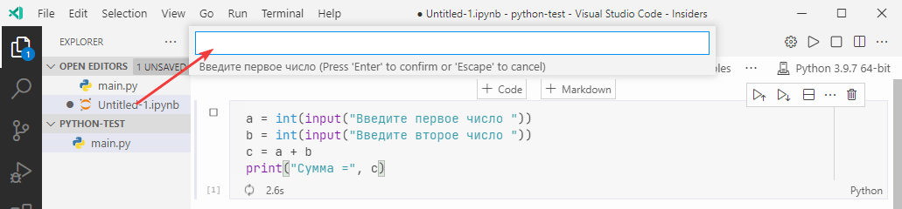

_Рисунок 120 — Ввод данных_

После отобразится результат выполнения программы:

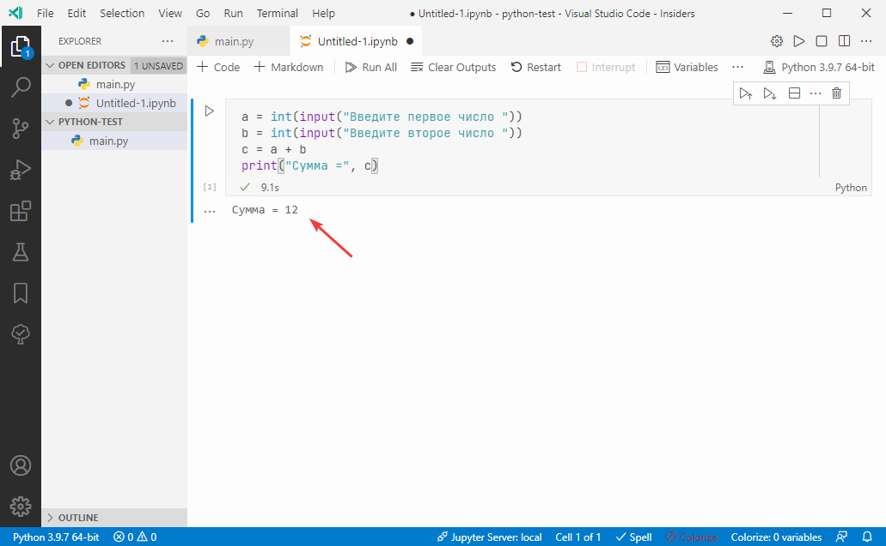

_Рисунок 121 — Результат выполнения программы_

### Виртуальные среды

В Python, в отличии от других языков программирования, не принято (но можно) работать с головным интерпретатором Python, который у вас установлен на компьютере. Желательно под каждый проект создавать специальную папку (виртуальная среда), в которой будет свой экземпляр Python (копируясь с головного интерпретатора). В ней же будут храниться все установленные пакеты под ваш проект.

Зачем это? Разные версии Python могут быть несовместимы друг с другом. Тоже самое касается и пакетов. И чтобы разные проекты не конфликтовали друг с другом, была предложена идея виртуальных сред.

В примерах запуска кода, которые приведены выше, все эксперименты проводились без использования виртуальных сред, и запускался головной файл `python.exe` (у меня он располагается по пути `C:\Python39\python.exe`).

Итак, у нас есть папка, например, `python-test` со скриптами, открытая в VSCode. Также открыт терминал через `Ctrl` + `` ` ``:

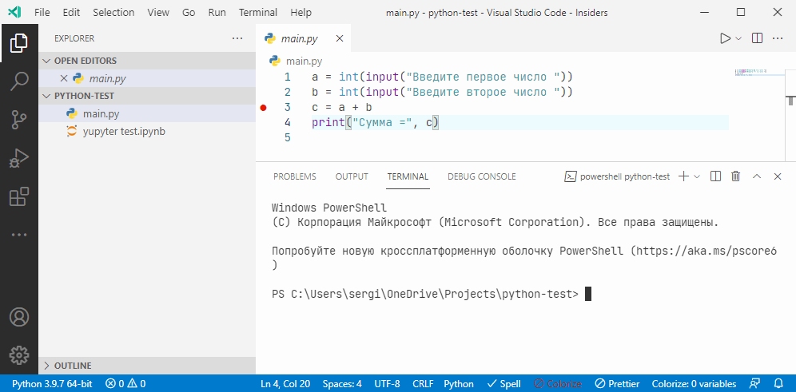

_Рисунок 122 — Открытая папка в VSCode_

#### Venv

Новую виртуальную среду под наш проект можно создать через команду:

```shell
python -m venv .venv
```

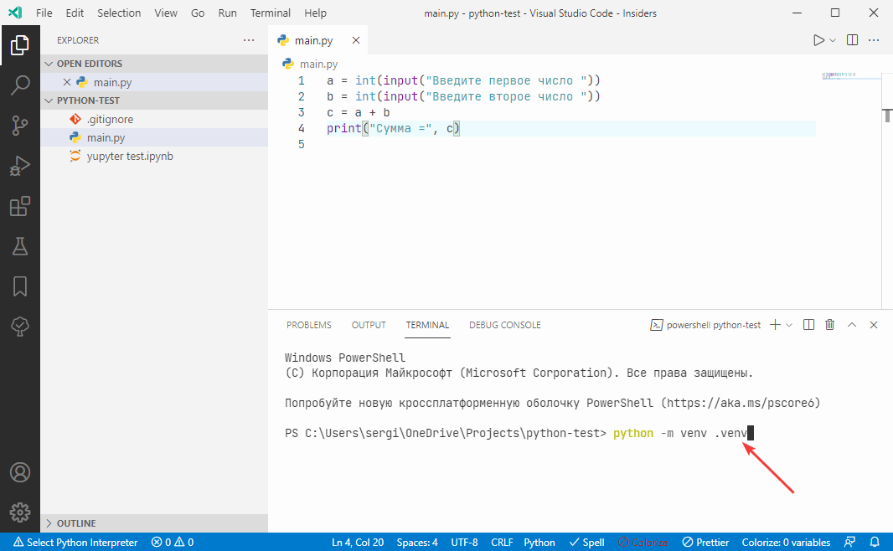

_Рисунок 123 — Ввод команды python -m venv venv_

Надеюсь, что вы понимаете, что в терминале вы должны находиться в папке, в которой вы хотите создать виртуальную среду.

После этого VSCode попросит использовать созданную виртуальную среду у себя для запуска скриптов:

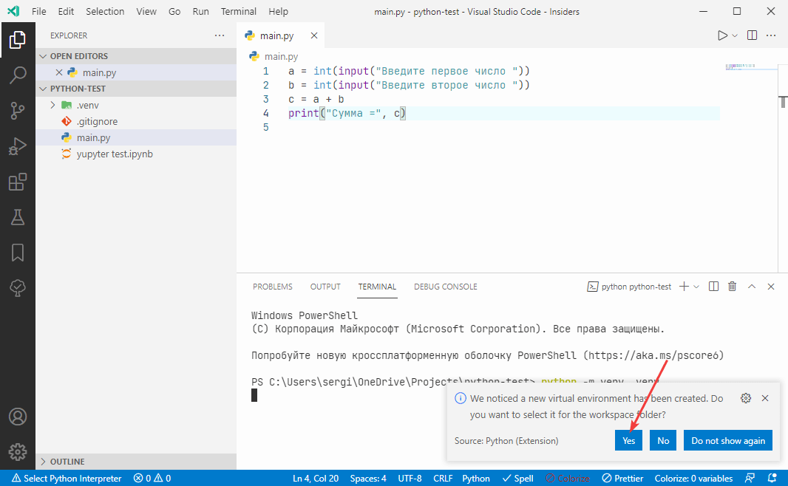

_Рисунок 124 — Запрос на использование виртуальной среды_

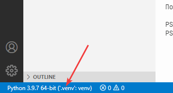

_Рисунок 125 — Отображение виртуальной среды_

Кстати, если вы свой проект храните в git (например, в GitHub), то не забудьте в файл `.gitignore` добавить папку виртуальной среды. Её не нужно добавлять в git историю:

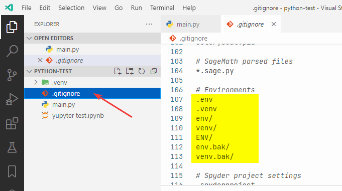

_Рисунок 126 — Возможные варианты называния папки виртуальной среды_

#### Virtualenv

Кроме встроенной системы виртуальных сред Venv есть и другие системы. Например, PyCharm использует [Virtualenv](https://virtualenv.pypa.io/en/stable/) по умолчанию. Вначале устанавливаем глобальный пакет:

```shell
python -m pip install virtualenv
```

В папке проекта виртуальную среду можно создать через:

```shell
python -m virtualenv .env
```

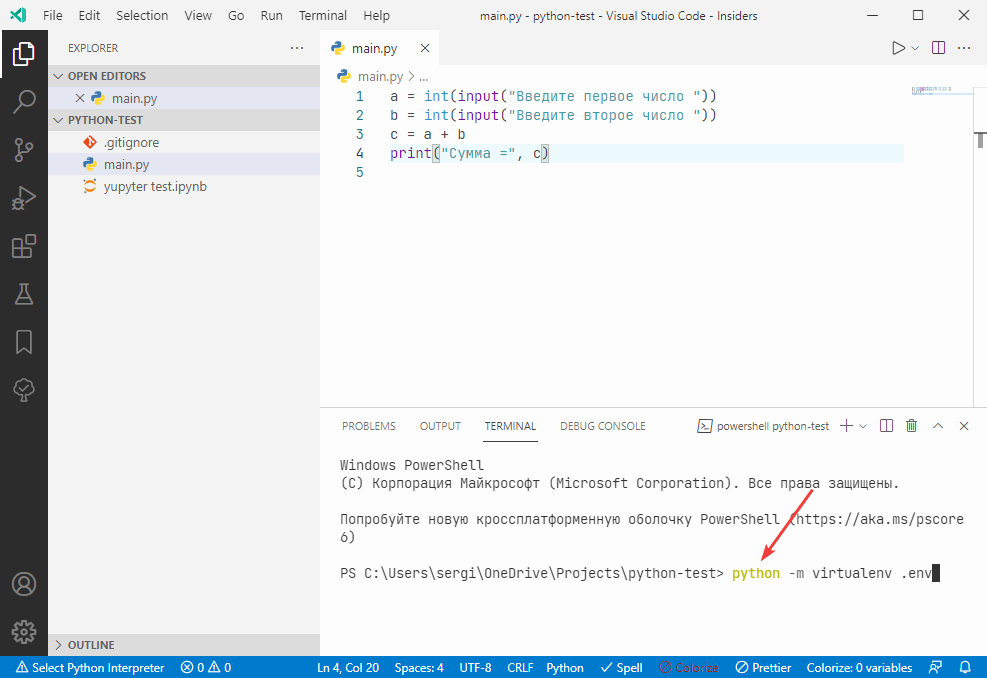

_Рисунок 127 — Создание виртуальной среды_

VSCode также обнаружит её и попросит выбрать:

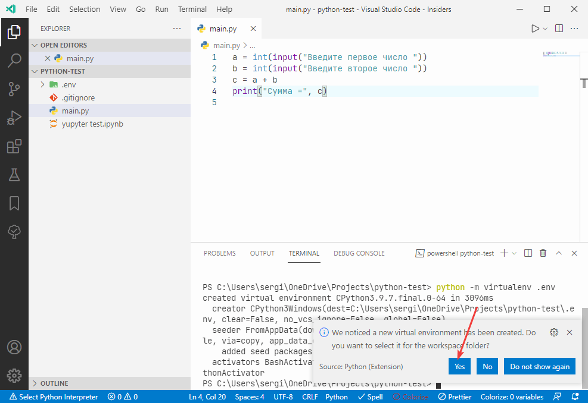

_Рисунок 128 — Выбор созданной виртуальной среды_

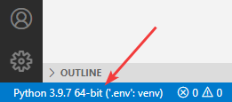

_Рисунок 129 — Выбранная виртуальная среда_

[Путь к виртуальному окружению]\Scripts\activate.bat

c:\projects\harrix-test-package\.env\Scripts\activate.bat

Когда вы устанавливаете пакеты в проект, то в проекте создается файл `requirements.txt` (этот файл в отличии от папки с виртуальной средой нужно в git добавлять) со списком пакетов. И на другой машине можно восстановить пакеты через команду:

```shell
python -m pip install -r requirements.txt
```

#### Pipenv

Ну, а лично я использую [Pipenv](https://github.com/pypa/pipenv). Он работает с виртуальными средами Virtualenv, но также фиксирует все версии пакетов, включая внутренние зависимости, что позволяет однозначно развернуть ваш проект на другой машине.

Установка глобального пакета (лучше устанавливать под администратором):

```shell
python -m pip install virtualenv
python -m pip install pipenv
```

По умолчанию Pipenv использует папку `C:\Users\[User]\.virtualenvs` для сохранения виртуальных сред в отличии от двух предыдущих инструментов, которые соответствующую виртуальные среды сохраняют в папку проекта. Есть способ это поменять через `set PIPENV_VENV_IN_PROJECT=1`, но не советую, так как папки виртуальных сред будут называться, например, для проекта `python-test` как `python-test-TCOhYAuY`, что усложнит добавление папки в `.gitignore`.

Виртуальную среду можно создать через две команды:

```shell
pipenv install
pipenv shell
```

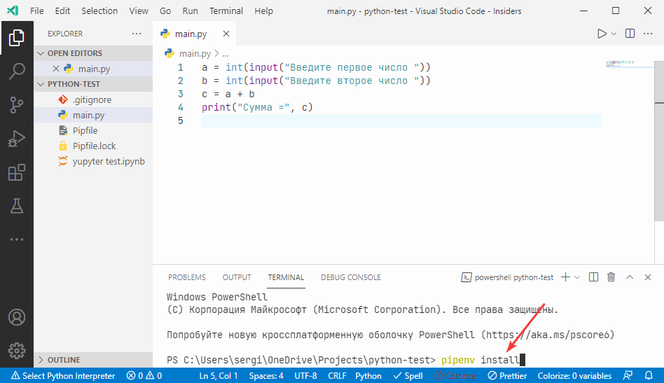

_Рисунок 130 — Создание виртуальной среды_

Появится, например, папка `C:\Users\sergi\.virtualenvs\python-test-TCOhYAuY` с виртуальной средой, а в папке с проектом появятся два файла `Pipfile` и `Pipfile.lock`, которые нужно добавлять в git.

И вот тут VSCode не подхватит сразу созданную виртуальную среду, так как она создается не в папке с проектом. Поэтому добавьте в файл настроек VSCode следующую строку с вашим путем, куда Pipenv сохраняет виртуальные среды:

```json
"python.venvPath": "C:\\Users\\sergi\\.virtualenvs",
```

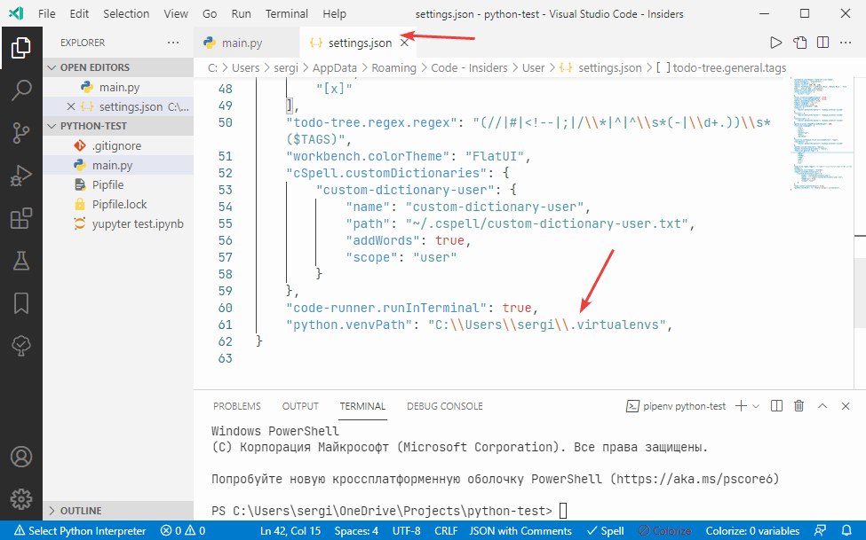

_Рисунок 131 — Установка пути к виртуальным средам_

Перезапустите VSCode после этого.

Теперь внизу слева вы можете выбрать вашу виртуальную среду:

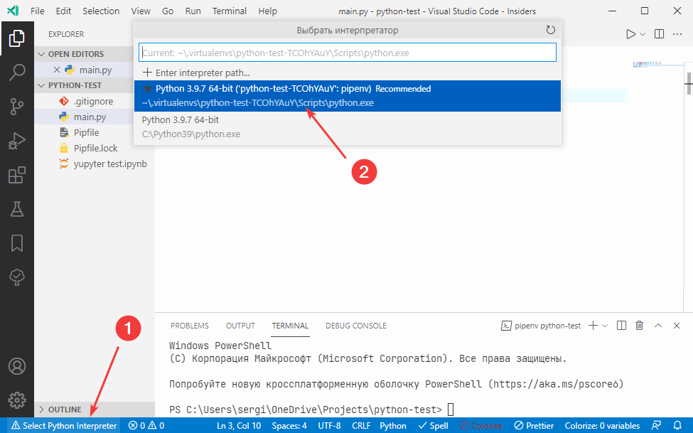

_Рисунок 132 — Выбор виртуальной среды_

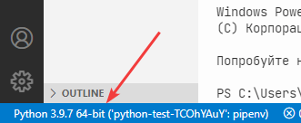

_Рисунок 133 — Выбранная виртуальная среда_

Также при использовании Pipenv при установке пакетов для вашего проекта внутри виртуальной среды вместо команд `pip install numpy` (`python -m pip install numpy`) теперь надо использовать `pipenv install numpy` (`python -m pipenv install numpy`).

А если вы хотите развернуть ваш проект на другой машине, то установите Pipenv на другой машине и вызовите команду (это аналог `python -m pip install -r requirements.txt`):

```shell
pipenv install
pipenv shell
```

И иногда может пригодится команда, которая для Pipenv укажет путь к Python: `pipenv --python C:\Python39\python.exe` (у вас будет другой путь). Например, ниже на скриншоте я на новой машине пытался через `pipenv install --dev` поднять свой проект, но на прошлой машине у меня был Python 3.8, а теперь перешел на 3.9. И пришлось через вышеуказанную команду указывать путь к Python:

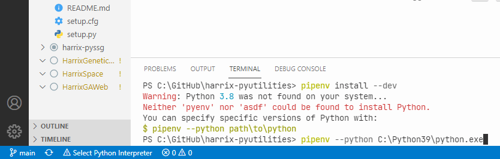

_Рисунок 134 — Переназначение пути к Python_

Через команду `pipenv update` в проекте можно обновить все пакеты.

#### Несколько виртуальных сред

Как вы уже знаете, VSCode может в одном окне открыть несколько папок, каждая из которых может быть полноценным Python проектом:

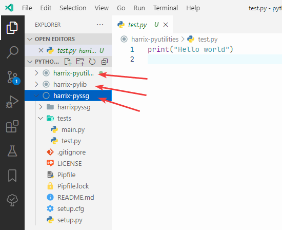

_Рисунок 135 — Три проекта в одном окне_

И возникает проблема переключения виртуальных сред между проектами. К счастью, VScode можно научить, что в каждом проекте будет своя виртуальная среда. Для этого для каждого проекта щелкаем на выбор виртуальной среды, выбираем проект, а потом под него виртуальную среду:

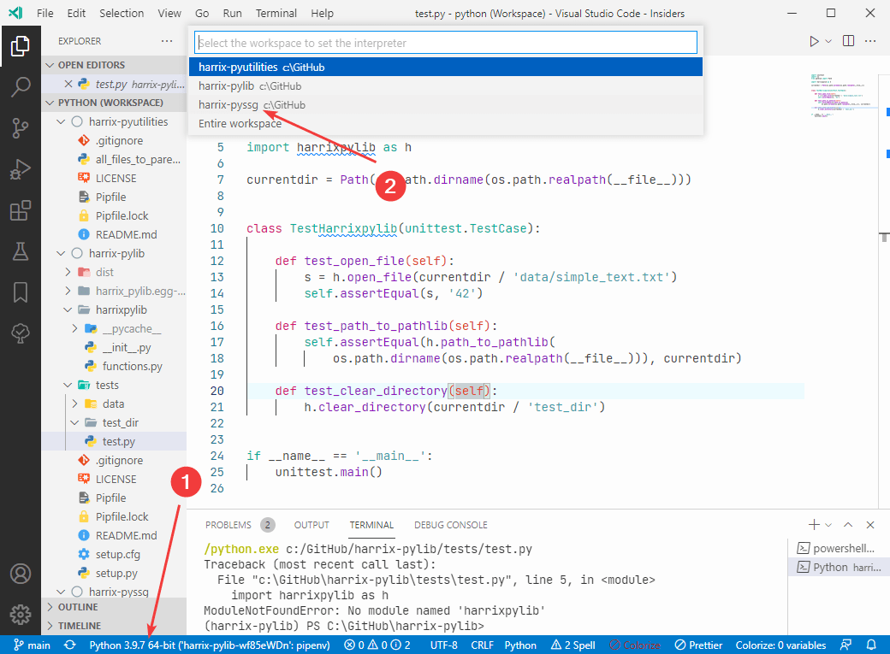

_Рисунок 136 — Выбор проекта_

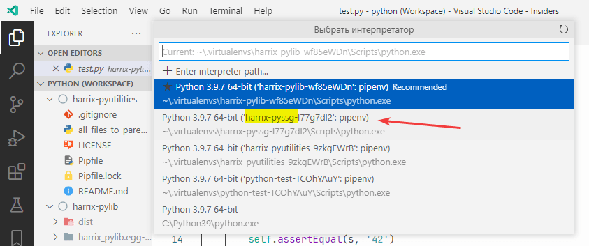

_Рисунок 137 — Выбор виртуальной среды под проект_

В качестве общей виртуальной среды выбирает общий интерпретатор Python:

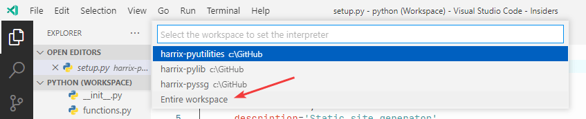

_Рисунок 138 — Выбор рабочей области_

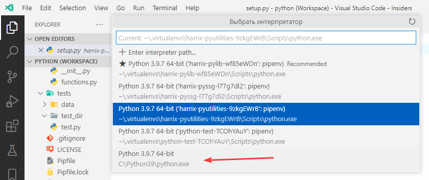

_Рисунок 139 — Выбор интерпретатора_

После этого при переключении файлов разных проектов будет выбираться виртуальная среда соответствующего проекта:


_Рисунок 140 — Переключение виртуальных сред_

Есть еще одна потенциальная опасность. Например, вы добавляете еще один проект, в котором в терминале хотите через `pipenv install` создать виртуальную среду под новый проект:

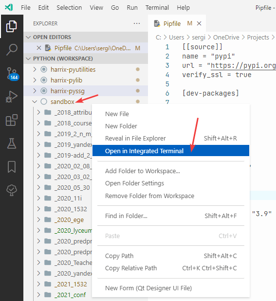

_Рисунок 141 — Открытие нового проекта в терминале_

И возможно, что у вас в терминале откроется не чистый терминал, а с открытой виртуальной средой предыдущего проекта:

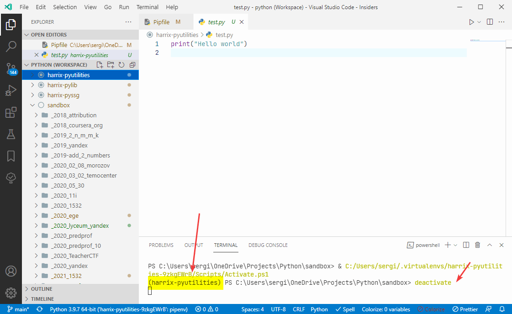

_Рисунок 142 — Открытие нового проекта в терминале_

И тут команда `pipenv install` сработает не так как нужно. Поэтому в этом случае выходим из виртуальной среды через команду `deactivate`, как на скриншоте выше.

#### Принудительный выбор виртуальной среды

Может так быть, что виртуальная среда не появится сразу в списке. Тогда её можно выбрать через `Enter interpreter path…`:

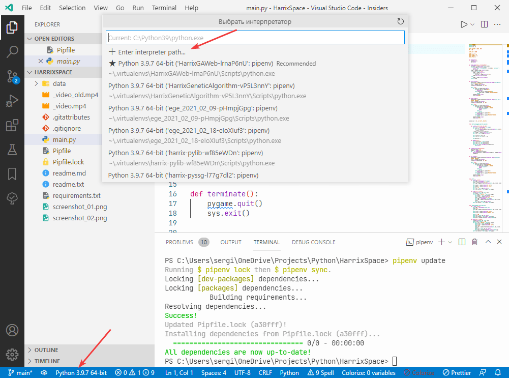

_Рисунок 143 — Выбор ввода пути виртуальной среды_

Например, тут я посмотрел в папке виртуальных сред `C:\Users\[User]\.virtualenvs\` папку своей среды `C:\Users\sergi\.virtualenvs\HarrixSpace-hgtVR0PE`, ввел ёё и нажал на `Enter`:

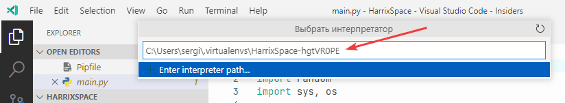

_Рисунок 144 — Ввод пути виртуальной среды_

### Автоформатирование кода

VSCode поддерживает автоформатирование кода. Например, у вас есть такой код:

```python
a = int(input(  "Введите первое число "))
b = int(   input("Введите второе число "))
c =a +   b
print("Сумма =",     c)
```

Как и всегда, команду можно вызвать через панель команд `F1`, а после написав `format`

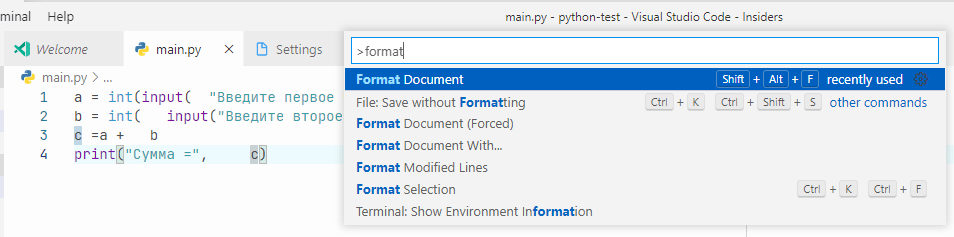

_Рисунок 145 — Вызов команды Format Document_

Будет преложено установить один из трех плагинов: `autopep8`, `black`, `yapf`

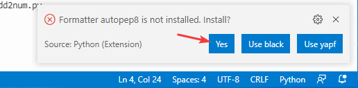

_Рисунок 146 — Выбор плагина_

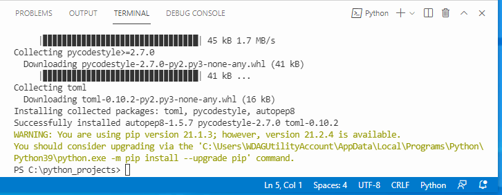

_Рисунок 147 — Установка пакета_

Обратите внимание на то, что это установка глобального пакета Python, а не установка расширения в VSCode.

И после этого вышеприведенный код будет отформатирован так:

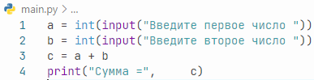

_Рисунок 148 — Результат форматирования_

Но лично я предпочитаю плагин [black](https://github.com/psf/black), отличительной особенностью которого является то, что он почти никак не настраивается: общие правила для всех.

А мы только что установили autopep8. Будем менять. Вначале установим глобально плагин black:

```shell
pip install black
```

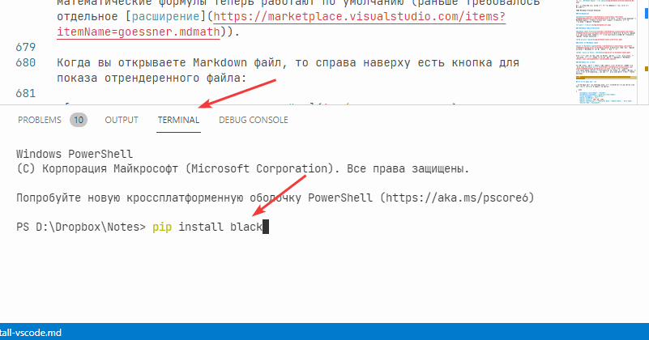

_Рисунок 149 — Установка пакета black_

А потом меняем в настройках плагин для автоформатирования:

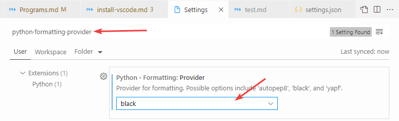

_Рисунок 150 — Выбор плагина_

Либо меняете в настройках в виде JSON:

```json
"python.formatting.provider": "black",
```

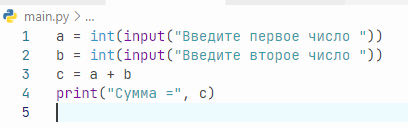

_Рисунок 151 — Результат форматирования_

Сравнение плагинов автоформатирования можно почитать [тут](https://blog.frank-mich.com/python-code-formatters-comparison-black-autopep8-and-yapf/).

## Работа с Markdown

Работа с Markdown файлами заложена по умолчанию в VSCode. Даже математические формулы теперь работают по умолчанию (раньше требовалось отдельное [расширение](https://marketplace.visualstudio.com/items?itemName=goessner.mdmath)).

Когда вы открываете Markdown файл, то справа наверху есть кнопка для показа отрендеренного файла:

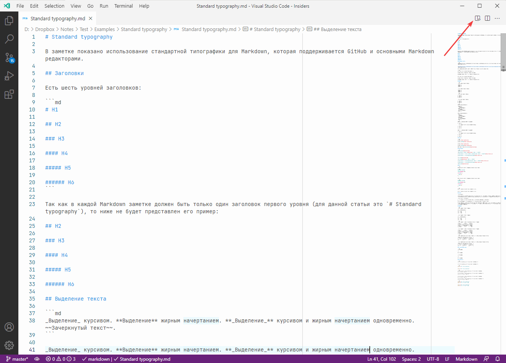

_Рисунок 152 — Кнопка показа превью Markdown файла_

Слева вы можете редактировать файл, а справа видеть, что получается в режиме реального времени:

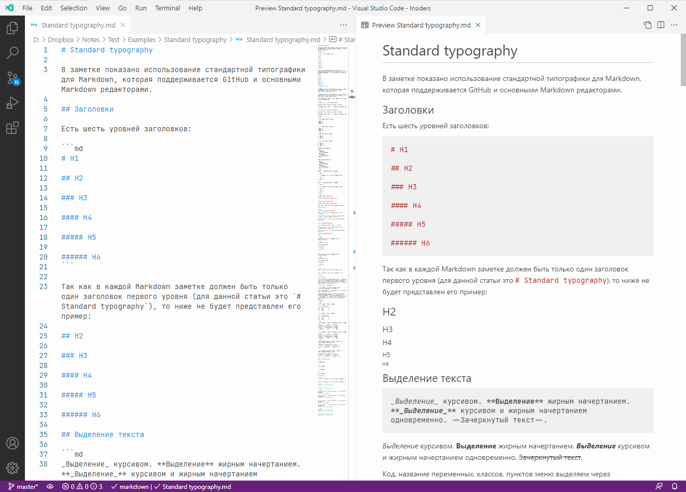

_Рисунок 153 — Markdown файл и его превью_

Попробуйте создать Markdown файл `test.md` с таким [содержимым](files/test.md):

````markdown
---
date: 2022-09-15
categories: []
tags: []
latex: true
published: false
---

# Markdown test

## Подзаголовок


_Выделение_ курсивом. **Выделение** жирным начертанием. **_Выделение_** курсивом и жирным начертанием одновременно. ~~Зачеркнутый текст~~.

Код `int x = 0;` объявляет переменную `x`.

Команда `File` → `New File` создает новый файл.

Пример ненумерованного списка:

- пункт 1;
- пункт 2;
- пункт 3.

Ссылка: <https://github.com>.

Ссылка: [GitHub](https://github.com).


Кусок кода:

```cpp
#include <iostream>

using namespace std;

int main() {

  return 0;
}
```

Пример таблицы с двумя столбцами:

| №   | Высота (мм) |
| --- | ----------- |
| 1   | 23          |
| 2   | 52          |
| 3   | 123         |

Встроенная формула: $c = a^2$. И еще одна формула $\sqrt{\frac{a}{b}}$.

Пример формулы:

$$
\tag{1} x+y^{2x}
$$

Пример более сложной формулы:

$$
\def\arraystretch{1.5}
   \begin{array}{c:c:c}
   a & b & c \\ \hline
   d & e & f \\
   \hdashline
   g & h & i
\end{array}
$$

| Дерево | Возраст |
| ------ | ------- |
| Яблоня | 20      |
| Липа   | 12      |
| Ель    | 55      |
````

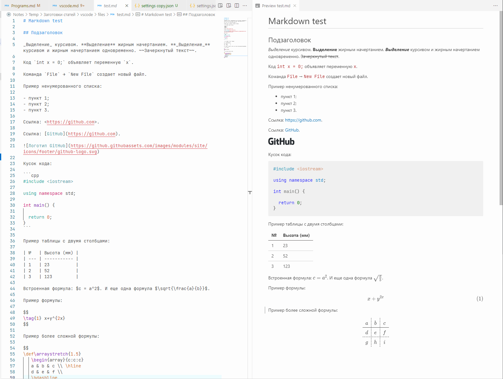

_Рисунок 154 — Markdown файл с формулами и таблицей_

Слева внизу есть раздел `Outline`, при раскрытии которого вы увидите структуру вашего Markdown файла:

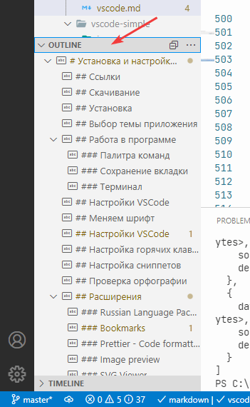

_Рисунок 155 — Область Outline_

Теперь посмотрим на дополнительные расширения.

### Markdown Preview Enhanced

[Markdown Preview Enhanced](https://marketplace.visualstudio.com/items?itemName=shd101wyy.markdown-preview-enhanced) — превью для Markdown файлов.

После установки плагина появится вторая иконка (она будет первой) для открытия просмотра Markdown файла:

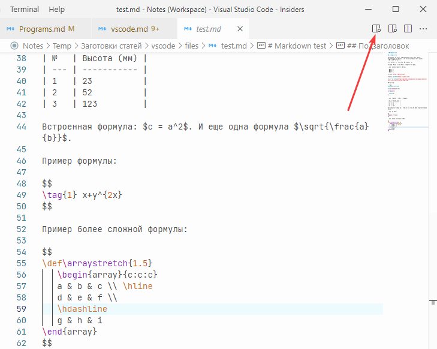

_Рисунок 156 — Кнопка открытия превью Markdown файла_

Да, в VSCode уже встроен просмотрщик Markdown файлов в отрендеренном виде, что рассматривалось выше. Но этот плагин более крутой. Например, в нем есть встроенное содержание документа:

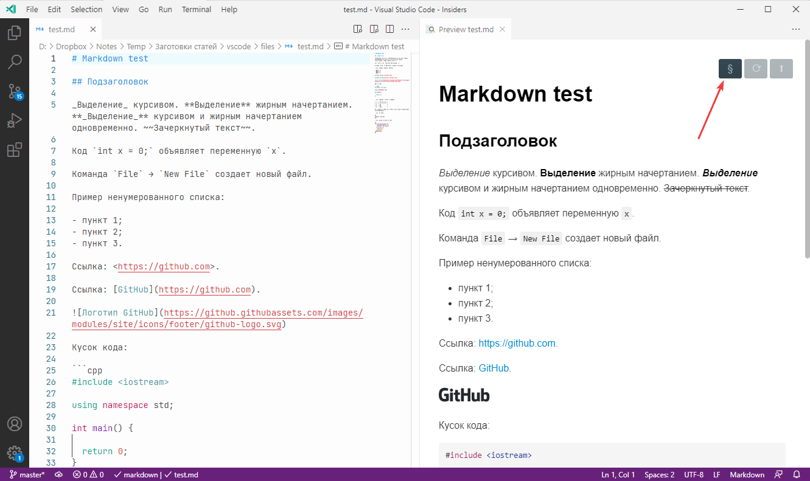

_Рисунок 157 — Кнопка открытия содержания Markdown файла_

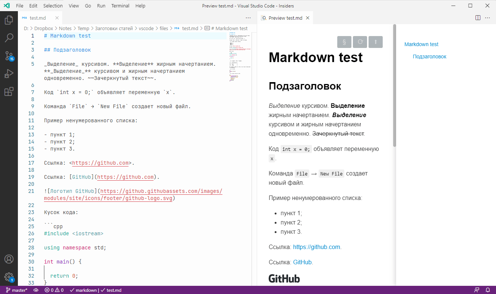

_Рисунок 158 — Превью Markdown файла с содержанием_

Если кликнуть правой кнопкой мыши, то обнаружим богатое меню с разными командами. Есть много команд по экспорту Markdown документа в PDF, HTML:

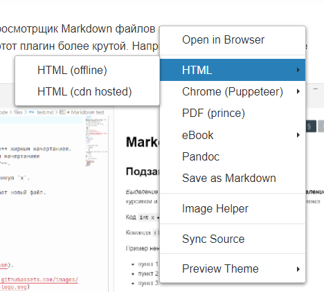

_Рисунок 159 — Контекстное меню_

Например, команда `HTML` → `HTML (offline)` сгенерирует HTML файл в той же папке, что и Markdown файл, открыв который, мы увидим отрендеренный файл:

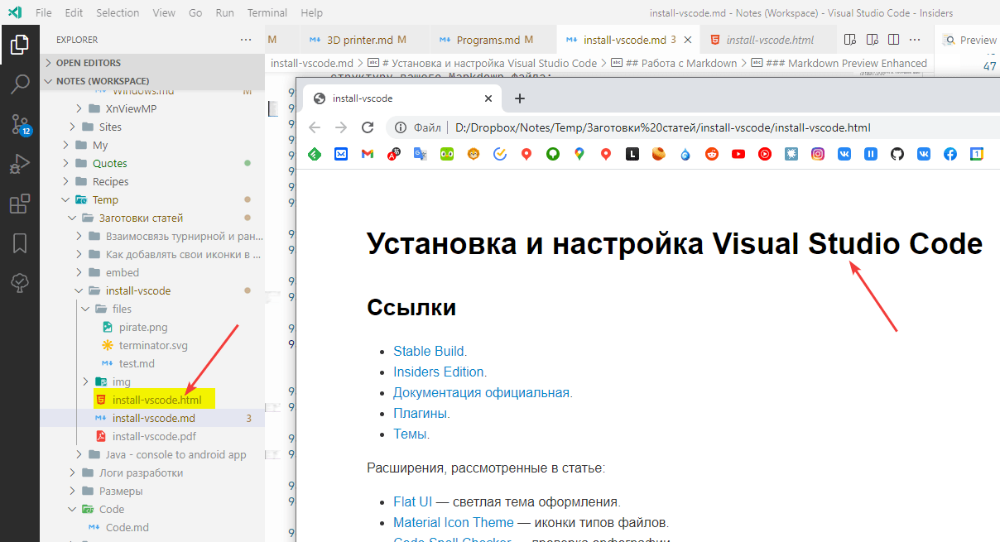

_Рисунок 160 — HTML файл_

TODO Markdown Preview Enhanced

### markdownlint

[markdownlint](https://marketplace.visualstudio.com/items?itemName=DavidAnson.vscode-markdownlint) — линтер (статический анализатор) Markdown файлов. Другими словами ищет ошибки в документе, которые отображает в панели `Problems`:

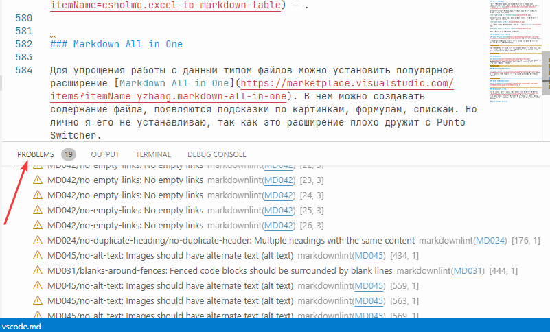

_Рисунок 161 — Ошибки в документе_

### Markdown Table Prettifier

[Markdown Table Prettifier](https://marketplace.visualstudio.com/items?itemName=darkriszty.markdown-table-prettify) — позволяет привести таблицы к нормальному виду. Делается это через клик правой кнопки по выделенной таблице `Format Selection`:


_Рисунок 162 — Исправление таблицы_

### Excel to Markdown table

[Excel to Markdown table](https://marketplace.visualstudio.com/items?itemName=csholmq.excel-to-markdown-table) — позволяет копировать таблицы из Excel в Markdown формат по `Shift` + `Alt` + `V`:


_Рисунок 163 — Копирование из Excel в Markdown_

Если что-то идет не так, либо не удобно работать с этим расширением, то рекомендую вот этот онлайн сервис по работе с таблицами в Markdown: <https://www.tablesgenerator.com/markdown_tables>.

### Markdown All in One

Для упрощения работы с данным типом файлов можно установить популярное расширение [Markdown All in One](https://marketplace.visualstudio.com/items?itemName=yzhang.markdown-all-in-one). В нем можно создавать содержание файла, появляются подсказки по картинкам, формулам, спискам. Но лично я его не устанавливаю, так как это расширение плохо дружит с Punto Switcher.

TODO https://marketplace.visualstudio.com/items?itemName=marp-team.marp-vscode

## Итоговый файл настроек

Привожу файл настроек settings.json, который получился у меня после всех настроек (в частично урезанном варианте):

```json
{
  "workbench.iconTheme": "material-icon-theme",
  "files.autoSave": "afterDelay",
  "editor.wordWrap": "on",
  "editor.rulers": [80, 88, 120],
  "editor.fontFamily": "'JetBrains Mono','Roboto Mono', 'Fira Code', 'Courier New', monospace",
  "explorer.confirmDelete": false,
  "files.associations": {
    "*.inc": "ini"
  },
  "files.trimTrailingWhitespace": true,
  "explorer.confirmDragAndDrop": false,
  "editor.mouseWheelZoom": true,
  "cSpell.language": "en,ru",
  "cSpell.enabled": true,
  "prettier.printWidth": 120,
  "[html]": {
    "editor.defaultFormatter": "esbenp.prettier-vscode"
  },
  "[jsonc]": {
    "editor.defaultFormatter": "esbenp.prettier-vscode"
  },
  "[javascript]": {
    "editor.defaultFormatter": "esbenp.prettier-vscode"
  },
  "gutterpreview.imagePreviewMaxHeight": 200,
  "colorize.languages": [
    "css",
    "scss",
    "sass",
    "javascript",
    "html",
    "markdown"
  ],
  "security.workspace.trust.untrustedFiles": "open",
  "[markdown]": {
    "editor.defaultFormatter": "esbenp.prettier-vscode"
  },
  "python.insidersChannel": "daily",
  "python.formatting.provider": "black",
  "todo-tree.general.tags": [
    "BUG",
    "HACK",
    "FIXME",
    "TODO",
    "XXX",
    "[ ]",
    "[x]"
  ],
  "todo-tree.regex.regex": "(//|#|<!--|;|/\\*|^|^\\s*(-|\\d+.))\\s*($TAGS)",
  "workbench.colorTheme": "FlatUI",
  "cSpell.customDictionaries": {
    "custom-dictionary-user": {
      "name": "custom-dictionary-user",
      "path": "~/.cspell/custom-dictionary-user.txt",
      "addWords": true,
      "scope": "user"
    }
  },
  "code-runner.runInTerminal": true
}
```

TODO

## Синхронизация настроек в облаке

После всех манипуляций вы наконец получили версию VSCode, настроенную под себя. А теперь представьте, что вам нужно будет всё это повторить на другом компе? Опять всё повторять? Чтобы это не делать, можно синхронизировать настройки с облаком.

В разделе настроек есть кнопка включения синхронизации `Turn on Settings Sync`:

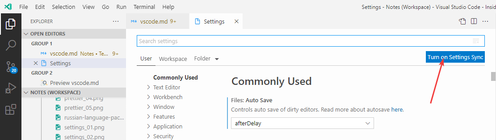

_Рисунок 164 — Кнопка Turn on Settings Sync_

Вас попросят выбрать то, что хотите синхронизировать. Мы хоти всё:

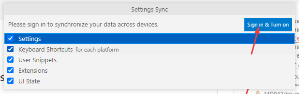

_Рисунок 165 — Выбор синхронизируемых параметров_

Выбираем стабильную или инсайдерскую версию VSCode. Так как всю статью работал с инсайдерской версией, то на скриншоте её и выбираю:

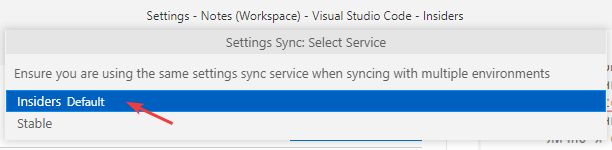

_Рисунок 166 — Выбор версии VSCode_

Теперь нужно выбрать сервис, относительно которого будем авторизоваться для синхронизации. Так как предполагаю, что не у всех есть лицензионная версия Windows, то буду показывать на примере аккаунта GitHub:

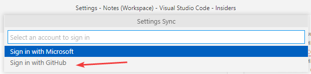

_Рисунок 167 — Выбор аккаунта для авторизации_

Потом вас перекинет в браузер, где нужно будет войти в учетку GitHub, а потом подтвердить связь аккаунта GitHub с VSCode:

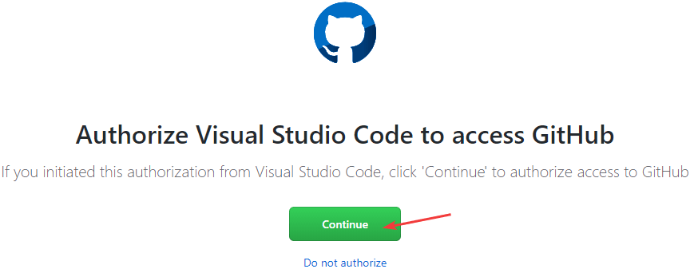

_Рисунок 168 — Авторизация на GitGub_

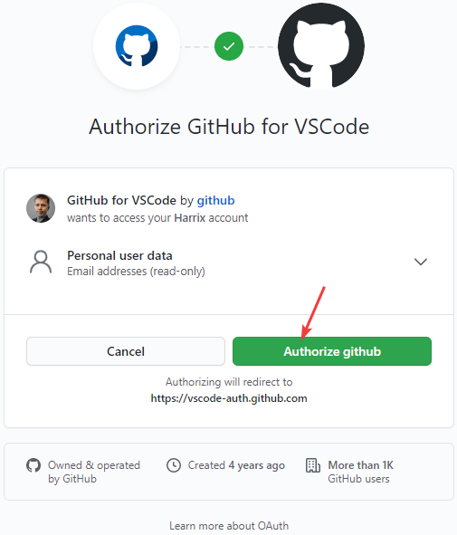

_Рисунок 169 — Подтверждение авторизации_

После этого в Chrome предложат открыть VSCode для продолжения работы:

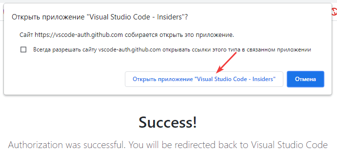

_Рисунок 170 — Переход из Chrome в VSCode_

VScode спросит стоит ли открывать всякие ссылки из Chrome:

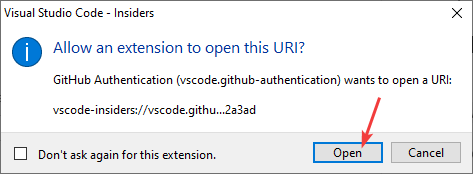

_Рисунок 171 — Открытие ссылки из Chrome в VSCode_

Всё. Теперь все настройки, список расширений, темы будут синхронизироваться с облаком. И если вы войдете на другом компе в VSCode и включите там синхронизацию настроек и войдете под своим аккаунтом, то VSCode всё синхронизирует, и вы получите такой же VSCode, что и у вас на первом компе:

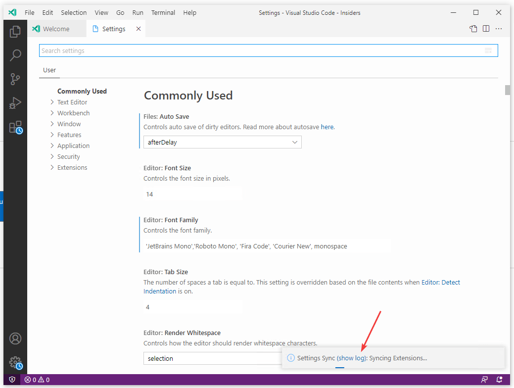

_Рисунок 172 — Синхронизация настроек на втором компьютере_

Но, помните, что всякие сторонние программы, которые используется для работы в VSCode (Python, Git и др.) надо будет устанавливать и настраивать отдельно.

И если вы включаете синхронизацию VSCode где-то на публичном компьютере (например, в компьютерной школьном классе), то не забывайте после работы выходить из него, так как вам могут в VSCode сбить настройки, которые будут синхронизированы с основным компьютером.

Чтобы выйти из аккаунта, перейдите в меню к команде `Settings Sync in On`:

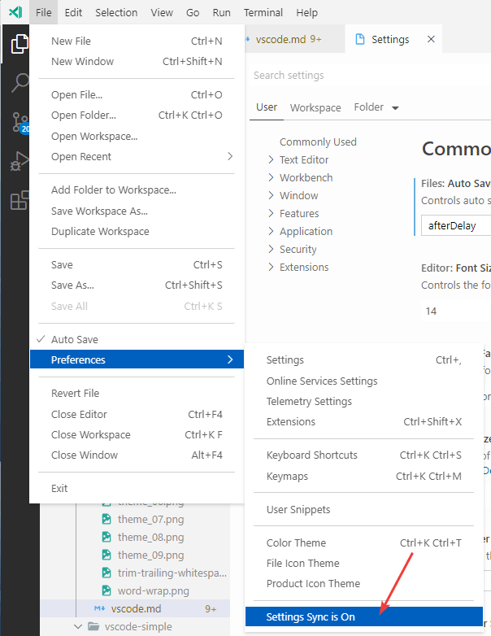

_Рисунок 173 — Команда Settings Sync in On_

И потом выберите команду `Settings Sync: Turn Off`:

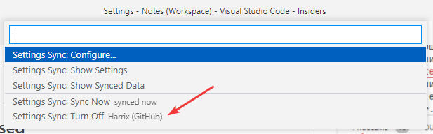

_Рисунок 174 — Выход из аккаунта_

TODO бэкап настроек https://code.visualstudio.com/docs/editor/settings-sync

TODO shift + alt выделение мышкой нескольких строк

TODO Если не работает ctrl v в терминале то правый клик мышкой
