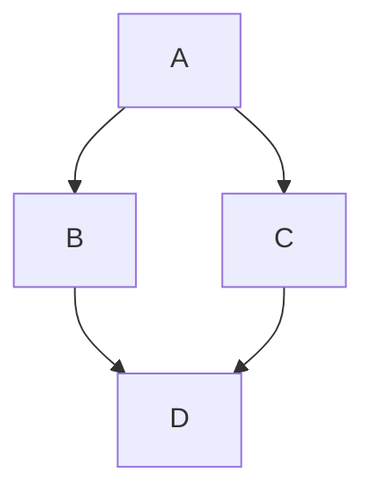

# Markdown синтаксис


Подробное описание синтаксиса Markdown, проверенного на нескольких платформах: GitHub, VSCode, Obsidian, Markor.

<details>
<summary>📖 Содержание ⬇️</summary>

## Содержание

- [Стандартная типографика](#стандартная-типографика)
  - [Заголовки](#заголовки)
  - [H3 заголовок](#h3-заголовок)
    - [H4 заголовок](#h4-заголовок)
      - [H5 заголовок](#h5-заголовок)
        - [H6 заголовок](#h6-заголовок)
  - [Списки](#списки)
  - [Выделение текста](#выделение-текста)
  - [Ссылки](#ссылки)
  - [Изображения](#изображения)
  - [Код](#код)
  - [Цитаты](#цитаты)
  - [Таблицы](#таблицы)
  - [Горизонтальная линия](#горизонтальная-линия)
  - [Комментарии](#комментарии)
- [Расширенная типографика](#расширенная-типографика)
  - [Математические формулы](#математические-формулы)
  - [Содержимое директории](#содержимое-директории)
  - [Список дел](#список-дел)
  - [Схемы Mermaid](#схемы-mermaid)
  - [Unicode символы](#unicode-символы)
  - [Эмодзи](#эмодзи)
  - [Предупреждения (Admonitions)](#предупреждения-admonitions)
  - [Сноски (Footnotes)](#сноски-footnotes)
  - [Youtube видео](#youtube-видео)

</details>

<details>
<summary>Вводные пояснения</summary>

- Весь синтаксис «чистился» через [Prettier](https://prettier.io/)(`prettier --parser markdown --write **/*.md --end-of-line crlf`). Поэтому те конструкции, которые его не проходили, сюда не попали. Например, [Admonition](https://shd101wyy.github.io/markdown-preview-enhanced/#/markdown-basics?id=admonition).

- Синтаксис также проверялся на VSCode через [markdownlint](https://marketplace.visualstudio.com/items?itemName=DavidAnson.vscode-markdownlint) со следующими настройками:

  ```json
  "markdownlint.config": {
    "default": true,
    "MD033": { "allowed_elements": ["details", "summary"] }
  }
  ```

- Просмотр Markdown на VSCode велся через [Markdown Preview Enhanced](https://marketplace.visualstudio.com/items?itemName=shd101wyy.markdown-preview-enhanced) со следующими настройками:

  ```json
  "markdown-preview-enhanced.automaticallyShowPreviewOfMarkdownBeingEdited": true,
  "markdown-preview-enhanced.enableHTML5Embed": true,
  "markdown-preview-enhanced.HTML5EmbedUseLinkSyntax": true,
  "markdown-preview-enhanced.imageFolderPath": "/img",
  "markdown-preview-enhanced.breakOnSingleNewLine": false,
  "markdown-preview-enhanced.enableExtendedTableSyntax": true,
  "markdown-preview-enhanced.enableTypographer": true,
  "markdown-preview-enhanced.enableWikiLinkSyntax": false,
  "markdown-preview-enhanced.frontMatterRenderingOption": "code block",
  "markdown-preview-enhanced.HTML5EmbedIsAllowedHttp": true,
  ```

- Obsidian проверялся на Android и Windows.

</details>

## Стандартная типографика

В этом разделе показана стандартная типографика для [Markdown](https://ru.wikipedia.org/wiki/Markdown), которая должна работать везде. Проверено на:

- ✅ [GitHub](https://github.com/) (например, в `README.md`)
- ✅ [VSCode](https://code.visualstudio.com/) с [Markdown Preview Enhanced](https://marketplace.visualstudio.com/items?itemName=shd101wyy.markdown-preview-enhanced)
- ✅ [Obsidian](https://obsidian.md/)
- ✅ [Markor](https://play.google.com/store/apps/details?id=net.gsantner.markor&hl=ru&gl=US)

### Заголовки

Шесть уровней заголовков:

```markdown
# H1 заголовок

## H2 заголовок

### H3 заголовок

#### H4 заголовок

##### H5 заголовок

###### H6 заголовок
```

Чтобы не нарушать структуру заметки, то ниже примеры будут только со третьего уровня заголовков. Первый уровень заголовка смотрите выше (`# Markdown типографика`), так и второго (`## Стандартная типографика`).

### H3 заголовок

#### H4 заголовок

##### H5 заголовок

###### H6 заголовок

### Списки

```markdown
Пример ненумерованного списка:

- Пункт 1
- Пункт 2
- Пункт 3
```

Пример ненумерованного списка:

- Пункт 1
- Пункт 2
- Пункт 3

```markdown
Пример нумерованного списка:

1. Пункт 1
2. Пункт 2
3. Пункт 3
```

Пример нумерованного списка:

1. Пункт 1
2. Пункт 2
3. Пункт 3

```markdown
Использование подсписков:

- Пункт 1:
  - Подпункт
  - Второй подпункт
- Пункт 2:
  1. Подпункт
  2. Второй подпункт
- Пункт 3
```

Использование подсписков:

- Пункт 1:
  - Подпункт
  - Второй подпункт
- Пункт 2:
  1. Подпункт
  2. Второй подпункт
- Пункт 3

```markdown
Список с разделением пунктов на абзацы:

1. Пункт 1

   Этот абзац относится к первому пункту списка

2. Пункт 2

3. Пункт 3
```

Список с разделением пунктов на абзацы:

1. Пункт 1

   Этот абзац относится к первому пункту списка

2. Пункт 2

3. Пункт 3

### Выделение текста

```markdown
- _Выделение_ курсивом
- **Выделение** жирным начертанием
- **_Выделение_** курсивом и жирным начертанием одновременно
- ~~Зачеркнутый текст~~
```

- _Выделение_ курсивом
- **Выделение** жирным начертанием
- **_Выделение_** курсивом и жирным начертанием одновременно
- ~~Зачеркнутый текст~~

Код, названия переменных, классов, пунктов меню выделяем через оформлением кода:

```markdown
- Код `int x = 0;` инициализирует переменную `x`.
- Команда `File` → `New File` создает новый файл.
- Комбинация клавиш `Ctrl` + `C` копирует выделенный текст.
```

- Код `int x = 0;` инициализирует переменную `x`.
- Команда `File` → `New File` создает новый файл.
- Комбинация клавиш `Ctrl` + `C` копирует выделенный текст.

### Ссылки

```markdown
- Ссылка: <https://github.com>
- Ссылка: [GitHub](https://github.com)
- Внутренняя ссылка: [изображение](img/image.png)
```

- Ссылка: <https://github.com>
- Ссылка: [GitHub](https://github.com)
- Внутренняя ссылка: [изображение](img/image.png)

### Изображения

В примере ниже картинки находятся в папке `\img` (кроме последних двух примеров):

```markdown


[](https://github.com)


```


_Рисунок 1 — Изображение_

[](https://github.com)


_Рисунок 2 — SVG изображение_


_Рисунок 3 — Логотип GitHub_

### Код

````markdown
Кусок кода оформляется с указанием языка программирования:

```cpp
#include <iostream>
using namespace std;

int main() {
  return 0;
}
```
````

Кусок кода оформляется с указанием языка программирования:

```cpp
#include <iostream>
using namespace std;

int main() {
  return 0;
}
```

Лучше писать полное название языка, например, в мобильной версии Obsidian Python не распознается через ` ```py `, а через ` ```python ` всё пройдет хорошо. Также вместо ` ```md `пишем ` ```markdown `.

```markdown
Встроенный код оформляется так: `double x = 1.3`.
```

Встроенный код оформляется так: `double x = 1.3`.

### Цитаты

```markdown
Пример цитаты:

> Придется накинуть тебе еще час в день — пока не сможешь четко представить по уравнению четырехмерную гиперповерхность в неэвклидовом континууме, даже стоя на голове под холодным душем.

Пример многострочной цитаты:

> Итак, у меня две проблемы: нехватка земли и ничего съедобного, чтобы туда посадить.
>
> Но черт побери, ведь я же ботаник! Я должен найти решение. В противном случае через год простой ботаник станет очень голодным ботаником.
```

Пример цитаты:

> Придется накинуть тебе еще час в день — пока не сможешь четко представить по уравнению четырехмерную гиперповерхность в неэвклидовом континууме, даже стоя на голове под холодным душем.

Пример многострочной цитаты:

> Итак, у меня две проблемы: нехватка земли и ничего съедобного, чтобы туда посадить.
>
> Но черт побери, ведь я же ботаник! Я должен найти решение. В противном случае через год простой ботаник станет очень голодным ботаником.

### Таблицы

```markdown
Пример таблицы с двумя столбцами:

| №   | Высота (мм) |
| --- | ----------- |
| 1   | 23          |
| 2   | 52          |
| 3   | 123         |
```

Пример таблицы с двумя столбцами:

| №   | Высота (мм) |
| --- | ----------- |
| 1   | 23          |
| 2   | 52          |
| 3   | 123         |

```markdown
Пример таблицы с разным выравниванием текста в столбцах:

| Слева   |    По центру     | Справа |
| ------- | :--------------: | -----: |
| Телефон | Длинное значение |  $1600 |
| Дрон    |     Значение     |    $12 |
| Ноутбук |        2         |     $1 |
```

Пример таблицы с разным выравниванием текста в столбцах:

| Слева   |    По центру     | Справа |
| ------- | :--------------: | -----: |
| Телефон | Длинное значение |  $1600 |
| Дрон    |     Значение     |    $12 |
| Ноутбук |        2         |     $1 |

```markdown
Пример таблицы без форматирования столбцов, но с использованием выделения текста:

| Заголовок | Еще заголовок | Третий    |
| --------- | ------------- | --------- |
| _Пример_  | `double y`    | **Текст** |
| 1         | 2             | 3         |
```

Пример таблицы без форматирования столбцов, но с использованием выделения текста:

| Заголовок | Еще заголовок | Третий    |
| --------- | ------------- | --------- |
| _Пример_  | `double y`    | **Текст** |
| 1         | 2             | 3         |

Еще один пример таблицы:

```markdown
|                    | Header 1 | Header 2 |
| ------------------ | -------- | -------- |
| **First column A** | Cell 1A  | Cell 2A  |
| **First column B** | Cell 1B  | Cell 2B  |
```

|                    | Header 1 | Header 2 |
| ------------------ | -------- | -------- |
| **First column A** | Cell 1A  | Cell 2A  |
| **First column B** | Cell 1B  | Cell 2B  |

Для создания таблиц можно использовать [Tables Generator
](https://www.tablesgenerator.com/markdown_tables) или [Table Editor](https://truben.no/table/).

### Горизонтальная линия

```markdown
Первый абзац.

---

Второй абзац.
```

Первый абзац.

---

Второй абзац.

### Комментарии

```markdown
<!-- Это комментарий, который не видно в Markdown -->
```

<!-- Это комментарий, который не видно в Markdown -->

```markdown
[//]: # "Это тоже комментарий"
```

[//]: # "Это тоже комментарий"

```markdown
<!-- Это многострочный комментарий, который не видно в Markdown
И это вторая строка -->

<!-- Это многострочный комментарий, который не видно в Markdown -->
<!-- И это вторая строка -->
```

<!-- Это многострочный комментарий, который не видно в Markdown
И это вторая строка -->

<!-- Это многострочный комментарий, который не видно в Markdown -->
<!-- И это вторая строка -->

```markdown
[//]: # "Это тоже комментарий"
[//]: # "И это вторая строка"
```

[//]: # "Это тоже комментарий"
[//]: # "И это вторая строка"

Выше вы видите только примеры кода комментариев, а не сами комментарии, так как они на то и комментарии, чтобы не отображаться при показе превью Markdown документа.

Более подробно о базовом синтаксисе Markdown можно посмотреть [тут](https://www.markdownguide.org/basic-syntax/) и [тут](https://www.markdownguide.org/extended-syntax/).

## Расширенная типографика

В этом разделе показана дополнительная типографика для [Markdown](https://ru.wikipedia.org/wiki/Markdown), которая поддерживается [GitHub](https://github.com/) и некоторыми Markdown редакторами ([VSCode](https://code.visualstudio.com/) и др.), но не всеми.

[Официальная документация](https://docs.github.com/en/get-started/writing-on-github/getting-started-with-writing-and-formatting-on-github/basic-writing-and-formatting-syntax) GitHub по своей поддержке Markdown.

Обратите внимание на то, что в GitHub репозиториях в `README.md` часто используются HTML вставки (например, для центрирования текста, подчеркивания текста и др.). Тут это рассматриваться не будет, так как это не чистый код Markdown. К тому же [markdownlint](https://marketplace.visualstudio.com/items?itemName=DavidAnson.vscode-markdownlint) будет ругаться.

### Математические формулы

```markdown
Встроенная формула: $c = a^2$. И еще одна формула $\sqrt{\frac{a}{b}}$.

Пример формулы с номером:

$$
z = x+y^{2x} \tag{1}
$$

Примеры более сложных формул:

$$
\begin{array}{c:c:c}
   a & b & c \\
   \hline
   d & e & f \\
   \hdashline
   g & h & i
\end{array}
$$

$$
M=\begin{bmatrix}
  1 & 2 & 1 \\
  3 & 0 & 1 \\
  0 & 2 & 4
\end{bmatrix}
$$
```

Встроенная формула: $c = a^2$. И еще одна формула $\sqrt{\frac{a}{b}}$.

Пример формулы с номером:

$$
z = x + y^{2x} \tag{1}
$$

Примеры более сложных формул:

$$
\begin{array}{c:c:c}
  a & b & c \\
  \hline
  d & e & f \\
  \hdashline
  g & h & i
\end{array}
$$

$$
M = \begin{bmatrix}
  1 & 2 & 1 \\
  3 & 0 & 1 \\
  0 & 2 & 4
\end{bmatrix}
$$

Для создания формул можно использовать [HotMath](http://www.hostmath.com/) или [LaTeX Equation Editor](https://latexeditor.lagrida.com/).

### Содержимое директории

Через отображение стандартного блока кода:

````markdown
```text
C:\test
├─ folder1
│  ├─ file1.txt
│  ├─ file2.txt
│  ├─ file3.txt
│  ├─ file4.txt
│  └─ image.jpg
└─ folder2
   ├─ file5.txt
   └─ file6.txt
```
````

Вот так это будет выглядеть:

```text
C:\test
├─ folder1
│  ├─ file1.txt
│  ├─ file2.txt
│  ├─ file3.txt
│  ├─ file4.txt
│  └─ image.jpg
└─ folder2
   ├─ file5.txt
   └─ file6.txt
```

Обратите внимание на исходник данной заметки, где я использовал ` ````markdown ` для блока с демонстрацией ` ```text `.

### Список дел

```text
- [ ] Купить молоко
- [x] Вбить гвоздь
```

- [ ] Купить молоко
- [x] Вбить гвоздь

Для VSCode нужно расширение, например, [Markdown Checkboxes](https://marketplace.visualstudio.com/items?itemName=bierner.markdown-checkbox).

### Схемы Mermaid

Через отображение стандартного блока кода с префиксом ` ```mermaid `:

````markdown

````


Подробнее [тут](https://mermaid-js.github.io/).

Для VSCode нужно расширение, например, [Markdown Preview Mermaid Support](https://marketplace.visualstudio.com/items?itemName=bierner.markdown-mermaid).

### Unicode символы

Вместо некоторых символов можно вставлять готовые Unicode символы.

| Символ | ASCII | Пример                          | Значение       |
| ------ | ----- | ------------------------------- | -------------- |
| `—`      | `---`   | Век живи — век учись.           | Тире           |
| `–`    | `--`  | 2010–2012                       | Короткое тире  |
| `−`    | `-`   | 5−2=3                           | Минус          |
| `-`      | `-`     | Кое-что, тел.: 123-45-67        | Обычный дефис  |
| `«»`     | `<<>>`  | Петя сказал: «Скоро Новый год». | Кавычки-елочки |
| `©`      | `(c)`   | Все права защищены © 2022.      | Знак копирайта |
| `×`      | `×`     | 1920 × 768 px                   | Знак умножения |
| `→`      | `->`    | `File` → `New file`             | Стрелка        |
| `…`      | `…`     | Надо так много сказать…         | Троеточие      |
| `°`      |       | Температура была +31 °.         | Градус         |

### Эмодзи

Примеры эмодзи: ⭐ 🔥 💥 👍 🔗 ❤️ 🎵 ⚡ 🗺️ 🌏 🌎 🎓 🎁 💾 📷 🎥 💻 ☎️ 📞 🔍 🔒 🔓 🔑 📧 ✉️ 📦 📁 📂 📅 📆 ⏱️ 🔔 📚 📖 🏆 🇷🇺 🇺🇸 ❌ ✅ ❓ ❗ ⛔ 🚫 🔍 🔖 🏷️ ✏️ 🔞 📝 ⚠️ 💡 👉🏻

Их можно ставить или просто символом `❤️` или кодом `:heart:`. В VSCode для второго варианта нужно расширение, например, [Markdown Emoji](https://marketplace.visualstudio.com/items?itemName=bierner.markdown-emoji).

Список эмодзи можно посмотреть [тут](https://www.webfx.com/tools/emoji-cheat-sheet/).

### Предупреждения (Admonitions)

Предупреждения очень часто встречаются в различных версиях Markdown, и каждый придумывает то, что хочет. [Данный вариант](https://www.markdownguide.org/hacks/#admonitions) нравится тем, что он будет работать везде. Используется механизм цитат с эмодзи:

```markdown
Предупреждение:

> :warning: **Warning:** Не нажимать на большую красную кнопку.

Заметка:

> :memo: **Note:** Восходы прекрасны.

Совет:

> :bulb: **Tip:** Не забывайте ценить мелочи в жизни.
```

```markdown
Предупреждение:

> ⚠️ **Warning:** Не нажимать на большую красную кнопку.

Заметка:

> 📝 **Note:** Восходы прекрасны.

Совет:

> 💡 **Tip:** Не забывайте ценить мелочи в жизни.
```

Предупреждение:

> ⚠️ **Warning:** Не нажимать на большую красную кнопку.

Заметка:

> 📝 **Note:** Восходы прекрасны.

Совет:

> 💡 **Tip:** Не забывайте ценить мелочи в жизни.

### Сноски (Footnotes)

```markdown
Github может отображать сноски[^1]. Об этом можно почитать в официальной документации[^2].

[^1]: [Footnotes now supported in Markdown fields](https://github.blog/changelog/2021-09-30-footnotes-now-supported-in-markdown-fields/)

[^2]: [Footnotes](https://docs.github.com/en/get-started/writing-on-github/getting-started-with-writing-and-formatting-on-github/basic-writing-and-formatting-syntax#footnotes)
```

GitHub может отображать сноски[^1]. Об этом можно почитать в официальной документации[^2].

[^1]: [Footnotes now supported in Markdown fields](https://github.blog/changelog/2021-09-30-footnotes-now-supported-in-markdown-fields/)

[^2]: [Footnotes](https://docs.github.com/en/get-started/writing-on-github/getting-started-with-writing-and-formatting-on-github/basic-writing-and-formatting-syntax#footnotes)

### Youtube видео

Нормальной поддержки видео в Markdown нет, в том числе на GitHub. Но можно сделать картинку с ссылкой на Youtube видео:

```markdown
[](https://www.youtube.com/watch?v=YOUTUBE-ID)
```

Например:

```markdown
[](https://www.youtube.com/watch?v=dQw4w9WgXcQ)
```

[](https://www.youtube.com/watch?v=dQw4w9WgXcQ)

`\` в конце строк как break
