# Установка Rye (Python) в VSCode


Что использовать вместо pip? Есть Pipenv, Hatch, Poetry и PDM (c оговорками относительно всех). Но недавно появился Rye, который очень быстро всех нагоняет и обгоняет. Будем учиться с ним работать.

## Ссылки

- [Rye](https://rye.astral.sh/) — документация.

## Подготовка

<details>
<summary>Установка программ и создание папки для проектов</summary>

Python не обязателен, так как Rye умеет сам устанавливать и управлять Python.

Нужен VSCode. Если его нет, то смотрите статью [Установка Visual Studio Code (простая)](https://github.com/Harrix/harrix.dev-articles-2021/blob/main/install-vscode-simple/install-vscode-simple.md) | [🡥](https://harrix.dev/ru/articles/2021/install-vscode-simple/).

Нужно расширение Python в VScode:

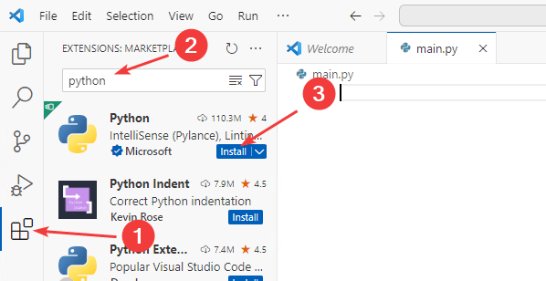

_Рисунок 1 — Установка расширения Python_

Не забудьте перейти в раздел файлов:

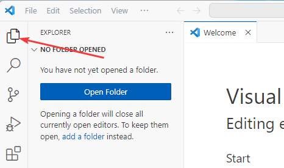

_Рисунок 2 — Раздел Explorer_

Создайте любым способом на компьютере папку, где будут располагаться проекты, например, `C:\python-projects`, если у вас еще нет папки для Python проектов (например, через команду `mkdir C:\python_projects\` или просто через проводник). Через `File` → `Open Folder...` откройте эту папку (там тоже через окно открытия папки можно создать нужную папку):


_Рисунок 3 — Открытие папки_

Вас спросят о том, доверяете ли вы авторам этой папки. Но ведь эту папку вы только что создали? Так что доверяем:

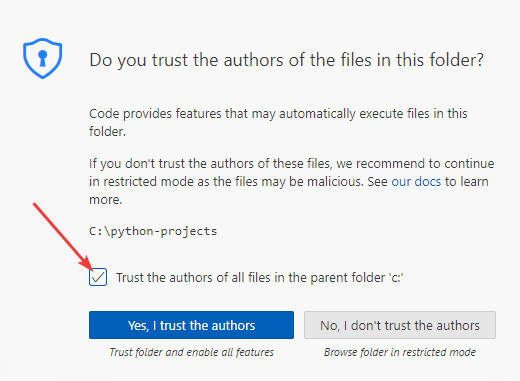

_Рисунок 4— Подтверждение доступа к папке_

И включите режим автосохранения, чтобы не забывать сохранять изменения в файле:

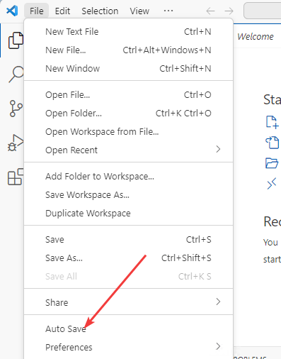

_Рисунок 5 — Режим Auto Save_

</details>

## Установка Rye

На главной странице сайта скачиваем установщик под вашу операционную систему. В нашем случае это Windows:


_Рисунок 6 — Скачивание установщика_

Запускаем его и нас попросят ответить на несколько вопросов. Для начала нажимаем `y` на клавиатуре:

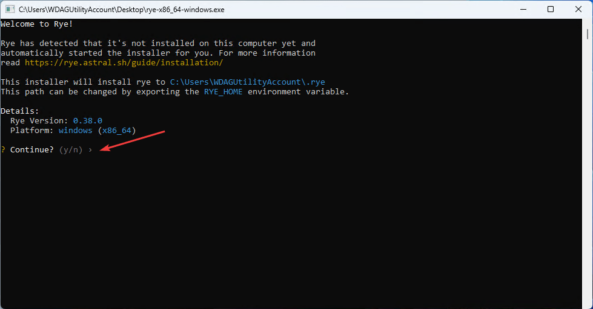

_Рисунок 7 — Начало установки Rye_

На данный момент (лето 2024) предлагается выбрать механизм установки пакетов. И по умолчанию идет [uv](https://github.com/astral-sh/uv) на Rust, который работает быстрее pip. Выбор параметров осуществляется стрелками, а подтверждаем через `Enter`:

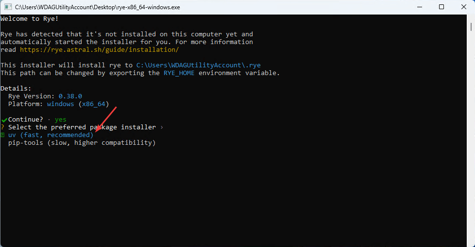

_Рисунок 8 — Выбор систему установки пакетов_

Можно использовать ту версию Python, которая есть уже на компьютере, но лучше довериться Rye, что позволит также переключать разные версии Python в проектах на Rye:

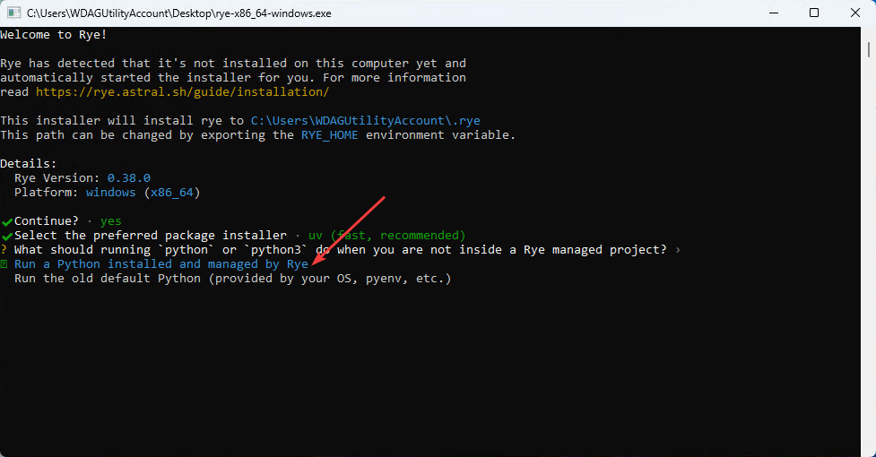

_Рисунок 9 — Выбор метода управления Python_

Если вы доверились Rye, то нужно прописать версию Python, которую он установит. Рекомендую ставить не самую последнюю версию, а предпоследнюю, так как многие библиотеки могут не работать с последней версией. На момент написания статьи последняя версия — это 3.12, поэтому пишем `cpython@3.11` и жмем `Enter`:

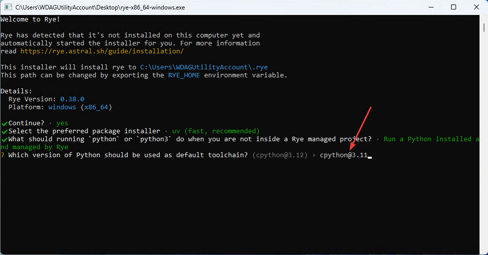

_Рисунок 10 — Выбор версии Python_

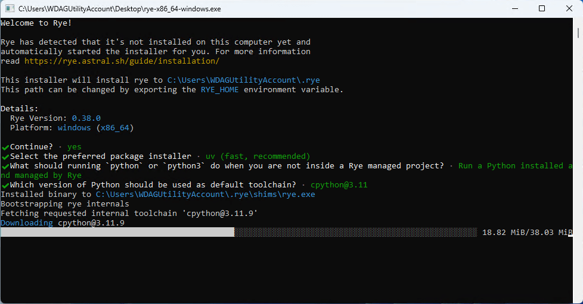

_Рисунок 11 — Процесс установки Rye_

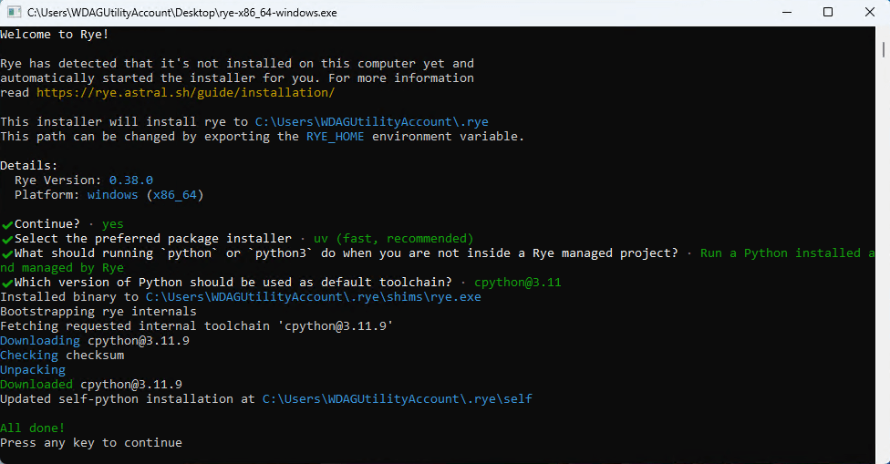

_Рисунок 12 — Завершение установки_

Теперь можно создать проект для Rye. Вместо `Test Rye` введите имя своего проекта:

```console
rye init test-rye
```

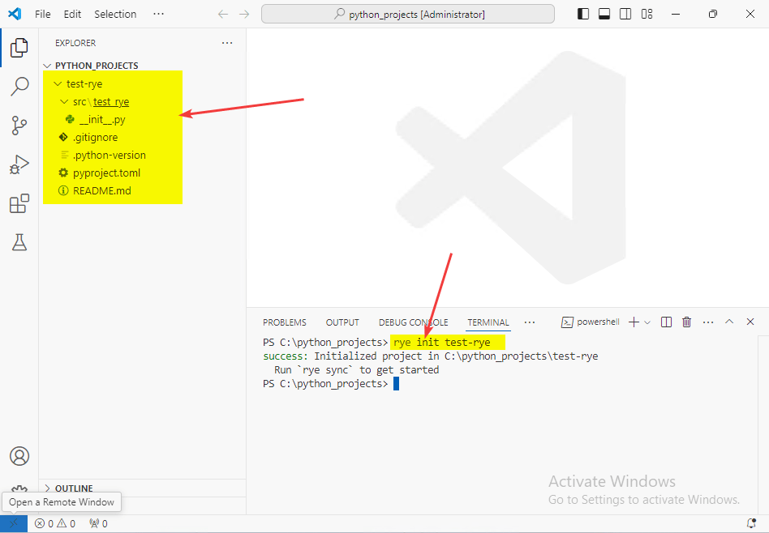

_Рисунок 9 — Инициализация проекта_

Итак, у нас из названия проекта `Test Rye` создалась папка `test-rye`. Обратите внимание, что в папке `src` создалась папка `test_rye`, то есть сам проект для потенциальной публикации в интернете вместо пробела вставляет дефис, а внутри для работы импорта внутри Python скриптов пробел заменяется на нижнее подчеркивание. Если вы назвали проект по другому, то и название папки будет другим.

Командой `cd test-rye` переходим в эту папку проекта:

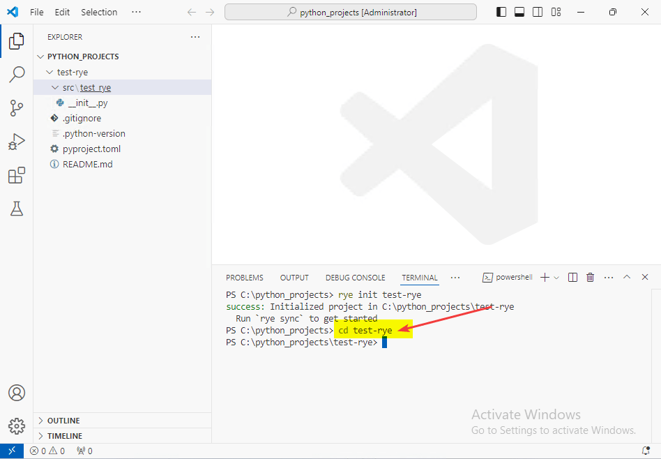

_Рисунок 10 — Переход в папку проекта_

Но лучше сразу откройте через `File` → `Open Folder...` вновь созданную папку `C:\python-projects\test-rye` и откройте терминал `Ctrl` → `` ` `` (`Ctrl` → `Ё`):

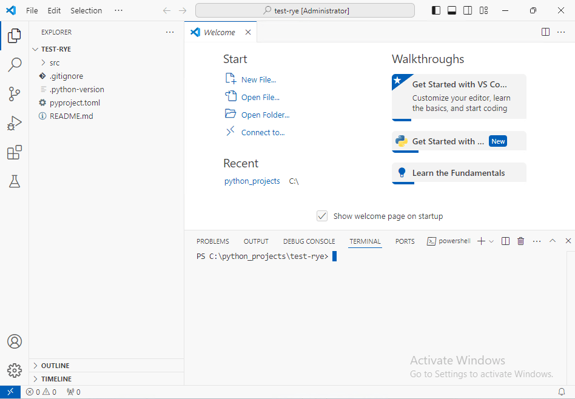

_Рисунок 11 — Открытая папка проекта test-rye_

Если вы не откроете папку с проектом, то следующая команда по созданию виртуального окружения сработает на папку проектов, а не конкретного проекта.

