# Установка и работа с Rye (Python) в VSCode


Что использовать вместо pip? Есть Pipenv, Hatch, Poetry и PDM. Но недавно появился Rye, который очень быстро всех нагоняет и обгоняет. Будем учиться с ним работать.

<details>
<summary>📖 Содержание ⬇️</summary>

## Содержание

- [Кратко](#кратко)
- [Ссылки](#ссылки)
- [Подготовка](#подготовка)
- [Установка Rye](#установка-rye)
- [Создание проекта](#создание-проекта)
- [Создание виртуального окружения](#создание-виртуального-окружения)
- [Написание кода и его запуск](#написание-кода-и-его-запуск)
- [Добавление библиотек](#добавление-библиотек)
- [Форматирование кода](#форматирование-кода)
- [Дополнительные команды для Rye](#дополнительные-команды-для-rye)
- [Тестирование](#тестирование)
- [Развертывание проекта на новой машине](#развертывание-проекта-на-новой-машине)
- [Выбор другой версии Python](#выбор-другой-версии-python)
- [Сборка EXE файла](#сборка-exe-файла)
- [Создание пакетов](#создание-пакетов)

</details>

Обзор этих инструментов можно посмотреть [тут](https://dev.to/adamghill/python-package-manager-comparison-1g98).

Итак, в [Rye](https://github.com/astral-sh/rye) появилось сообщение: «If you're getting started with Rye, consider uv, the successor project from the same maintainers». Так что вот только что перешел на Rye, а теперь надо переходить на [uv](https://github.com/Harrix/harrix.dev-articles-2025/blob/main/uv-vscode-python/uv-vscode-python.md) | [↗️](https://harrix.dev/ru/articles/2025/uv-vscode-python/).

## Кратко

Создаем, например, проект `test-rye`.

- Установить [Rye](https://rye.astral.sh/).
- `rye init test-rye` — создать проект `test-rye`.
- Открыть папку проекта `test-rye` в VSCode.
- `rye sync` — создать виртуальное окружение.
- Выбрать в VSCode созданное виртуальное окружение.
- В папке `src\test-rye` создать файл `main.py` и запустить код из него.
- Чтобы развернуть проект на другой машине, то установите Rye и примените `rye sync`.

Команды для работы:

- `rye add cowsay` — добавляем новую библиотеку.
- `rye add --dev black` — добавляем новую библиотеку для режима разработки.
- `rye fmt` — форматирование Python файлов проекта.
- `rye lint` — проверка Python файлов проекта.
- `rye self update` — обновление самого Rye.
- `rye sync` — зафиксировать библиотеки и обновить файлы виртуального окружения по `.lock` файлам.
- `rye sync --update-all` — обновление всех библиотек проекта.
- `rye sync --update cowsay` — обновление конкретной библиотеки.
- `rye remove cowsay` — удаление библиотеки.
- `rye test` — запускает тесты на базе `pytest`.
- `rye fetch 3.12` + `rye pin 3.12` + `rye sync` — переключает на другую версию Python.
- `rye add --dev pyinstaller` + `pyinstaller -F src\test_rye\main.py` — генерирует EXE файл.
- `rye build --clean` — собирает библиотеку.
- `rye publish` — публикация библиотеки на PyPI.

## Ссылки

- [Rye](https://rye.astral.sh/) — сайт инструмента.
- [Rye - Basics](https://rye.astral.sh/guide/basics/) — базовая документация.
- [Создание пакетов в Python через Rye](https://github.com/Harrix/harrix.dev-articles-2024/blob/main/create-python-package-rye/create-python-package-rye.md) | [↗️](https://harrix.dev/ru/articles/2024/create-python-package-rye/).

## Подготовка

<details>
<summary>Установка программ и создание папки для проектов</summary>

Python не обязателен, так как Rye умеет сам устанавливать и управлять Python.

Нужен VSCode. Если его нет, то смотрите статью [Установка Visual Studio Code (простая)](https://github.com/Harrix/harrix.dev-articles-2021/blob/main/install-vscode-simple/install-vscode-simple.md) | [↗️](https://harrix.dev/ru/articles/2021/install-vscode-simple/).

Нужно расширение Python в VScode:

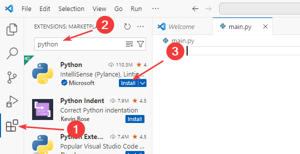

_Рисунок 1 — Установка расширения Python_

Не забудьте перейти в раздел файлов:

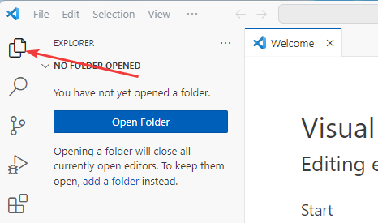

_Рисунок 2 — Раздел Explorer_

Создайте любым способом на компьютере папку, где будут располагаться проекты, например, `C:\python-projects`, если у вас еще нет папки для Python проектов (например, через команду `mkdir C:\python_projects\` или просто через проводник). Через `File` → `Open Folder...` откройте эту папку (там тоже через окно открытия папки можно создать нужную папку):

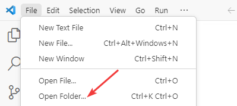

_Рисунок 3 — Открытие папки_

Вас спросят о том, доверяете ли вы авторам этой папки. Но ведь эту папку вы только что создали? Так что доверяем:

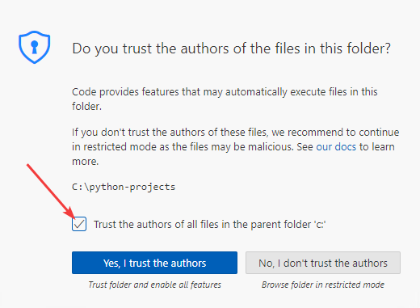

_Рисунок 4 — Подтверждение доступа к папке_

И включите режим автосохранения, чтобы не забывать сохранять изменения в файле:

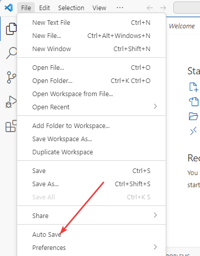

_Рисунок 5 — Режим Auto Save_

</details>

## Установка Rye

На главной странице сайта скачиваем установщик под вашу операционную систему. В нашем случае это Windows:

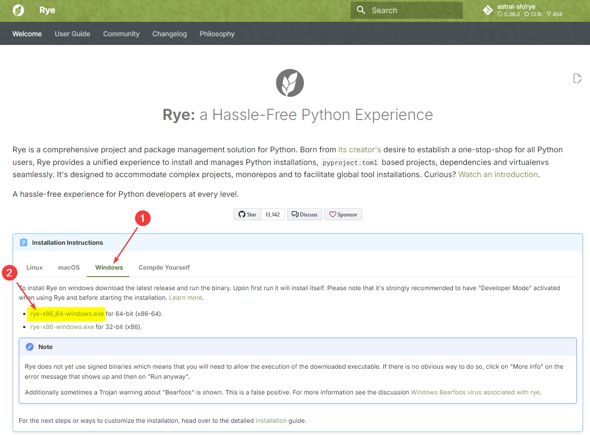

_Рисунок 6 — Скачивание установщика_

Запускаем его и нас попросят ответить на несколько вопросов. Для начала нажимаем `y` на клавиатуре:

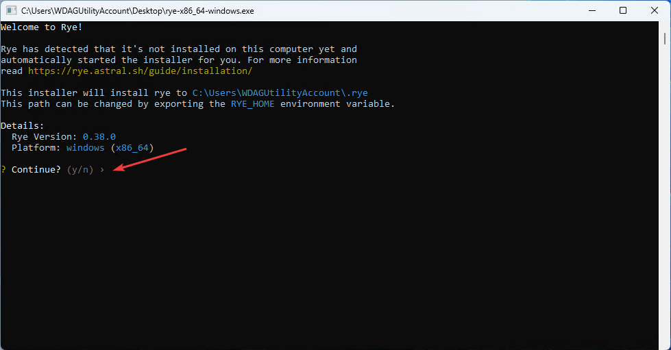

_Рисунок 7 — Начало установки Rye_

На данный момент (лето 2024) предлагается выбрать механизм установки пакетов. И по умолчанию идет [uv](https://github.com/astral-sh/uv) на Rust, который работает быстрее pip. Выбор параметров осуществляется стрелками (если хотите что-то другое выбрать), а подтверждаем через `Enter`:

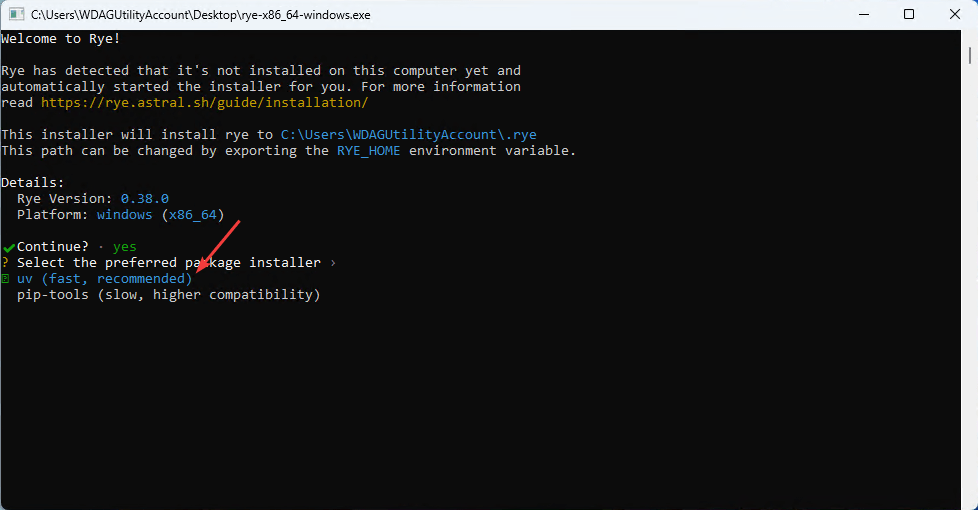

_Рисунок 8 — Выбор систему установки пакетов_

Можно использовать ту версию Python, которая есть уже на компьютере, но лучше довериться Rye, что позволит также переключать разные версии Python в проектах на Rye:

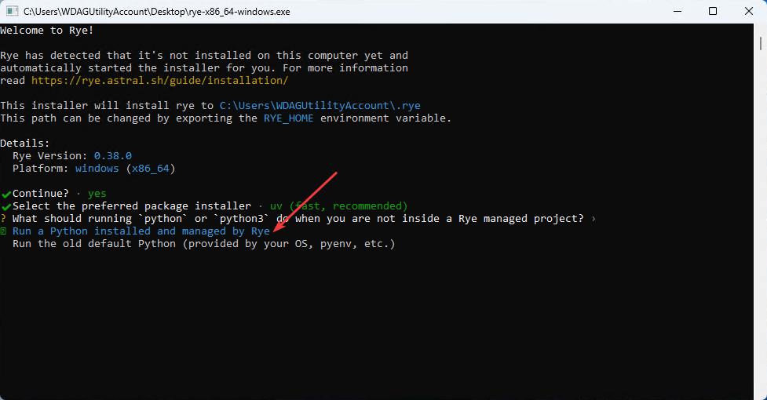

_Рисунок 9 — Выбор метода управления Python_

Если вы доверились Rye, то нужно прописать версию Python, которую он установит. Рекомендую ставить не самую последнюю версию, а предпоследнюю, так как многие библиотеки могут не работать с последней версией. На момент написания статьи последняя версия — это 3.12, поэтому пишем `cpython@3.11` и жмем `Enter`:

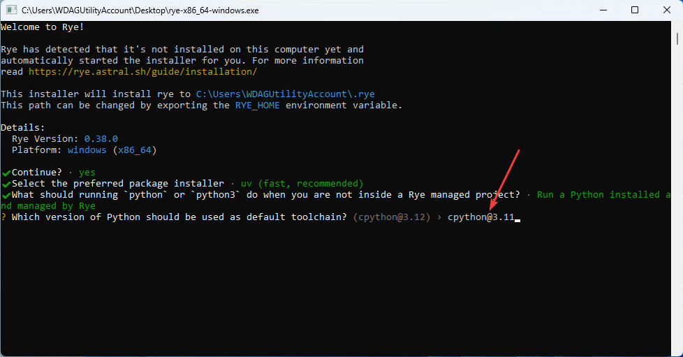

_Рисунок 10 — Выбор версии Python_

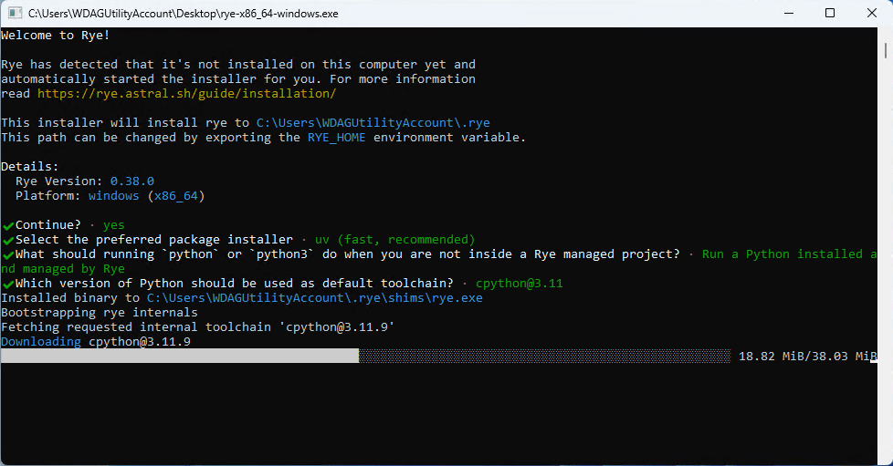

_Рисунок 11 — Процесс установки Rye_

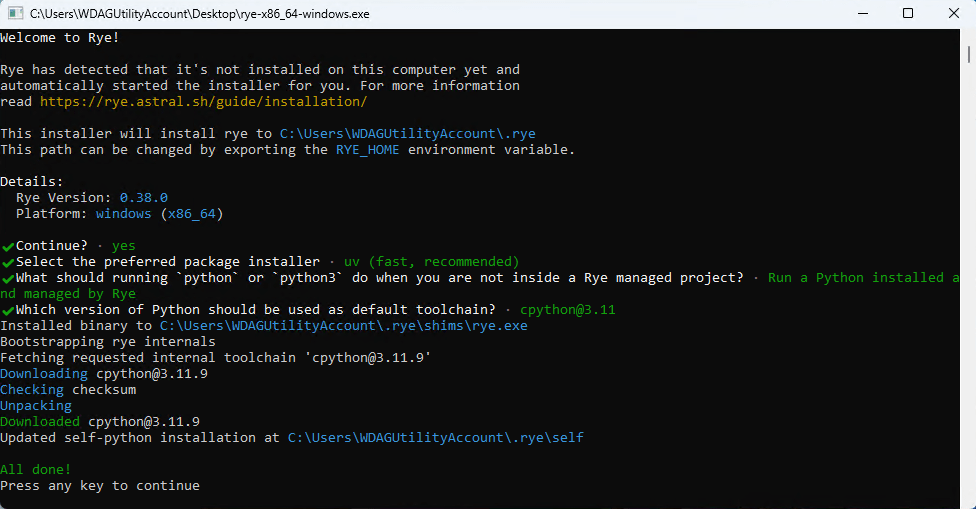

_Рисунок 12 — Завершение установки_

## Создание проекта

Закройте VSCode и откройте его заново, если вы при установке Rye его не закрывали.

Вызываем консоль в VSCode `Ctrl` → `` ` `` (`Ctrl` → `Ё`), прописываем команду создания нового проекта (после ввода команды не забываем нажать `Enter`). Вместо `test-rye` введите имя своего проекта (не используйте нижнее подчеркивание вместо дефиса):

```shell
rye init test-rye
```

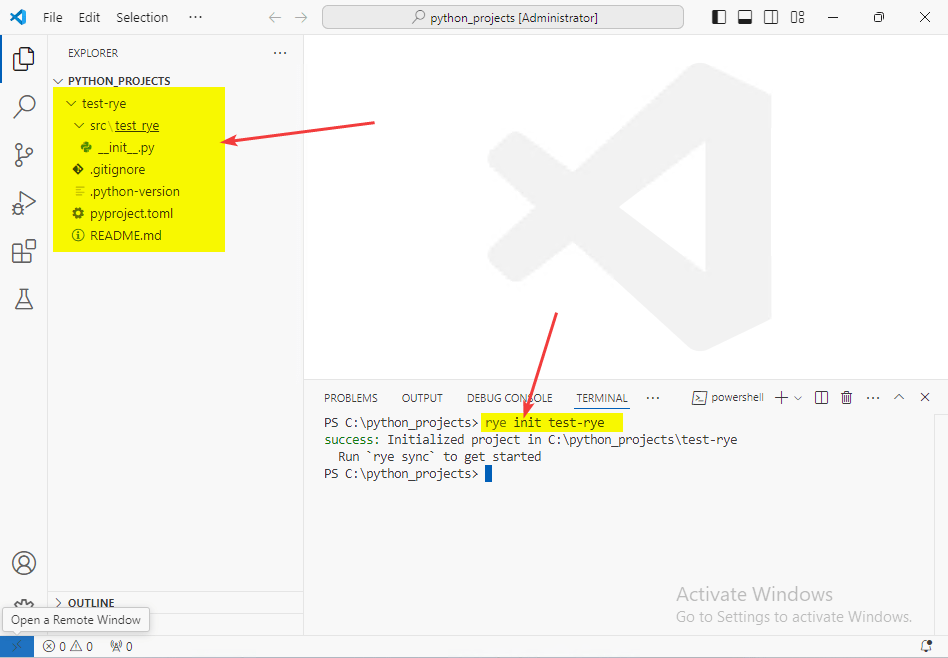

_Рисунок 13 — Инициализация проекта_

Если вы видите ошибку, как на рисунке ниже, то скорее всего вы не перезагрузили VSCode. Закройте и откройте его заново:

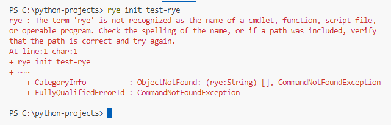

_Рисунок 14 — Ошибка при инициализация проекта_

В результате появилась папка со всеми нужными файлами. Обратите внимание, что в папке `src` создалась папка `test_rye`, то есть в проекте для работы импорта внутри Python скриптов дефис заменяется на нижнее подчеркивание. Если вы назвали проект по другому, то и название папки будет другим.

Командой `cd test-rye` переходим в эту папку проекта:

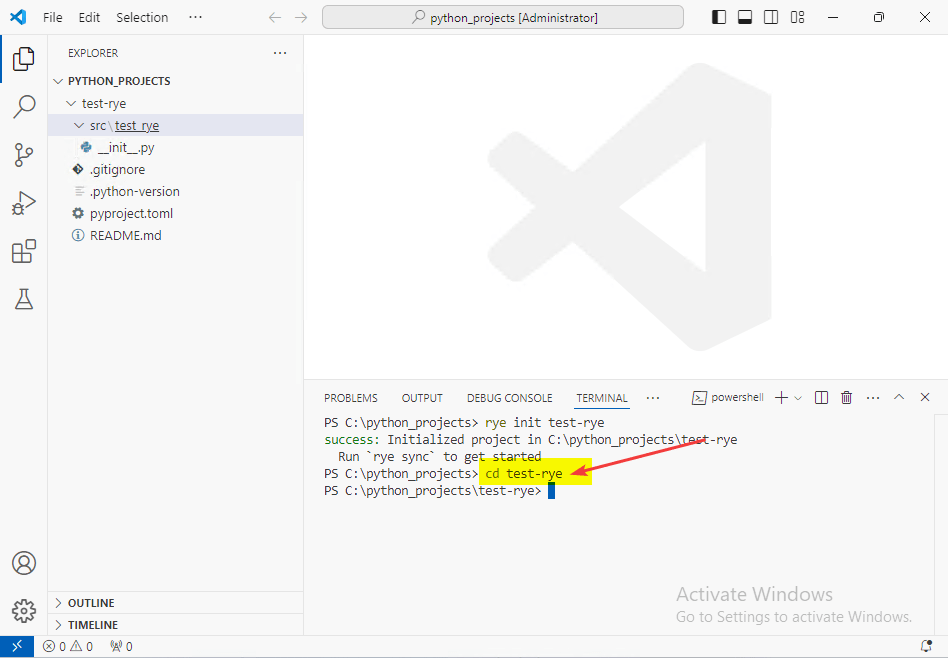

_Рисунок 15 — Переход в папку проекта_

Но лучше сразу откройте через `File` → `Open Folder...` вновь созданную папку `C:\python-projects\test-rye` и откройте терминал `Ctrl` → `` ` `` (`Ctrl` → `Ё`). В дальнейшем в статье буду исходить, что открыта именно папка в VSCode:

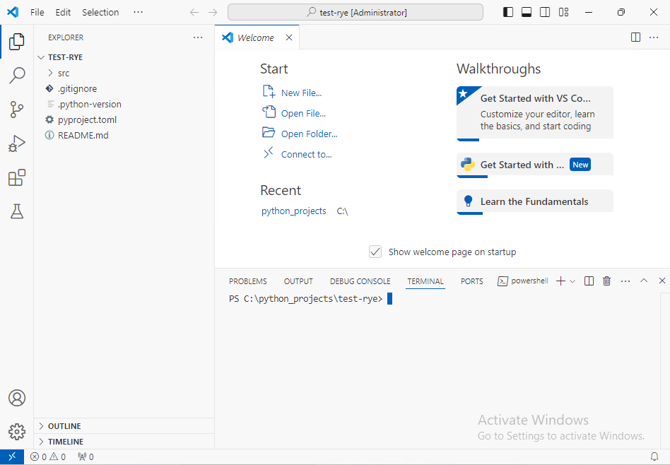

_Рисунок 16 — Открытая папка проекта test-rye_

## Создание виртуального окружения

Теперь нужно создать виртуальное окружение через команду:

```shell
rye sync
```

Папка виртуального окружения будет создана в папке с проектом:

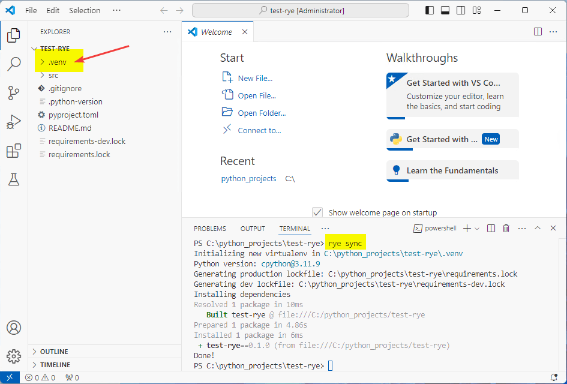

_Рисунок 17 — Созданное виртуальное окружение_

В других системах при работе с виртуальным окружением нужно следить, чтобы в терминале название виртуального окружения отображалось в круглых скобках, что означает активацию виртуального окружения:


_Рисунок 18 — Отображение названия виртуального окружения в терминале_

В Rye это не обязательно, так как он сам следит за тем, чтобы запускались скрипты в нужном виртуальном окружении. Это можно проверить, введя команду в терминал:

```python
python -c "import sys; print(sys.prefix)"
```

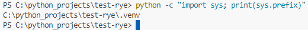

_Рисунок 19 — Путь к текущему виртуальному окружению_

Будет видно, что используется виртуальное окружение нашего проекта.

Однако VScode всё равно надо научить запускать самостоятельно нужное виртуальное окружение, когда VSCode сам запускает Python скрипты. Но об этом ниже в следующем разделе.

Основные настройки проекта находятся в файле `pyproject.toml`, а также есть файлы фиксирования библиотек проекта `requirements.lock` и `requirements-dev.lock`.

## Написание кода и его запуск

Теперь создадим `main.py` в папке `scr/test_rye`. Например, для этого можно кликнуть на указанную папку правой кнопкой мыши, а затем выбрать `New File...`:

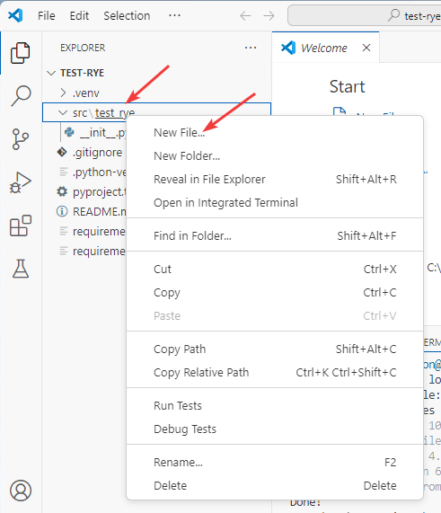

_Рисунок 20 — Выбор пункта создания нового файла_

Вводим имя файла `main.py` и нажимаем `Enter`:

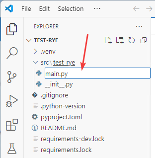

_Рисунок 21 — Создание нового файла_

Теперь можем протестировать запуск какого-нибудь Python скрипта (вторая строка для проверки запуска правильного виртуального окружения):

```python
print(2+2)

import sys; print(sys.prefix)
```

Проверим, что VSCode правильно подхватил виртуальное окружение `.venv`. Для этого смотрим внизу справа в панели состояния VSCode. Если там общее виртуальное окружение отображено (как на рисунке), то нажимаем на него и выбираем наше окружение `.venv`:

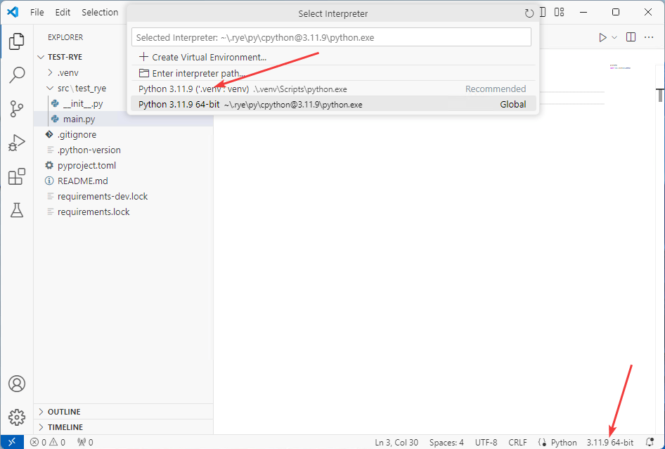

_Рисунок 22 — Выбор виртуального окружения в VSCode_

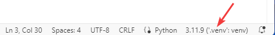

_Рисунок 23 — Выбор виртуального окружения в VSCode_

Запускаем кнопкой запуска сверху справа:

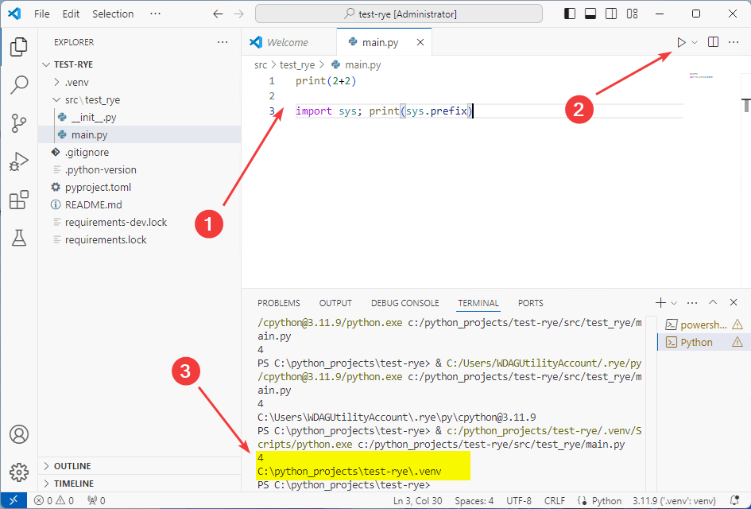

_Рисунок 24 — Запуск Python кода_

Если вы получили нужный вывод, то всё работает. Также проверьте, что путь к виртуальному окружению правильно выводится.

## Добавление библиотек

Добавление пакетов осуществляется через команду наподобие:

```shell
rye add cowsay
```

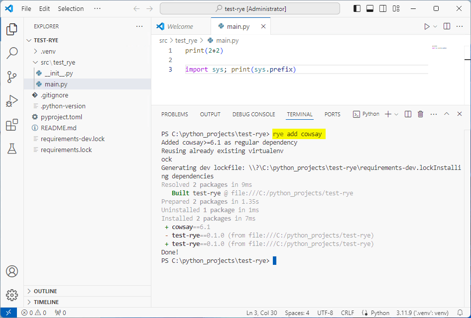

_Рисунок 25 — Добавление библиотеки_

Например, в `main.py` напишем такой код:

```python
import cowsay

cowsay.cow('Hello World')
```

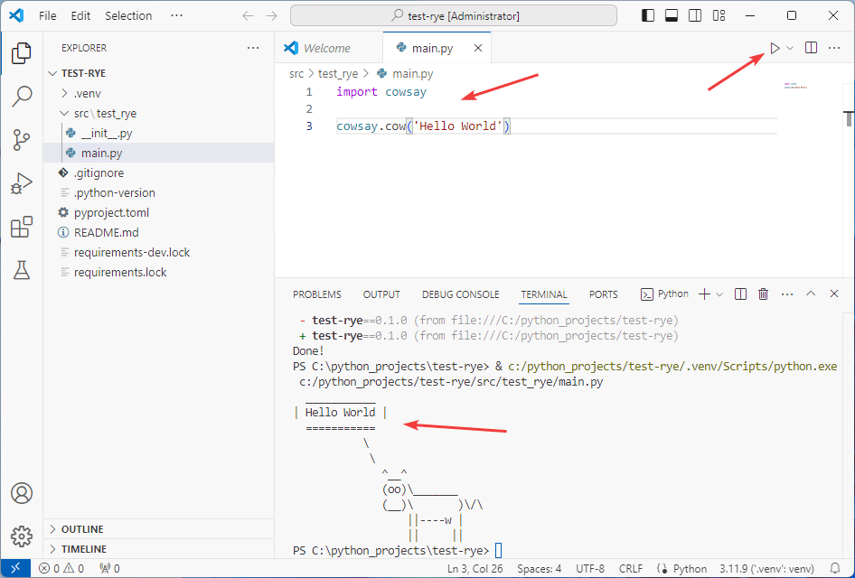

_Рисунок 26 — Запуск кода с установленной библиотекой_

Добавим ещё для примера библиотеку matplotlib:

```shell
rye add matplotlib
```

В `main.py` напишем такой код:

```python
import matplotlib.pyplot as plt
import numpy as np

x = np.linspace(-5, 5, 200)
y = x ** 2

fig, ax = plt.subplots()
ax.plot(x, y)
plt.show()
```

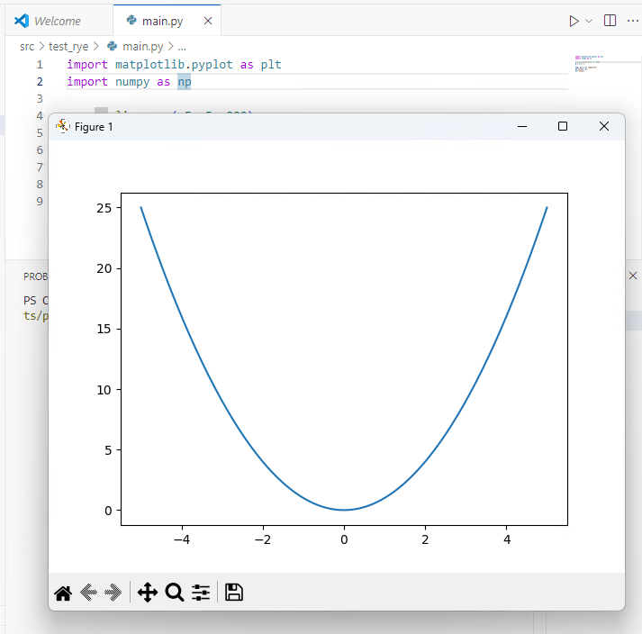

_Рисунок 27 — Вывод графика_

На рабочей Windows всё прошло нормально, но на пустой Windows в Sandbox вышла ошибка:

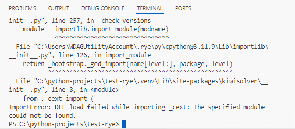

_Рисунок 28 — Ошибка с matplotlib_

Пришлось по [инструкции](https://stackoverflow.com/questions/75824703/matplotlib-importerror-dll-load-failed-while-importing-cext) устанавливать `rye add msvc-runtime` и [Visual C++ Redistributable](https://learn.microsoft.com/en-us/cpp/windows/latest-supported-vc-redist) (устанавливал летом 2024 [`vc_redist.x64.exe`](https://aka.ms/vs/17/release/vc_redist.x64.exe)) и перезапускать VSCode.

Если вам нужны в проекте библиотеки для разработки, то есть они не будут нужны потом пользователю вашей библиотеки, если вы её будете публиковать, то устанавливаем их с параметром `--dev`. Например, вам в самом проекте при его написании надо форматировать код с помощью библиотеки [black](https://pypi.org/project/black/). Вам эта библиотека нужна как разработчику библиотеки, но пользователям вашего проекта не нужна. Тогда устанавливаем его вот так:

```shell
rye add --dev black
```

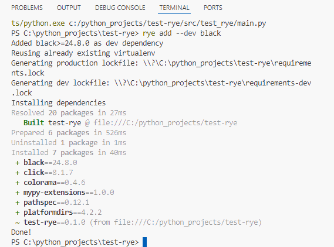

_Рисунок 29 — Установка пакета black_

## Форматирование кода

Выше в разделе библиотек говорилось про библиотеку black для форматирования кода, но в Rye встроена библиотека [Ruff](https://pypi.org/project/ruff/). И её можно использовать сразу для всех файлов проекта:

```shell
rye fmt
```

Был вот такой кода:

```python
import matplotlib.pyplot as plt
import    numpy as   np

x =    np.linspace( -5, 5,    200)
y = x**2
fig, ax =    plt.subplots()
ax.plot(x,    y)
plt.show()
```

Стал вот такой код:

```python
import matplotlib.pyplot as plt
import numpy as np

x = np.linspace(-5, 5, 200)
y = x**2
fig, ax = plt.subplots()
ax.plot(x, y)
plt.show()
```

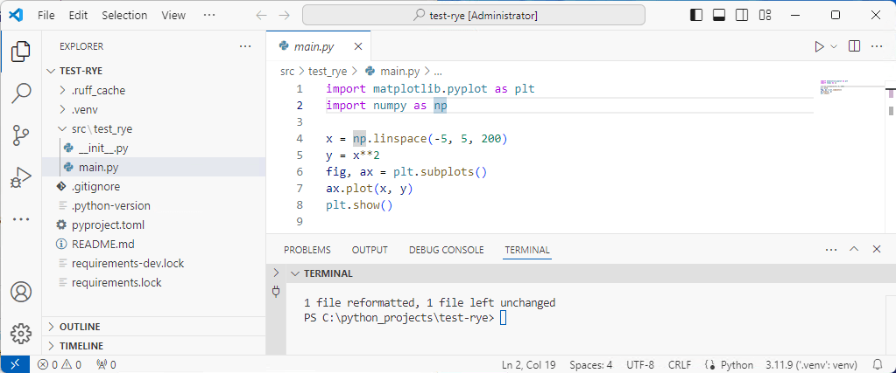

_Рисунок 30 — Форматирование Python кода_

Для форматирования кода в 120 символов можно использовать команду `rye fmt -- --line-length 120`, а можно в `pyproject.toml` вставить строчки ниже и тогда можно использовать `rye fmt`:

```toml
[tool.ruff]
line-length = 120
```

## Дополнительные команды для Rye

Чтобы обновить сам Rye для последней версии воспользуйтесь командой:

```shell
rye self update
```

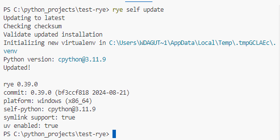

_Рисунок 31 — Обновление Rye_

Чтобы зафиксировать библиотеки и обновить файлы виртуального окружения по `.lock` файлам, то используйте команду:

```shell
rye sync
```

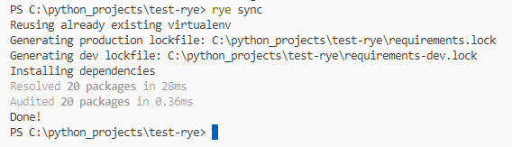

_Рисунок 32 — Запуск rye sync_

Обновление всех библиотек в проекте можно так:

```shell
rye sync --update-all
```

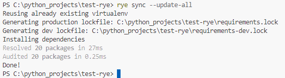

_Рисунок 33 — Обновление всех пакетов_

Если нужно обновить конкретную библиотеку, например, `cowsay`, то это можно сделать следующей командой:

```shell
rye sync --update cowsay
```

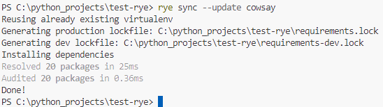

_Рисунок 34 — Обновление конкретного пакета_

Если какой-то пакет вам не нужен, то удаляем так:

```shell
rye remove cowsay
```

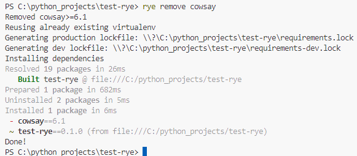

_Рисунок 35 — Удаление библиотеки_

Для проверки кода на наличие ошибок можно использовать встроенный линтер:

```shell
rye lint
```

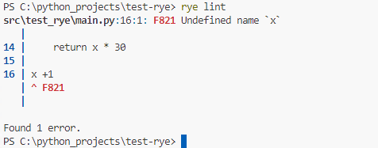

_Рисунок 36 — Пример сообщения об ошибке_

## Тестирование

Тестирование осуществляется через `pytest`, который нужно установить командой:

```shell
rye add --dev pytest
```

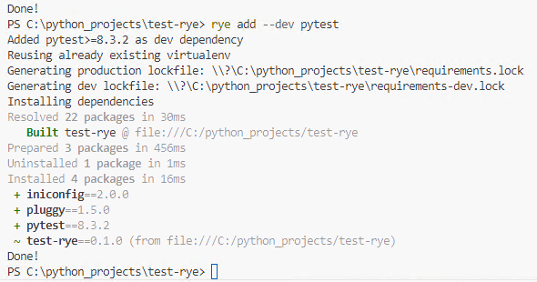

_Рисунок 37 — Установка pytest_

Теперь в файле `src\main.py` напишем, например, такие функции, которые хотим протестировать:

```python
def multiply_2(x):
    return x * 2

def multiply_10(x):
    return x * 10

def multiply_20(x):
    return x * 20

def multiply_30(x):
    return x * 30
```

Создайте папку `tests` в корне своего проекта:

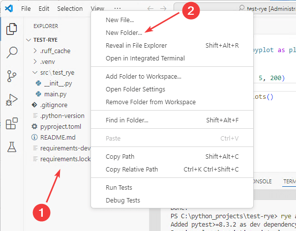

_Рисунок 38 — Создание папки tests через правый клик в explorer_

В неё создайте файл, например, `test_main.py`:


_Рисунок 39 — Созданный файл `test_main.py`_

Обратите внимание, что файл должен начинаться с `test_`. То есть если вы назовёте файл, например, `test.py`, `tests.py`, `testmain.py`, `for_test.py`, то `pystest` не будет находить тесты (можно настроить, но лучше так не делать).

Теперь `pytest` должен понять, где находятся наш основной код. Для этого в файле `pyproject.toml` в конце прописываем строчки настройки `pystest` (не пропустите пробел после точки):

```toml
[tool.pytest.ini_options]
pythonpath = ". src"
```

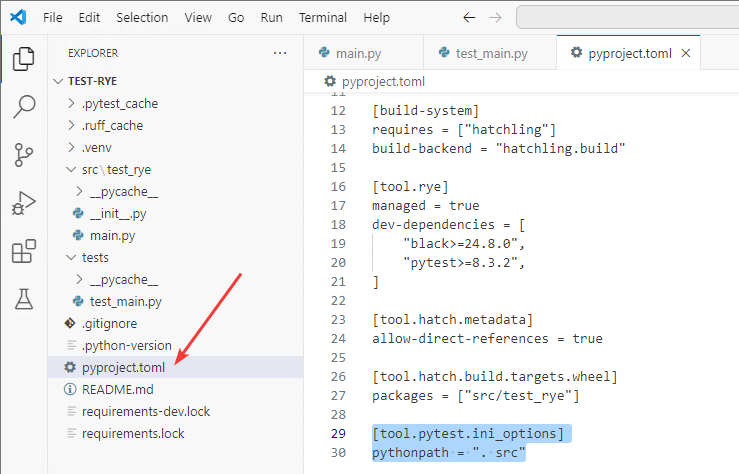

_Рисунок 40 — Настройка pytest_

И теперь в файле `test_main.py` можем прописать простейшие тесты наших функций:

```python
from src.test_rye.main import *


def test_multiply_2():
    re = multiply_2(2)
    assert re == 4


def test_multiply_10():
    re = multiply_10(2)
    assert re == 20


def test_multiply_20():
    re = multiply_20(2)
    assert re == 40


def test_multiply_30():
    re = multiply_30(2)
    assert re == 60
```

Функции тестов должны также начинаться с `test_`.

Теперь в терминале вызываем команду запуска тестов:

```shell
rye test
```

Если всё правильно сделали, то тесты должны успешно быть пройдены:

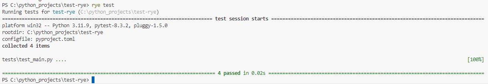

_Рисунок 41 — Успешный запуск тестов_

## Развертывание проекта на новой машине

Теперь представим, что вы успешно написали свой проект и хотите теперь запустить на другой машине. Как быть?

Чтобы развернуть проект на другой машине, то установите Rye и примените `rye sync`.

На другой компьютер вы переносите папку проекта `test-rye` (или как он у вас там называется). Для приведенного выше примера нам нужны следующие файлы из первоначальной папки:

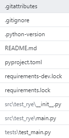

_Рисунок 42 — Файлы проекта_

То есть папки `.pytest_cache`, `.ruff_cache`, `.venv` вам не нужны. Они нужны конкретно вашей локальной версии проекта. Если вы используете Git, то благодаря файлу `.gitignore` лишние папки не попадут в переносимую папку.

На компьютере устанавливаете опять Rye и VSCode, открываете папку `test-rye` в VSCode:

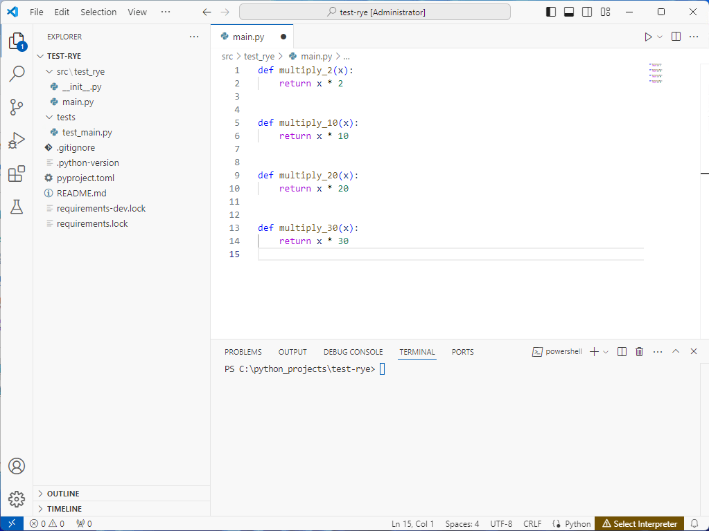

_Рисунок 43 — Проект открытый в VSCode_

Пока у нас не установлено виртуальное окружение, что видно по отсутствию его внизу справа с надписью `Select Interpreter`.

Пишем команду для создания виртуального окружения с теми же самыми библиотеками, что были в проекте. Это прописано в файлах `requirements.lock` и `requirements-dev.lock`:

```shell
rye sync
```

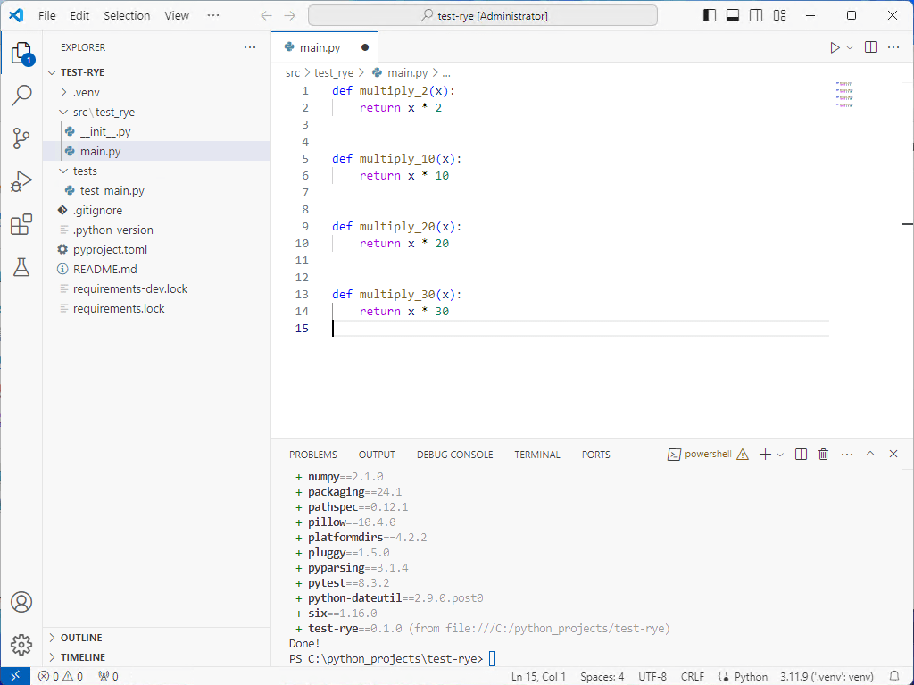

_Рисунок 44 — Проект открытый в VSCode_

Выбираем в VSCode виртуальное окружение из папки `.venv` (VSCode скорее всего даже предложит поменять виртуальное окружение самостоятельно).

Теперь можно запускать код. Я для примера вставил код выше для тестирования `matplotlib`:

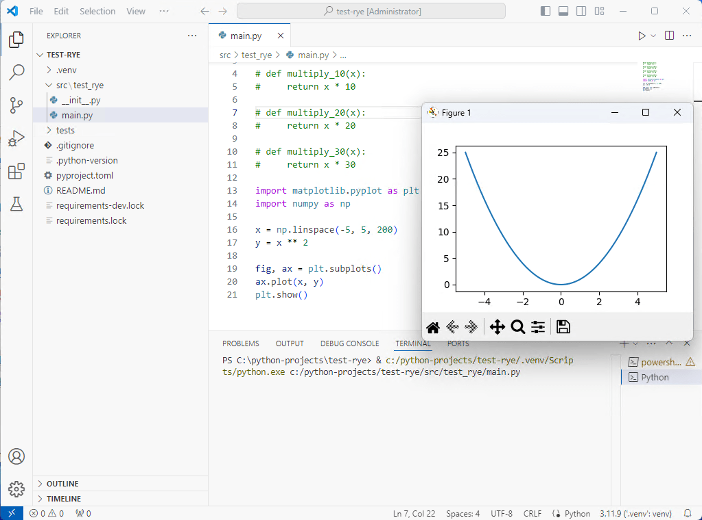

_Рисунок 45 — Восстановленный проект на другой машине_

## Выбор другой версии Python

Вначале скачиваем нужную версию Python:

```shell
rye fetch 3.12
```

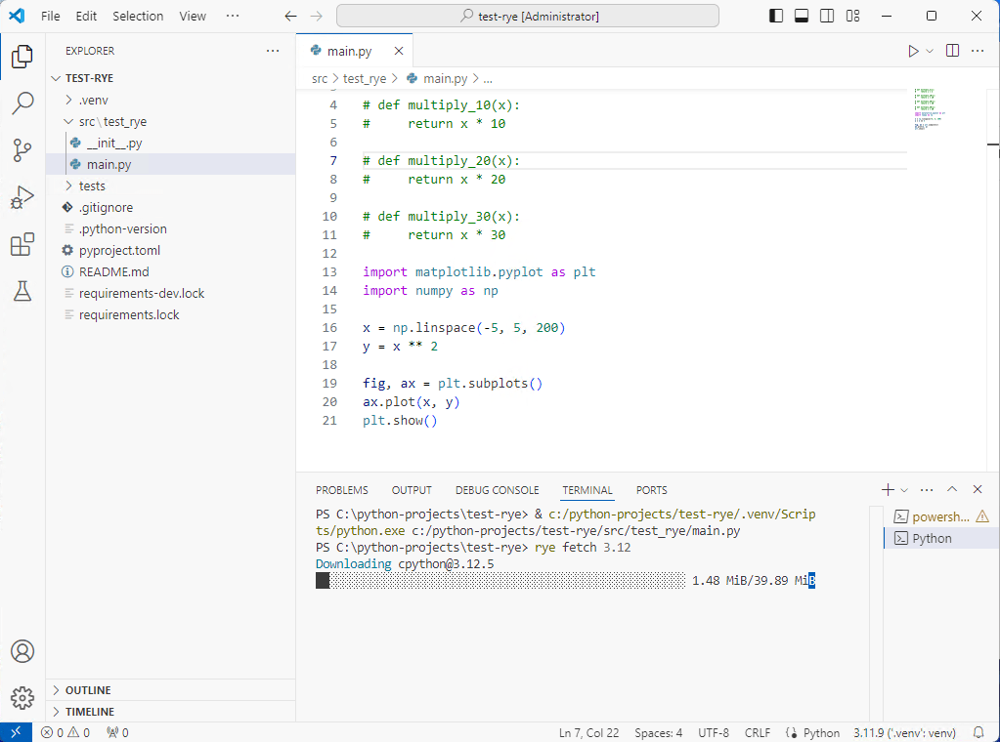

_Рисунок 46 — Скачивание новой версии Python_

Потом потом надо указать, что мы хотим переключиться на другую версию Python. Это команда приведет к изменению файла `.python-version`:

```shell
rye pin 3.12
```

А потом надо переделать виртуальное окружение под новую версию Python:

```shell
rye sync
```

Всё. Теперь в VSCode отображается другая версия Python. Также это можно проверить через код:

```python
import sys
print(sys.version)
```

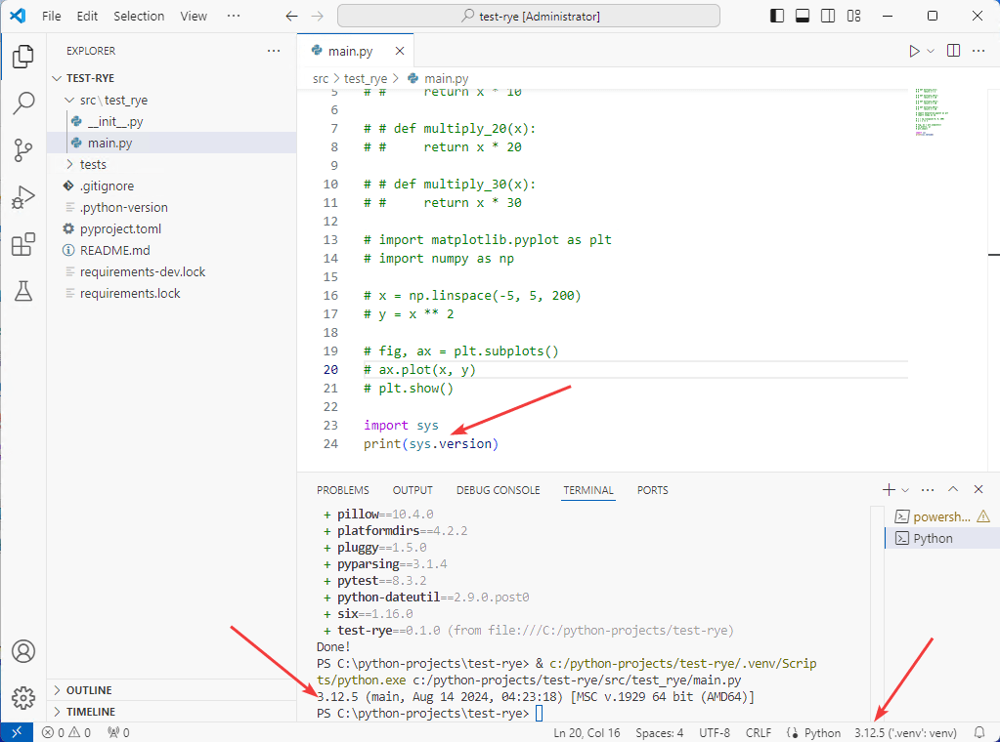

_Рисунок 47 — Скачивание новой версии Python_

Чтобы обратно перейти на старую версию Python, то меняем аналогично, только уже не скачивая версию:

```shell
rye pin 3.11
rye sync
```

Аналогично поступаем для обновления текущей версии Python. Например, у вас стоит Python 3.11.8, а вышла версия 3.11.8. Простой команды я не нашел, но можно через тот же способ всё провернуть:

```shell
rye fetch 3.11.9
rye pin 3.11.9
rye sync
```

Посмотреть на последнюю версию Python, на которую вы хотите обновиться можно на сайтах [Python.org](https://www.python.org/downloads/windows/) или [python-build-standalone](https://github.com/indygreg/python-build-standalone/releases).

## Сборка EXE файла

Попробуем собрать консольное приложение с таким кодом:

```python
a = int(input())
b = int(input())
print(a + b)

input("Press enter to exit.")
```

Для этого установим в режиме `--dev` пакет [pyinstaller
](https://pyinstaller.org/en/stable/):

```shell
rye add --dev pyinstaller
```

После этого можно запустить pyinstaller:

```shell
pyinstaller -F src\test_rye\main.py
```

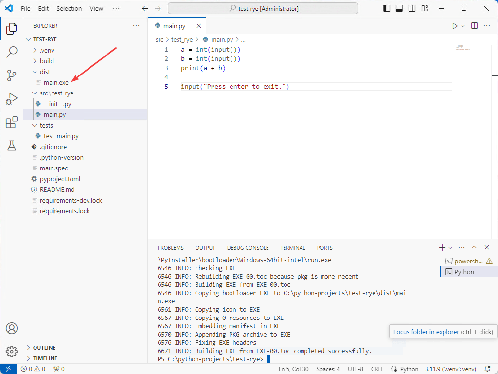

_Рисунок 48 — Генерация EXE файла_

Создаться папка `dist` с файлом `main.exe`.

Запускаем, вводим числа и видим:

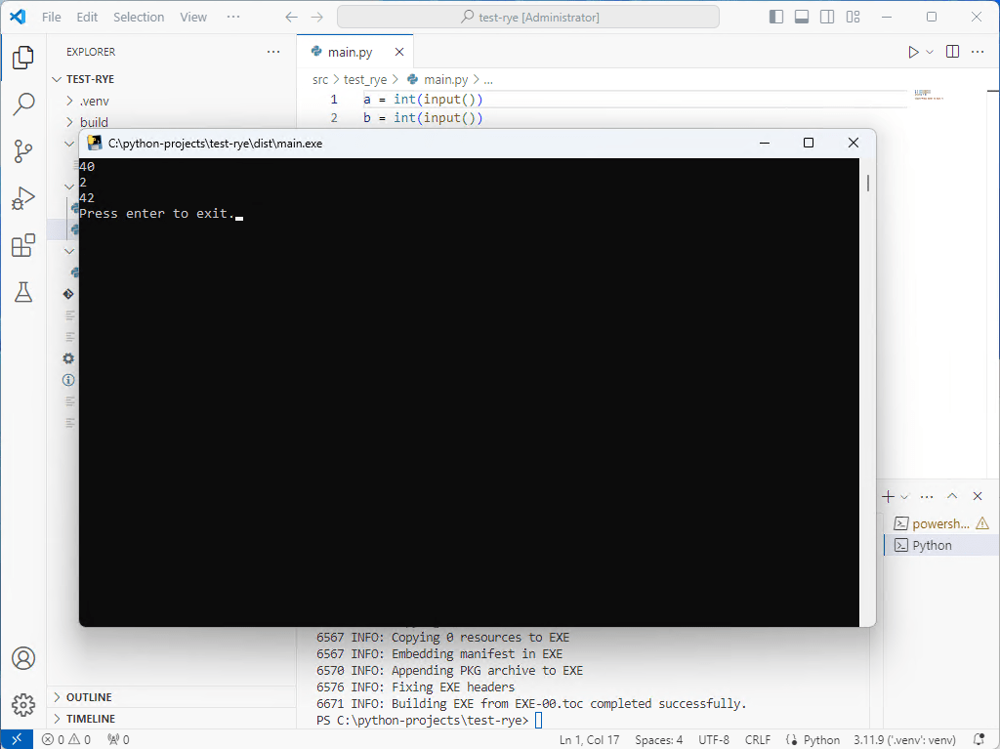

_Рисунок 49 — Результат выполнения программы_

С matplotlib тоже всё работает:

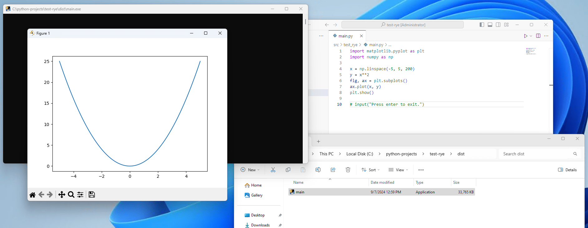

_Рисунок 50 — Результат выполнения программы с matplotlib_

Запуск EXE файлов был проверен на пустой Windows 11.

Если один файл не нужен, то не используйте флаг `-F`, а если нужно консольное приложение без консоли (то есть должно в фоне выполняться без создания черного окна терминала), то используйте флаг `--windowed`, например, `pyinstaller -F --windowed src\test_rye\main.py`.

## Создание пакетов

Читайте в отдельной статье [Создание пакетов в Python через Rye](https://github.com/Harrix/harrix.dev-articles-2024/blob/main/create-python-package-rye/create-python-package-rye.md) | [↗️](https://harrix.dev/ru/articles/2024/create-python-package-rye/).

Но так как Rye уже устарел, то смотрите [Создание пакетов в Python через uv](https://github.com/Harrix/harrix.dev-articles-2025/blob/main/create-python-package-uv/create-python-package-uv.md) | [↗️](https://harrix.dev/ru/articles/2025/create-python-package-uv/).
